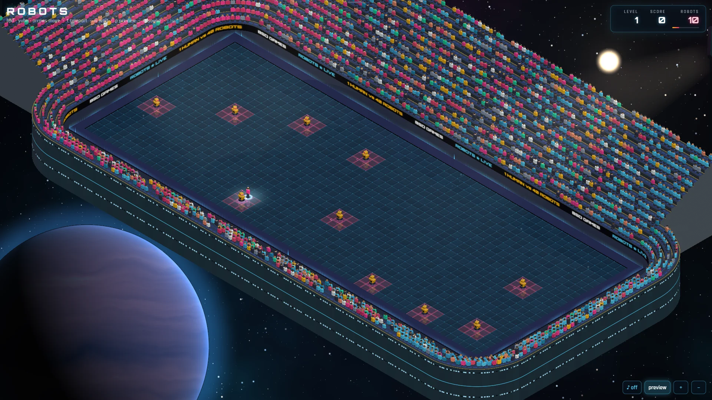

# Robots

> Lure the robots into each other. Stay out of reach.

## The hook

Every time you move, every robot on the field takes one step straight at you. You have no weapon,
only your feet and a teleporter you cannot aim. The trick is to stand where two robots will arrive
at the same square at the same moment: they crash into a smoking heap, and anything that walks into
the heap crashes too. Line up a chain and the whole stadium is on its feet, and a loud crowd pays
double, triple, four times for every crash.

## Where it comes from

`robots` is Ken Arnold’s turn-based chase from the BSD games (its manual page is dated 1991);
Christos Zoulas later added an automatic mode that plays for you. On an 80×24 terminal the robots
were plus signs, their wrecks were asterisks and you were an at sign, and the game went on, one
field after another, until they finally caught you.

## What is new

- A glass arena in a floodlit stadium somewhere in deep space; the game opens on a distant star and
  falls into it.
- Robots with visors that burn brighter as they close in, wrecks that smoulder, a walk with planted
  steps, and each wave in a new stretch of sky.
- Crashes land when the robots actually meet, with slow motion and a chain counter for the big ones.
- A danger preview that marks every square a robot can reach next turn.
- A wait that is safe: it stops before a robot would reach you.
- A crowd of two thousand that cheers every crash, sets off fireworks when you clear a wave, and
  rises to applaud the run when you are caught.
- A hype meter: the louder the crowd, the more each crash is worth, from Warm ×1 to Showtime ×4.
- Jumbotron calls on most waves (a chain, no teleports, a quick clear…) that stamp a trophy wall.
- Five ways to play from a game menu: the original’s endless Exhibition; a Grand Tour of twelve
  matches that keeps the original’s escalation and goes past its forty robots; a Daily Showdown with
  the same waves for everyone and a rule for each day of the week; Blitz, the original’s hidden
  real-time switch; and a custom match.
- A match report after every run, records for every mode, and stars for the tour.

## At a glance

|                 |                             |
| --------------- | --------------------------- |
| Directory       | `/usr/games/arcade`         |
| Players         | 1                           |
| Session         | 3–10 minutes                |
| Daily challenge | yes: the Daily Showdown     |
| Inspired by     | `robots` (1991 manual page) |

## More

- [How to play](HOW-TO-PLAY.md)
- [Changes from the original](CHANGES-FROM-ORIGINAL.md)
- [Architecture](ARCHITECTURE.md)
- [Notes](NOTES.md)
