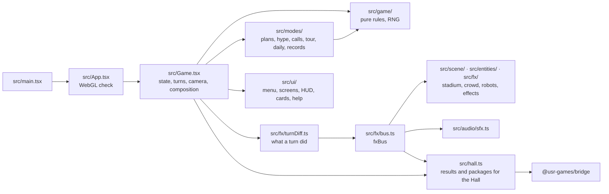
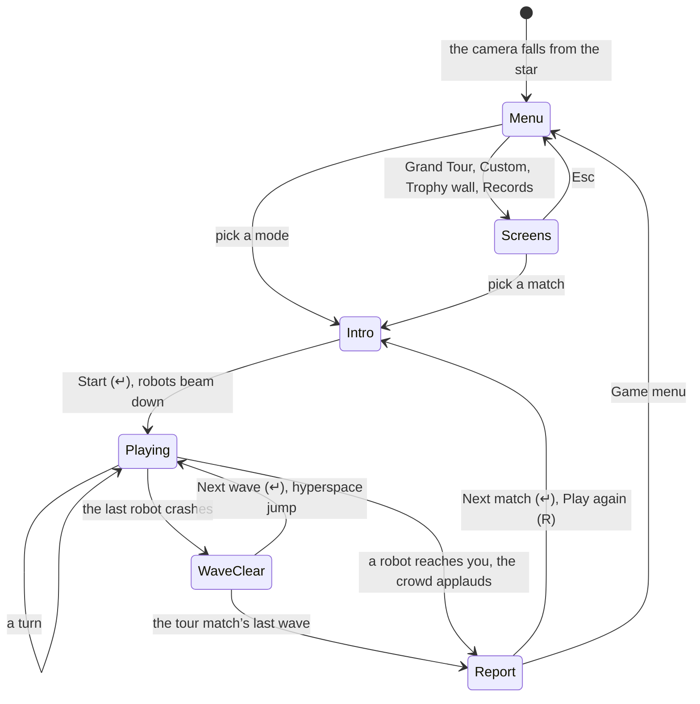
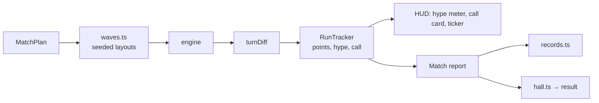

# Robots — architecture

## Overview

Robots is a **hosted** game: the owner’s finished remaster (`robots`, fancy-web-remastered),
adopted as it was into `games/robots/app/`. It is TypeScript, React 18 and react-three-fiber over
three.js, built by its own Vite; the Hall runs the built game in a same-origin frame at
`play/robots/`. The rules live in a small pure engine; everything else is presentation read from
the difference between two game states. Since 2026-10-02 a modes layer (`src/modes/`) frames the
runs: match plans, the crowd’s hype, jumbotron calls, the Grand Tour, the Daily Showdown and the
records. The upstream design notes are in
[`../app/docs/architecture.md`](../app/docs/architecture.md) and its decisions in [`adr/`](adr/).

## Module map

| Path                | Responsibility                                                                                      |
| ------------------- | --------------------------------------------------------------------------------------------------- |
| `app/src/game/`     | Rules: grid, robot steps, crashes, teleport, safe wait, levels                                      |
| `app/src/modes/`    | Match plans, hype, jumbotron calls, the run tracker, tour, daily, seeded waves, records, commentary |
| `app/src/fx/`       | The turn reader, the event bus, the visual clock (slow motion), effects, crowd mood                 |
| `app/src/scene/`    | Sky, glass arena, stadium, crowd, lighting, danger preview                                          |
| `app/src/entities/` | Robots, the player and its walk, wrecks                                                             |
| `app/src/audio/`    | Web Audio synthesis, driven by the bus                                                              |
| `app/src/ui/`       | Game menu and its screens, broadcast HUD, match cards, help, styles, fonts                          |
| `app/scripts/`      | Tour calibration (`bot.ts`, `tour-search.ts`, `tour-sim.ts`) and upstream tools                     |
| `app/src/hall.ts`   | The bridge glue (added on adoption)                                                                 |

## State machine

## Engine

`src/game/engine.ts` is the fancy-web engine, rule for rule: a 60×23 field, `min(level × 10, 40)`
robots, robots stepping by the sign of the distance on each axis, crashes into wrecks, a random
teleport, the safe wait and its bonus. `initGame` and `nextLevel` take an optional robot count, which
the Grand Tour uses for its planned waves. Presentation never feeds back into the rules:
`turnDiff.ts` compares two states and announces what happened on `fxBus`.

## Modes

A `MatchPlan` (`src/modes/plans.ts`) says what a run needs beyond the rules: robots per wave (or the
original’s escalation), start wave, teleports, tempo, whether waiting is allowed, the crowd’s gain
and starting hype, and whether the jumbotron calls. `Game.tsx` applies it: it gates teleports and
waiting, runs the Blitz clock, and lays out waves through `src/modes/waves.ts`, which seeds each
wave’s layout and teleport landings from the plan for the Grand Tour and the Daily Showdown and
from the clock otherwise.

The `RunTracker` (`src/modes/tracker.ts`) hears every turn (crashes, the original’s score gain,
teleport, wait, the nearest robot, clear or caught) and keeps the points with the crowd’s
multiplier, the hype (`hype.ts`), the wave’s call (`calls.ts`) and the run’s record; it never changes
the game state. At the end its summary goes to the records (`records.ts`, one local key), the Hall
and the match report.

## Where visuals are defined

| Visual                                | Defined in                                                              |
| ------------------------------------- | ----------------------------------------------------------------------- |
| Sky, nebula, planet, sun (per sector) | `app/src/scene/Background.tsx` (`SECTORS`)                              |
| Glass arena, danger squares, pulse    | `app/src/scene/Platform.tsx`                                            |
| Stands, boards, floodlights, far star | `app/src/scene/Stadium.tsx`, `standsGeometry.ts`, `stadiumLayout.ts`    |
| Crowd                                 | `app/src/scene/Crowd.tsx`, `app/src/fx/crowd.ts`                        |
| Robots, player, wrecks                | `app/src/entities/`                                                     |
| Crashes, teleports, fireworks         | `app/src/fx/Effects.tsx`, `Fireworks.tsx`                               |
| Post-processing (bloom, vignette…)    | `PostFx` in `app/src/Game.tsx`                                          |
| HUD and cards                         | `app/src/ui/Hud.tsx`, `Broadcast.tsx`, `MatchCards.tsx`, `remaster.css` |
| Game menu and its screens             | `app/src/ui/Menus.tsx`, `app/src/ui/modes.css`                          |
| Quality tiers and reduced motion      | `app/src/fx/store.ts`                                                   |

The stadium has one night look and does not read the Hall’s tokens. Software renderers get a
lighter tier automatically.

## Where sounds are defined

Every sound is synthesised in `app/src/audio/sfx.ts` from `fxBus` events (no audio files): the hum,
steps, servos, crashes pitched up a chain, teleports, the crowd (a gasp, then applause when you are
caught), fireworks. Sound is off until the player presses `m`.

## Hall integration

`app/src/hall.ts` listens to the same bus as the scene and the sound, plus calls from `Game.tsx`
when a run starts and ends, when the crowd reaches Showtime, and whether the game menu is showing.

| Robots moment                            | Bridge message                                                                                                                |
| ---------------------------------------- | ----------------------------------------------------------------------------------------------------------------------------- |
| A run ends (after the last crashes land) | `result { outcome, score, stats, xpEvents, daily, durationSeconds }`                                                          |
| A wave cleared                           | packages `first-wave`, `feet-on-the-ground`, `full-house`, `blitz-wave` (when the robots keep time)                           |
| The run’s third wave starts              | package `third-wave`                                                                                                          |
| A chain of 3, 5 or 8                     | packages `pile-up`, `chain-reaction`, `meltdown`                                                                              |
| Teleport with a robot one step away      | package `close-call`                                                                                                          |
| The crowd reaches Showtime               | package `showtime`                                                                                                            |
| A Daily Showdown ends; the tour won      | packages `daily-showdown`; `grand-final`                                                                                      |
| The game menu shows or hides             | `setTitleScreen`: Escape on the menu goes back to the Hall                                                                    |
| Pause and resume from the Hall           | The Blitz clock and the safe wait stop; the clock starts afresh on resume                                                     |
| 6.5 s after loading, once per visit      | `poster` (via `posterFromCanvas`): the stadium, captured by react-three-fiber’s `addAfterEffect` right after a frame is drawn |

`score` is the run’s points, the crowd’s multiplier and the calls included. `outcome` is `win` or
`loss` for a Grand Tour match; any other run is a `win` when it cleared at least one wave. `stats`
carries `wavesCleared`, `robotsCrashed`, `bestChain`, `teleports`, `callsMet` and `matchesWon`; the
first two and `callsMet` feed the weekly goals in the manifest. `xpEvents`: `waves-cleared` (5 per
wave, at most 25), `match-won` (8) and `calls-met` (3 each, at most 9). `daily` is true for the
day’s first finished Showdown only. The game ignores appearance messages (it has one look).

The package joins the pnpm workspace through `games/*/app` and depends on `@usr-games/bridge`
(`workspace:*`). `vite.config.ts` leaves out the modulepreload polyfill (a `fetch` call); the Hall’s
build sets the base to `play/robots/`.

## Tests

| Test             | Command                                                    | What it proves                                                                                                                                        |
| ---------------- | ---------------------------------------------------------- | ----------------------------------------------------------------------------------------------------------------------------------------------------- |
| Unit tests (99)  | `pnpm run test:hosted` (or `pnpm run test:once` in `app/`) | Rules, turn reading, visual clock, walk, stadium layout, and the modes: hype, calls, plans, the Showdown calendar, the tracker, seeded waves, records |
| Type check       | `pnpm run typecheck` in `app/`                             | The game’s own strict TypeScript                                                                                                                      |
| In the Hall (8)  | `pnpm exec playwright test -c games/robots`                | The game menu, the tour’s locks, packages, a win reaching the Hall’s save, every way out (Escape on the menu included), no outside requests           |
| Tour calibration | `npx tsx games/robots/app/scripts/tour-sim.ts [runs]`      | How often the calibration bot wins each Grand Tour match, against its score target                                                                    |
| Screenshots      | `SHOTS=1 pnpm exec playwright test -c games/robots`        | `docs/media/`, on the machine’s GPU                                                                                                                   |

Set `HALL_PORT` when the Hall’s usual port (5173) is taken. On its own,
`pnpm --dir games/robots/app dev` serves Robots at `http://localhost:5202/`.

## Kit candidates

None: hosted games talk to the Hall only through the bridge.
