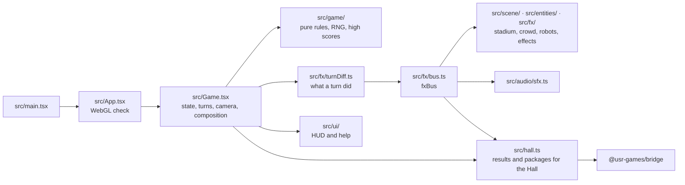
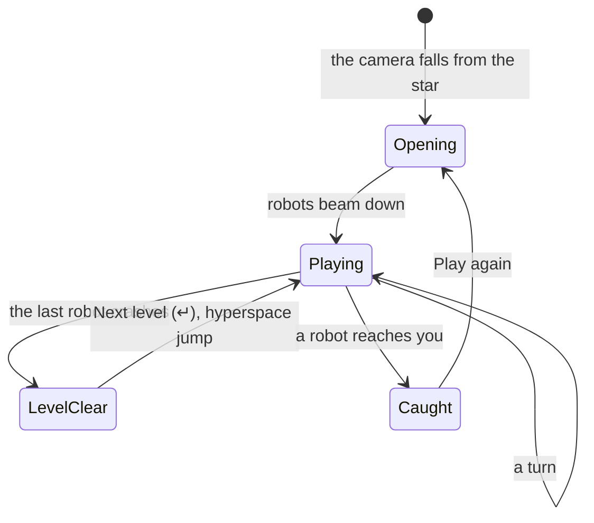

# Robots — architecture

## Overview

Robots is a **hosted** game: the owner’s finished remaster (`robots`, fancy-web-remastered),
adopted as it was into `games/robots/app/`. It is TypeScript, React 18 and react-three-fiber over
three.js, built by its own Vite; the Hall runs the built game in a same-origin frame at
`play/robots/`. The rules live in a small pure engine; everything else is presentation read from
the difference between two game states. The upstream design notes are in
[`../app/docs/architecture.md`](../app/docs/architecture.md) and its decisions in [`adr/`](adr/).

## Module map

| Path                | Responsibility                                                                      |
| ------------------- | ----------------------------------------------------------------------------------- |
| `app/src/game/`     | Rules: grid, robot steps, crashes, teleport, safe wait, levels, high scores         |
| `app/src/fx/`       | The turn reader, the event bus, the visual clock (slow motion), effects, crowd mood |
| `app/src/scene/`    | Sky, glass arena, stadium, crowd, lighting, danger preview                          |
| `app/src/entities/` | Robots, the player and its walk, wrecks                                             |
| `app/src/audio/`    | Web Audio synthesis, driven by the bus                                              |
| `app/src/ui/`       | HUD, help panel, styles, self-hosted fonts (added on adoption)                      |
| `app/src/hall.ts`   | The bridge glue (added on adoption)                                                 |

## State machine

## Engine

`src/game/engine.ts` is the fancy-web engine, rule for rule: a 60×23 field, `min(level × 10, 40)`
robots, robots stepping by the sign of the distance on each axis, crashes into wrecks, a random
teleport, the safe wait and its bonus. It is seeded from the clock (`src/game/rng.ts`); there is no
daily seed. Presentation never feeds back into the rules: `turnDiff.ts` compares two states and
announces what happened on `fxBus`.

## Where visuals are defined

| Visual                                 | Defined in                                                           |
| -------------------------------------- | -------------------------------------------------------------------- |
| Sky, nebula, planet, sun (per sector)  | `app/src/scene/Background.tsx` (`SECTORS`)                           |
| Glass arena, danger squares, pulse     | `app/src/scene/Platform.tsx`                                         |
| Stands, boards, floodlights, far star  | `app/src/scene/Stadium.tsx`, `standsGeometry.ts`, `stadiumLayout.ts` |
| Crowd                                  | `app/src/scene/Crowd.tsx`, `app/src/fx/crowd.ts`                     |
| Robots, player, wrecks                 | `app/src/entities/`                                                  |
| Crashes, teleports, fireworks, rubbish | `app/src/fx/Effects.tsx`, `Fireworks.tsx`, `Trash.tsx`               |
| Post-processing (bloom, vignette…)     | `PostFx` in `app/src/Game.tsx`                                       |
| HUD and cards                          | `app/src/ui/Hud.tsx`, `app/src/ui/remaster.css`                      |
| Quality tiers and reduced motion       | `app/src/fx/store.ts`                                                |

The stadium has one night look and does not read the Hall’s tokens. Software renderers get a
lighter tier automatically.

## Where sounds are defined

Every sound is synthesised in `app/src/audio/sfx.ts` from `fxBus` events (no audio files): the hum,
steps, servos, crashes pitched up a chain, teleports, the crowd, fireworks. Sound is off until the
player presses `m`.

## Hall integration

`app/src/hall.ts` listens to the same bus as the scene and the sound, plus one call from
`Game.tsx` when the run ends.

| Robots moment                        | Bridge message                                                                                                                |
| ------------------------------------ | ----------------------------------------------------------------------------------------------------------------------------- |
| Caught (after the last crashes land) | `result { outcome, score, stats, xpEvents, durationSeconds }`                                                                 |
| A wave cleared                       | packages `first-wave`, `feet-on-the-ground`, `full-house`, `ten-waves`                                                        |
| A wave starts                        | packages `third-wave`, `sixth-wave`                                                                                           |
| A chain of 3, 5 or 8                 | packages `pile-up`, `chain-reaction`, `meltdown`                                                                              |
| Teleport with a robot one step away  | package `close-call`                                                                                                          |
| Final score of 500 or 1,500          | packages `scrap-dealer`, `scrapyard`                                                                                          |
| 6.5 s after loading, once per visit  | `poster` (via `posterFromCanvas`): the stadium, captured by react-three-fiber’s `addAfterEffect` right after a frame is drawn |

`outcome` is `win` when the run cleared at least one wave, else `loss`. `stats` carries
`wavesCleared`, `robotsCrashed`, `bestChain`, `teleports` and `level`; the first two feed the weekly
goals in the manifest. `xpEvents`: `waves-cleared` (5 per wave, at most 25) and `chain-reaction`
(5, for a chain of five or more). Robots has no title screen, so it sends no title-screen signal;
the Hall’s strip carries the ways out. It ignores pause and appearance messages (the game is
turn-based and has one look).

The package joins the pnpm workspace through `games/*/app` and depends on `@usr-games/bridge`
(`workspace:*`). `vite.config.ts` leaves out the modulepreload polyfill (a `fetch` call); the Hall’s
build sets the base to `play/robots/`.

## Tests

| Test                     | Command                                                    | What it proves                                                                       |
| ------------------------ | ---------------------------------------------------------- | ------------------------------------------------------------------------------------ |
| Upstream unit tests (72) | `pnpm run test:hosted` (or `pnpm run test:once` in `app/`) | Rules, turn reading, visual clock, walk, stadium layout                              |
| Type check               | `pnpm run typecheck` in `app/`                             | The game’s own strict TypeScript                                                     |
| In the Hall (5)          | `pnpm exec playwright test -c games/robots`                | Launch, packages, a win reaching the Hall’s save, every way out, no outside requests |
| Screenshots              | `SHOTS=1 pnpm exec playwright test -c games/robots`        | `docs/media/`, on the machine’s GPU                                                  |

Set `HALL_PORT` when the Hall’s usual port (5173) is taken. On its own,
`pnpm --dir games/robots/app dev` serves Robots at `http://localhost:5202/`.

## Kit candidates

None: hosted games talk to the Hall only through the bridge.
