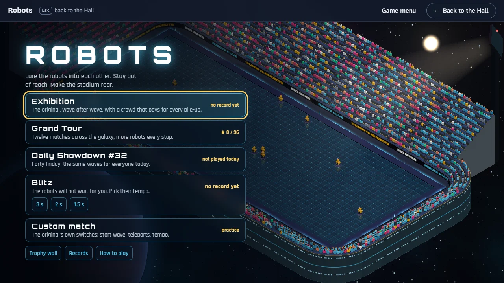
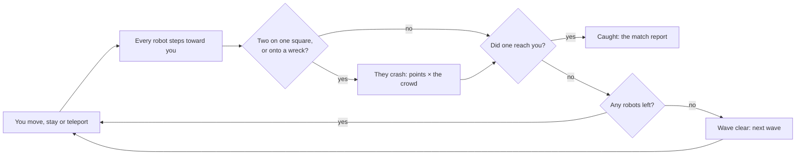
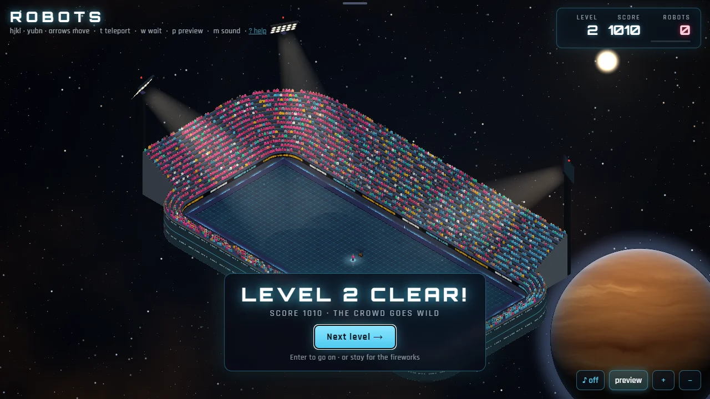
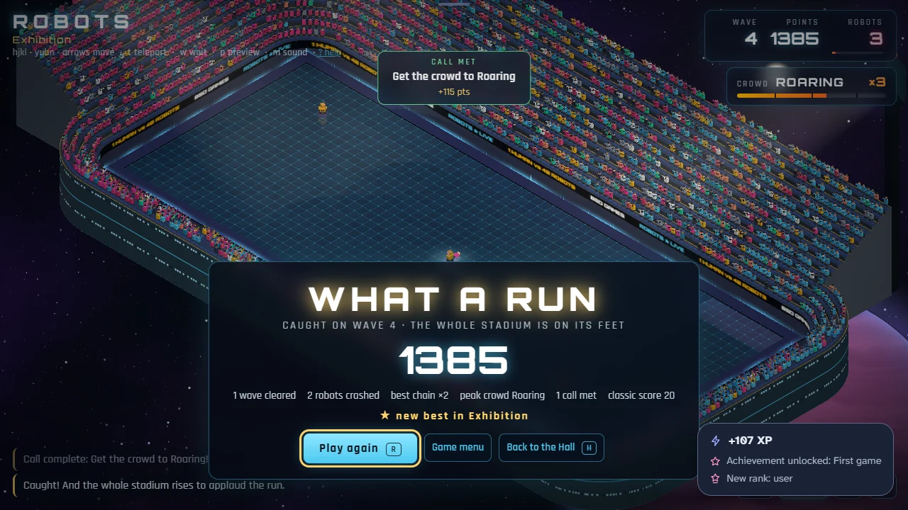

# How to play Robots

## Goal

Lure the robots into each other and stay out of reach. You clear a wave when every robot on the
field has crashed; the run ends when a robot catches you. The stadium pays for every crash, and the
louder the crowd, the more each one is worth.

## Controls

Robots is played with the keyboard; the mouse zooms the camera and works the buttons. Keys are the
game’s own and cannot be remapped from the Hall.

| Action                                | Keyboard                                | Mouse                                       |
| ------------------------------------- | --------------------------------------- | ------------------------------------------- |
| Pick a mode on the game menu          | Tab and Enter                           | Click a mode                                |
| Start the match from its card         | ↵                                       | Start                                       |
| Step one square (eight directions)    | h j k l y u b n, or the number keys 1–9 | —                                           |
| Step one square (four directions)     | ← ↑ → ↓                                 | —                                           |
| Stay where you are for one turn       | `.`, Space or 5                         | —                                           |
| Teleport to a random square           | t                                       | —                                           |
| Wait safely until the wave is decided | w or `>` (any key stops it)             | —                                           |
| Danger preview on or off              | p                                       | preview                                     |
| Sound on or off (off at the start)    | m                                       | ♪                                           |
| Zoom in or out                        | + / −                                   | The wheel, or the + and − buttons           |
| Next wave, after a clear              | ↵                                       | Next wave                                   |
| After a match: next match, again      | ↵ (Grand Tour), R                       | Next match, Play again                      |
| Back to the game menu                 | Esc on the menu’s screens               | Game menu (on the match report)             |
| Help                                  | ?                                       | ? help, or How to play on the menu          |
| Leave for the Hall                    | Esc on the game menu, or H after a run  | Move to the top edge; ← Back to the Hall    |
| Start afresh                          | Tab to the Hall’s strip                 | Move to the top edge; Game menu, then Leave |

## Rules

1. You move one square (or stay, or teleport).
2. Every robot steps one square toward you, diagonally if it can.
3. Two robots on the same square crash and leave a wreck; a robot that steps onto a wreck crashes
   too.
4. If a robot steps onto you, or you step onto a robot or a wreck, the run is over.
5. When the last robot crashes, the wave is clear and the next one beams down.

The safe wait (`w`) plays turns for you while nothing can reach you. Robots that crash while you
wait also add one point each to a wait bonus, paid when the wave is cleared.

## Modes

The game opens on its game menu, over the stadium.

| Mode           | What it is                                                                                                                                                                                                                |
| -------------- | ------------------------------------------------------------------------------------------------------------------------------------------------------------------------------------------------------------------------- |
| Exhibition     | The original: wave after wave, ten more robots each wave up to forty, until you are caught.                                                                                                                               |
| Grand Tour     | Twelve matches with set waves, from ten robots to fifty. Win a match to open the next. Each match has three stars: win it, reach its score target, and meet its own challenge. Some matches limit teleports or keep time. |
| Daily Showdown | The same waves for everyone today, numbered like every daily in the Hall, with one rule bent for the day of the week (below). Your first finished run of the day is the one that counts; play on afterwards for fun.      |
| Blitz          | The robots move every 3, 2 or 1.5 seconds whether you do or not. The original program had this as a hidden switch (`-r`).                                                                                                 |
| Custom match   | Choose the start wave (1–10), the teleports (unlimited, 5, 3, 1 or none), the tempo and whether you may wait. Practice only: custom matches keep no records.                                                              |

### The days of the Showdown

| Day       | Rule                                                        |
| --------- | ----------------------------------------------------------- |
| Monday    | Classic: no twists.                                         |
| Tuesday   | Two teleports for the whole run.                            |
| Wednesday | A wired crowd: hype builds half as fast again.              |
| Thursday  | Blitz: the robots move every 3 seconds.                     |
| Friday    | Straight in at wave 4, forty robots from the first whistle. |
| Saturday  | The stands start at Roaring.                                |
| Sunday    | No waiting.                                                 |

Starting past wave 1 (Friday’s Showdown, or a custom match) pays the original’s bonus of 600 points
when you clear that first wave.

## The crowd and the jumbotron

**Hype.** The meter under the scoreboard is the crowd. Every crash raises it, more along a chain
(crashes on turn after turn), more while you wait, and a little whenever a robot ends a turn right
beside you and you are still standing. A teleport quiets it, and so does a turn with nothing in it.

| Crowd    | From | Each crash is worth |
| -------- | ---- | ------------------- |
| Warm     | 0    | × 1                 |
| Loud     | 25   | × 2                 |
| Roaring  | 50   | × 3                 |
| Showtime | 80   | × 4, and fireworks  |

**Jumbotron calls.** On most waves the big screen calls for something extra: clear the wave
without teleporting, make a chain of four, get the crowd to Roaring, clear it inside so many
turns, crash robots while you wait, survive close calls, or clear it without waiting. Meet the
call for bonus points and a stamp on the **trophy wall**: bronze for the first, silver at five, gold
at fifteen. About one wave in four is quiet. The Grand Tour has no calls; its third star is the
match’s challenge instead.

## The match report

When a run ends the crowd rises to applaud it, and the report shows the points, the waves cleared,
the robots crashed, the best chain, the loudest the crowd got, the calls met and the original’s
own score (ten a robot, without the crowd). It tells you when a run makes your best five for its
mode. A Daily Showdown report can copy a one-line summary to share.

## Settings

The danger preview (`p`) and the sound (`m`) are toggles in the game. It follows your system’s
reduced-motion setting: no camera shake, slow motion, flashes or meter animation, and a shorter
opening. The stadium has a single night look; the Hall’s strip follows the Hall’s light or dark
appearance.

## Records

On this device the game keeps the best five runs of Exhibition, of Blitz and of the Showdowns,
the stars of every Grand Tour match, the last sixty Showdowns and the trophy wall’s stamps; the
Records screen shows them. The Hall records your best score and counts waves, crashes and calls
for weekly goals.

## Achievements (packages)

| Package              | How to earn it                                   |
| -------------------- | ------------------------------------------------ |
| `first-wave`         | Clear your first wave of robots.                 |
| `pile-up`            | Crash three robots in a single chain.            |
| `close-call`         | Teleport away when a robot is one step from you. |
| `third-wave`         | Reach the third wave of a run.                   |
| `feet-on-the-ground` | Clear a wave without teleporting once.           |
| `showtime`           | Get the crowd all the way to Showtime.           |
| `chain-reaction`     | Crash five robots in a single chain.             |
| `full-house`         | Clear a wave of forty robots.                    |
| `daily-showdown`     | Play a Daily Showdown to the end.                |
| `blitz-wave`         | Clear a wave while the robots move on their own. |
| `meltdown`           | Crash eight robots in a single chain.            |
| `grand-final`        | Win the last match of the Grand Tour.            |

A chain is the game’s own counter: crashes on consecutive turns add up until a turn passes with
none.

## XP

Each finished run reports to the Hall. A Grand Tour match is a win or a loss; any other run that
cleared at least one wave counts as a win (the original never ends in victory, so clearing a wave
is the win). Your first Showdown of the day reports as that day’s daily challenge. On top of the
session’s XP, a run earns 5 XP per wave cleared (up to 25), 8 for a Grand Tour match won and 3 per
jumbotron call met (up to 9); the Hall caps a session’s extras at 30. Weekly goals can ask you to
clear waves, crash robots or meet calls.

## Tips

- Stand still more than you think. Robots close in faster than they line up, and staying put lets
  two of them meet.
- Keep a wreck between you and a crowd: everything that follows you into it crashes.
- Teleport is a gamble, and the crowd hates it; use it before you are cornered, not after.
- Build hype before the big pile-up: crashes pay at the volume the crowd had before the turn.
- Turn the danger preview on while you learn: a red square is one you must not end your turn on.
