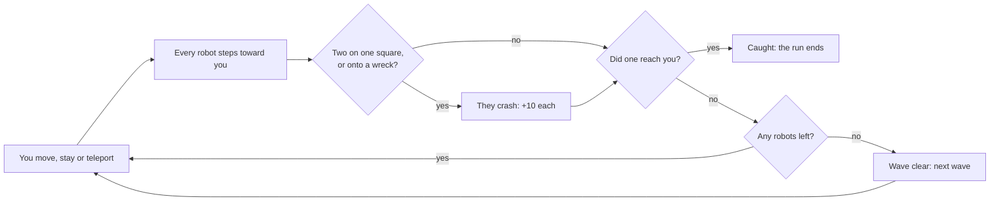

# How to play Robots

## Goal

Survive as many waves as you can. You clear a wave when every robot on the field has crashed; the
run ends when a robot catches you. Your score is ten points for every robot you wreck.

## Controls

Robots is played with the keyboard; the mouse zooms the camera and works the buttons. Keys are the
game’s own and cannot be remapped from the Hall.

| Action                                | Keyboard                                | Mouse                                       |
| ------------------------------------- | --------------------------------------- | ------------------------------------------- |
| Step one square (eight directions)    | h j k l y u b n, or the number keys 1–9 | —                                           |
| Step one square (four directions)     | ← ↑ → ↓                                 | —                                           |
| Stay where you are for one turn       | `.`, Space or 5                         | —                                           |
| Teleport to a random square           | t                                       | —                                           |
| Wait safely until the wave is decided | w or `>` (any key stops it)             | —                                           |
| Danger preview on or off              | p                                       | preview                                     |
| Sound on or off (off at the start)    | m                                       | ♪                                           |
| Zoom in or out                        | + / −                                   | The wheel, or the + and − buttons           |
| Next wave, after a clear              | ↵                                       | Next level                                  |
| Play again, after being caught        | —                                       | Play again                                  |
| Help                                  | ?                                       | ? help                                      |
| Leave for the Hall                    | Tab to the Hall’s strip                 | Move to the top edge; ← Back to the Hall    |
| Start a new run                       | Tab to the Hall’s strip                 | Move to the top edge; Game menu, then Leave |

## Rules

1. You move one square (or stay, or teleport).
2. Every robot steps one square toward you, diagonally if it can.
3. Two robots on the same square crash and leave a wreck; a robot that steps onto a wreck crashes
   too. Each crash is worth ten points.
4. If a robot steps onto you, or you step onto a robot or a wreck, the run is over.
5. When the last robot crashes, the wave is clear; the next one brings ten more robots, up to forty.

The safe wait (`w`) plays turns for you while nothing can reach you. Robots that crash while you
wait also add one point each to a wait bonus, paid when the wave is cleared.

## Modes

One mode: an endless run of waves. Robots has no daily challenge.

## Settings

The danger preview (`p`) and the sound (`m`) are toggles in the game. It follows your system’s
reduced-motion setting: no camera shake, slow motion or flashes, and a shorter opening. The stadium
has a single night look; the Hall’s strip follows the Hall’s light or dark appearance.

## Scoring

Ten points for each robot that crashes, plus the wait bonus. The game keeps its own top ten on this
device; the Hall records your best score and counts waves and crashes for weekly goals.

## Achievements (packages)

| Package              | How to earn it                                   |
| -------------------- | ------------------------------------------------ |
| `first-wave`         | Clear your first wave of robots.                 |
| `pile-up`            | Crash three robots in a single chain.            |
| `close-call`         | Teleport away when a robot is one step from you. |
| `third-wave`         | Reach the third wave in one run.                 |
| `feet-on-the-ground` | Clear a wave without teleporting once.           |
| `scrap-dealer`       | Score 500 points in one run.                     |
| `chain-reaction`     | Crash five robots in a single chain.             |
| `full-house`         | Clear a wave of forty robots.                    |
| `sixth-wave`         | Reach the sixth wave in one run.                 |
| `scrapyard`          | Score 1,500 points in one run.                   |
| `meltdown`           | Crash eight robots in a single chain.            |
| `ten-waves`          | Clear ten waves in one run.                      |

A chain is the game’s own counter: crashes on consecutive turns add up until a turn passes with
none.

## XP

Each finished run reports to the Hall. A run that cleared at least one wave counts as a win (the
original never ends in victory, so clearing a wave is the win). On top of the session’s XP, the run
earns 5 XP per wave cleared (up to 25) and 5 more for a chain of five or longer; the Hall caps a
session’s extras at 30. Weekly goals can ask you to clear a number of waves or crash a number of
robots.

## Tips

- Stand still more than you think. Robots close in faster than they line up, and staying put lets
  two of them meet.
- Keep a wreck between you and a crowd: everything that follows you into it crashes.
- Teleport is a gamble; use it before you are cornered, not after.
- Turn the danger preview on while you learn: a red square is one you must not end your turn on.
