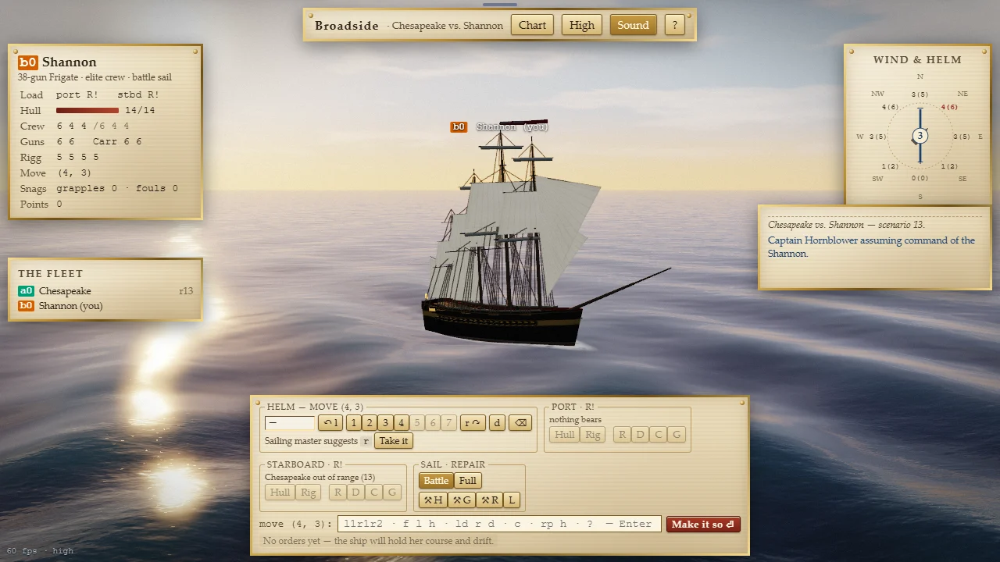

# Broadside

> Command a wooden warship in the age of sail.

## The hook

You command one wooden warship in a sea fight of the age of sail. Each turn you set the helm
against the wind, choose what to load and which side to fire, then give the order to make it so and
watch the turn play out: guns ripple down the side, smoke rolls away downwind, a mast goes over the
side. The moment every captain waits for is the rake: you cross an enemy’s stern, and your whole
broadside runs down the length of her decks.

## Where it comes from

`sail` is Dave Riggle’s computer version of a board game of fighting sail designed by S. Craig
Taylor. He wrote the first version on a PDP-11/70 in the autumn of 1980 and had it working by 1981.
Ed Wang made its angle arithmetic more correct that same year and rebuilt the program almost from
scratch in 1983; Craig Leres made it portable. On a terminal, several people could fight the same
battle: each ran a player program, a separate driver moved the world, and they shared a file that
was brought up to date about every seven seconds. Ships were two-character marks on the screen,
orders were short strings like `r1l2`, and the game kept a log of the ten best captains across its
thirty-two scenarios.

## What is new

- A living sea drawn entirely in code: rolling waves, a sky and weather that follow the game’s wind,
  and procedurally built hulls, sails, rigging and flags. There is not a single picture file.
- Every turn plays back as a short film you can skip, and everything in it is something the rules
  decided: shot holes splinter the hull and smoke, sails are holed and torn as the rigging is shot
  away, a topgallant goes and then the mast, guns knocked off their carriages leave empty ports, a
  battered hull settles and lists, and a ship that strikes hauls down her flag.
- Hulls fitted out as period warships: raised wales along the sheer, red-lined gun-port lids,
  anchors catted at the bow, head rails and a gilded figurehead, stern windows lit at dusk.
- A career: the Sea Service’s ten actions take you from midshipman to admiral, each with a briefing
  and three commendations to earn; a Daily Engagement that every captain fights the same day, with a
  weekday standing order and a share line; and a service record.
- Orders by button or by the original typed grammar, a wind rose that shows how far you can sail on
  every heading, and a sailing master who suggests a course.
- A chart view with range rings, firing arcs and the path of the helm you are typing.
- One captain against the computer’s captains, with a clear end: victory, defeat, nightfall or the
  hurricane.
- Twenty-two actions, each staged with its own light and weather: golden evenings, gales, tropical
  seas, moonlit night actions, grey winter seas and two battles on lakes.
- Sound made in code: wind and sea that rise with the weather, and cannon that boom a moment after
  the flash when the firing ship is far away.

## At a glance

|                 |                               |
| --------------- | ----------------------------- |
| Directory       | `/usr/games/strategy`         |
| Players         | 1                             |
| Session         | 15–40 minutes                 |
| Daily challenge | yes, the Daily Engagement     |
| Inspired by     | `sail` (1980, per its manual) |

## More

- [How to play](HOW-TO-PLAY.md)
- [Changes from the original](CHANGES-FROM-ORIGINAL.md)
- [Architecture](ARCHITECTURE.md)
- [Notes](NOTES.md)
