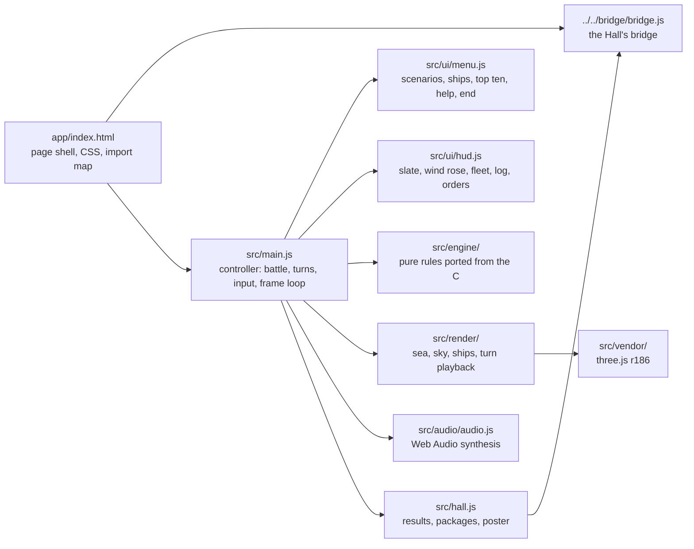
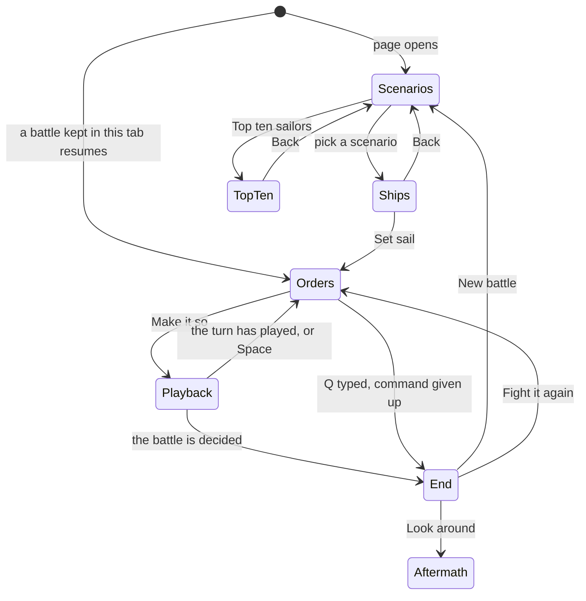

# Broadside — architecture

## Overview

Broadside is a **hosted** game: the finished port the owner built earlier (`sail`, fancy-web),
adopted as it was into `games/sail/app/` and run by the Hall in a same-origin frame at `play/sail/`.
It is plain ES modules with no build step, drawn in WebGL 2 through three.js r186, which is vendored
in `app/src/vendor/` and mapped to `three` by an import map in `index.html`. It uses no web fonts
(system serif and monospace stacks) and synthesises every sound. The rules are a pure engine ported
from the C, about 2,700 lines with the generated data tables; everything else shows what the engine
decided. The upstream design notes are kept in
[`../app/docs/architecture.md`](../app/docs/architecture.md) and its decisions in [`adr/`](adr/).

## Module map

| Path                             | Responsibility                                                                                                                                                                                            |
| -------------------------------- | --------------------------------------------------------------------------------------------------------------------------------------------------------------------------------------------------------- |
| `app/index.html`                 | The page: canvas, panels, overlays, all CSS (parchment and brass, no images), the import map                                                                                                              |
| `app/src/main.js`                | The controller: owns the engine state and this turn’s orders, runs a turn, drives camera and HUD                                                                                                          |
| `app/src/engine/`                | Rules, data, command-line grammar, top ten, sailing master; no DOM, clock or `Math.random`                                                                                                                |
| `app/src/render/`                | The three.js world, procedural ships, effects, the turn playback, camera director, chart                                                                                                                  |
| `app/src/ui/`                    | HUD panels (`hud.js`) and the overlays: scenario list, ship choice, top ten, help, end (`menu.js`)                                                                                                        |
| `app/src/audio/`                 | Synthesised ambience and one-shots, positioned and delayed by distance                                                                                                                                    |
| `app/src/hall.js`                | The bridge glue (added on adoption)                                                                                                                                                                       |
| `app/lab.html`, `app/src/lab.js` | A developer’s visual bench of isolated sea and ship scenes; the site build leaves `lab.html` out (`isAdoptedWorkbench` in `scripts/lib/hosted.ts`, ADR 0011), and nothing on the game page loads `lab.js` |
| `app/scripts/`                   | Developer tools: static server, screenshot and browser-flow scripts, the raster check, the data extractor                                                                                                 |

## State machine

`Scenarios` is the game menu: while it is open `hall.js` tells the Hall the game is on its title
screen. `Ships` and `TopTen` are drawn in the same overlay (`#menu`) but are steps inside the game.
`Aftermath` is the final scene with the end screen closed; nothing in the game leads on from it,
so the Hall’s Game menu does (see [`docs/KNOWN-ISSUES.md`](../../../docs/KNOWN-ISSUES.md)). A battle
in progress is saved to `sessionStorage` after every turn so that the quality switch, which reloads
the page, carries on where it was.

## Engine

`resolveTurn(state, orders)` in `src/engine/turn.js` is the entry point. It never changes its input:
it returns a new state and an ordered list of events (`fire`, `move`, `strike`, `capture`, `sink`,
`explode`, `wind`, `msg` and others). Inside, the human orders are applied first (grapples, sails,
boarders, fire, unload, load, helm, repair), then the original driver’s tick runs in its own order
(`next`, `unfoul`, `checkup`, `prizecheck`, `moveall`, `thinkofgrapples`, `boardcomp`,
`compcombat`, `resolve`, `reload`, `checksails`), then each human’s end of turn and `checkEnd`, the
port’s end rule ([ADR 003](adr/003-v1-scope.md)). Every module header cites the C functions and
`file:line` ranges it ports; the fixes to the C are in [ADR 004](adr/004-rules-fidelity.md).

The whole battle is one JSON object with its random number state inside (`rng.js`), so a battle
can be saved, replayed and compared in tests. `main.js` picks a seed for each battle (`?seed=` fixes
it); Fight it again reuses it. `data.js` (32 scenarios, 84 ship specifications, the wind, hit,
damage and melee tables) is generated by `scripts/extract-data.mjs` from the original `globals.c`.
`commands.js` parses the command line and holds the staging list (`FEATURED`, `STAGED`, each with
its mood). `scoreboard.js` ranks the top ten by net points.

## AI

The computer captains are the original driver’s. Each turn `closeon` (in `movement.js`, from
`dr_2.c`) runs a depth-first search over the helm strings the ship’s allowance permits and keeps the
one with the best score against the nearest enemy; the search ignores the drift rule, as the C does.
They fire double shot every turn when a target bears, never unload or repair, and set full sails
only while the nearest enemy is more than nine squares away (`checksails`). Grapples and boarding
come from `thinkofgrapples` and `boardcomp`. The sailing master (`hints.js`) runs the same search
for the player’s ship and only suggests. There is no difficulty setting; the search is bounded by
the allowance, not by time.

## Where visuals are defined

| Visual                                                          | Defined in                                                             |
| --------------------------------------------------------------- | ---------------------------------------------------------------------- |
| Waves (the Gerstner field, also sampled on the CPU for ships)   | `app/src/render/waves.js`                                              |
| Sea surface: reflections, foam, glitter, wakes, haze            | `app/src/render/ocean.js`                                              |
| Sky, clouds, sun and moon                                       | `app/src/render/sky.js`, `glsl.js` (one `skyColor` for sky and sea)    |
| Moods (time of day, palette, stars, lake shore) and storm light | `MOODS` in `app/src/render/atmosphere.js`                              |
| Which scenario gets which mood                                  | `FEATURED` and `STAGED` in `app/src/engine/commands.js`                |
| Rain                                                            | `app/src/render/weather.js`                                            |
| Hulls: loft, paint per nation, gun ports, shot holes, fire      | `app/src/render/hull.js` (`CLASS_DIM`, `PAINT`)                        |
| Masts, yards, sails, rigging                                    | `app/src/render/rig.js` ([ADR 005](adr/005-ship-rigging-and-masts.md)) |
| Ensigns                                                         | `app/src/render/flags.js` (`PAINTERS`)                                 |
| A ship kept in step with its engine state                       | `app/src/render/ship.js`                                               |
| Smoke, flashes, splinters, spray, fire, debris                  | `app/src/render/fx.js`                                                 |
| Turn playback: events into timed beats                          | `app/src/render/fleet.js`                                              |
| Camera shots, orbit, chart camera                               | `app/src/render/camera.js`                                             |
| Chart: grid, range rings, arcs, helm path, nation colours       | `app/src/render/tactical.js` (`NATION_COLOR`)                          |
| Bloom, tone mapping, grade, vignette, grain                     | `app/src/render/post.js`                                               |
| Renderer, lights, quality tiers                                 | `app/src/render/world.js`                                              |
| Captions during playback                                        | `onBeat` and `fireCaption` in `app/src/main.js`                        |
| Panels, buttons, type, colours                                  | The `<style>` block in `app/index.html` (custom properties on `:root`) |
| Panel content                                                   | `app/src/ui/hud.js`, `app/src/ui/menu.js`                              |

Every visual is keyed to an engine value: masts fall when their rigging counter reaches zero, the
lower ports shut when the engine applies the heavy-seas penalty, smoke drifts down the engine’s
wind. Broadside has one look and does not read the Hall’s tokens. Reduced motion is read once at
start from the system (`prefers-reduced-motion`, or `?reduced=1`); it skips the opening sweep,
speeds the playback, blends instead of cutting and turns off camera shake. The Low quality tier
halves the ocean grid, drops shadows and multisampling, and cuts the particle budgets.

## Where sounds are defined

Everything is synthesised in `app/src/audio/audio.js` (no audio files): looping wind, sea, a
rigging whistle from a gale up, and rain, all following the engine’s wind; one-shots for cannon,
impacts, splashes, explosions, a ship foundering, the bell, musketry, creaking timber and thunder.
One-shots are panned and filtered by distance from the camera and delayed by the speed of sound.
Sound starts with the first key or click and is on by default; M mutes it and the choice is
remembered (`broadside.muted` in `localStorage`).

## Hall integration

All of it lives in `app/src/hall.js`, plus the bridge script tag in `index.html` and one import and
four calls in `main.js`.

| Broadside moment                                                   | Bridge message                                                                                        |
| ------------------------------------------------------------------ | ----------------------------------------------------------------------------------------------------- |
| The scenario list is open (`#menu.open` holding `[data-sc]` cards) | `title-screen { active: true }`; `false` for the ship choice, the top ten and the battle              |
| One of your broadsides fires (a `fire` event from your ship)       | `achievement open-fire`; `down-her-length` when it rakes; `stern-rake` when it rakes from astern      |
| An enemy strikes to your guns (`strike` by your ship)              | `achievement colours-come-down`; `a-brace-of-prizes` at the second ship taken                         |
| You capture a ship by boarding (`capture` by your ship)            | `achievement prize-crew`; `a-brace-of-prizes` at the second ship taken                                |
| The battle ends (the top of `endBattle`)                           | `result { outcome, score, stats, xpEvents, durationSeconds }`, then the end packages below            |
| A win                                                              | `the-day-is-yours`; `heavy-weather` if the wind is 5 or more; `line-of-battle` with ten ships or more |
| Any end but giving up                                              | `see-it-through`                                                                                      |
| Seven seconds into the first battle, right after a frame is drawn  | `poster` from `#scene` (`posterFromCanvas`), once per page load                                       |

`outcome` comes from the engine’s `st.result.reason`: `victory` is `win`; `captured`, `lost` (sunk
or blown up) and `struck` are `loss`; `nightfall` and `hurricane` are `draw`; `quit` (the typed `Q`
or `quit`) is `quit`, which earns no XP. Any other reason would report `complete`; none occurs with
a human aboard. `score` is the player’s ship points, never below zero. `stats` carries `shipsTaken`,
`broadsidesFired` and `turns`; the first two feed the weekly goals in the manifest. `xpEvents`:
`ships-taken`, 8 per ship taken, at most 25. Before any battle the Hall shows its own key art for
the game.

The Hall’s Game menu reloads the frame. Because the game restores a battle from `sessionStorage`
(`broadside.battle`) on load, `hall.js` removes that saved battle when the page load is a reload
inside the Hall (`PerformanceNavigationTiming` type `reload`), before `main.js` reads it, so Game
menu brings back the scenario list. The quality switch is a navigation, not a reload, so it still
resumes the battle. Broadside ignores the Hall’s pause, appearance and settings messages: it is
turn-based and waits for the player anyway, it has one look, and it keeps its own sound switch.
Opened on its own, the bridge script is missing and `hall.js` does nothing.

## Tests

| Test                     | Command                                           | What it proves                                                                                                                                                                                                                                                                                 |
| ------------------------ | ------------------------------------------------- | ---------------------------------------------------------------------------------------------------------------------------------------------------------------------------------------------------------------------------------------------------------------------------------------------- |
| Upstream unit tests (44) | `pnpm run test:hosted` (or `pnpm test` in `app/`) | `node:test`: geometry truth tables, the canonical scenarios at engine level, determinism and save/continue, every scenario ending under computer play                                                                                                                                          |
| In the Hall (8)          | `pnpm exec playwright test -c games/sail`         | Opens on the scenario list with no outside requests; Escape closes the help opened over it and stays in the game; giving up command reports the battle (a quit); Game menu during a battle returns to the scenario list; Back to the Hall; Game menu; browser Back; Escape on the title screen |
| Screenshots              | `SHOTS=1 pnpm exec playwright test -c games/sail` | `docs/media/` (title, play, signature) at 1280×720, staged with the game’s own `?scenario`, `?ship`, `?seed`, `?stage`, `?auto` and `?readyAt` parameters                                                                                                                                      |

The in-Hall suites run on the machine’s GPU on Windows (`GPU_LAUNCH_ARGS` in
`packages/bridge/testing/shots.ts`); with software WebGL they took minutes longer. Set `HALL_PORT`
when the Hall’s usual port (5173) is taken. On its own, `pnpm --dir games/sail/app serve` serves
Broadside at `http://localhost:5205/`. The upstream browser scripts (`scripts/ui-smoke.mjs`,
`scripts/ui-flows.mjs`) and the raster check (`pnpm run check:raster` in `app/`) came with the game
and are kept as its own tools.

## Kit candidates

None: hosted games talk to the Hall only through the bridge.
