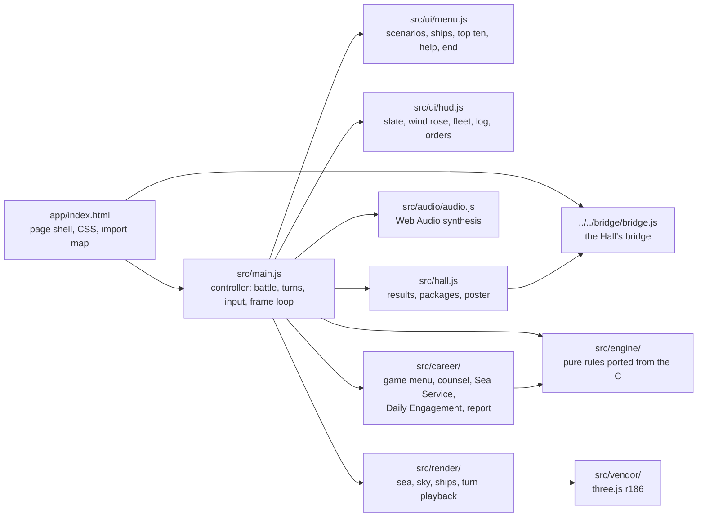
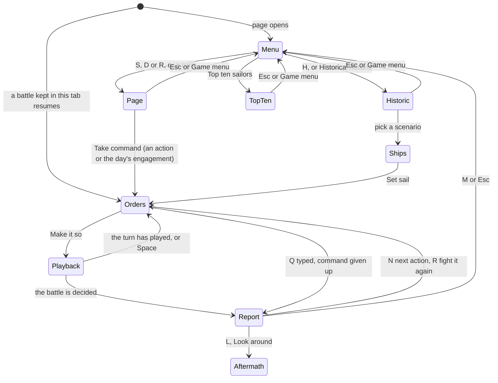

# Broadside — architecture

## Overview

Broadside is a **hosted** game: the finished port the owner built earlier (`sail`, fancy-web),
adopted as it was into `games/sail/app/` and run by the Hall in a same-origin frame at `play/sail/`.
It is plain ES modules with no build step, drawn in WebGL 2 through three.js r186, which is vendored
in `app/src/vendor/` and mapped to `three` by an import map in `index.html`. It uses no web fonts
(system serif and monospace stacks) and synthesises every sound. The rules are a pure engine ported
from the C, about 2,700 lines with the generated data tables; everything else shows what the engine
decided. The game menu and its career (`app/src/career/`, added on 2026-10-02) wrap the engine in
the Sea Service, the Daily Engagement and a service record without changing a rule. The upstream
design notes are kept in
[`../app/docs/architecture.md`](../app/docs/architecture.md) and its decisions in [`adr/`](adr/).

## Module map

| Path                             | Responsibility                                                                                                                                                                                                                                                                                                    |
| -------------------------------- | ----------------------------------------------------------------------------------------------------------------------------------------------------------------------------------------------------------------------------------------------------------------------------------------------------------------- |
| `app/index.html`                 | The page: canvas, panels, overlays, all CSS (parchment and brass, no images), the import map                                                                                                                                                                                                                      |
| `app/src/main.js`                | The controller: owns the engine state and this turn’s orders, runs a turn, drives camera and HUD                                                                                                                                                                                                                  |
| `app/src/engine/`                | Rules, data, command-line grammar, top ten, sailing master; no DOM, clock or `Math.random`                                                                                                                                                                                                                        |
| `app/src/render/`                | The three.js world, procedural ships, effects, the turn playback, camera director, chart                                                                                                                                                                                                                          |
| `app/src/ui/`                    | HUD panels (`hud.js`) and the overlays: scenario list, ship choice, top ten, help, end (`menu.js`)                                                                                                                                                                                                                |
| `app/src/audio/`                 | Synthesised ambience and one-shots, positioned and delayed by distance                                                                                                                                                                                                                                            |
| `app/src/hall.js`                | The bridge glue (added on adoption)                                                                                                                                                                                                                                                                               |
| `app/src/career/`                | The game menu and its pages (`deck.js`), the first lieutenant's counsel (`counsel.js`) and its autopilot, the Sea Service (`service.js`), the Daily Engagement (`daily.js`), commendations, the logbook, ranks, plans, settling and saving progress, and the strip, counsel panel and battle report (`report.js`) |
| `app/lab.html`, `app/src/lab.js` | A developer’s visual bench of isolated sea and ship scenes; the site build leaves `lab.html` out (`isAdoptedWorkbench` in `scripts/lib/hosted.ts`, ADR 0011), and nothing on the game page loads `lab.js`                                                                                                         |
| `app/scripts/`                   | Developer tools: static server, screenshot and browser-flow scripts, the raster check, the data extractor                                                                                                                                                                                                         |

## State machine

The game menu's first page (`career/deck.js`, marked `data-deck="menu"`) is the title screen: while
it is open `hall.js` tells the Hall the game is on its title screen, so Escape there leads home. Its
other pages, the historical actions, the ship choice and the top ten are drawn in the same overlay
(`#menu`) and keep Escape for going back. `Aftermath` is the final scene with the report closed;
nothing in the game leads on from it, so the Hall's Game menu does (see
[`docs/KNOWN-ISSUES.md`](../../../docs/KNOWN-ISSUES.md)). A battle in progress is saved to
`sessionStorage` after every turn, with its plan and logbook, so that the quality switch, which
reloads the page, carries on where it was.

## The game menu and the career

A battle is a **plan** (`career/plans.js`): the scenario, the player's ship, the seed, the name on
screen and its commendations. The Sea Service's plans come from `service.js` (ten actions with fixed
seeds), the day's engagement from `daily.js` (the date picks one of twelve duels and its seed), and
the historical actions make a free plan with a random seed. `main.js` keeps the plan for the whole
battle, so Fight it again is the same plan once more.

Every resolved turn goes through the **logbook** (`logbook.js`): broadsides, rakes and stern rakes,
ships struck to your guns, prizes taken by boarding, repair orders, the lowest hull and whether a
mast was ever lost. Commendations (`commendations.js`) are judged against it and the final state
when the battle ends, and only on a win; mid-battle their status feeds the strip under the top bar.
`progress.js` settles a finished battle into the saved progress, under `usr-games:sail:` in the
collection's `{ v, data }` envelope, so the Hall's “Forget everything” clears it: `service` (per
action: won, three stars), `engagements` (per date: number, won, rating, stars, turns; only the
first battle of a day, however it ended) and `record` (battles, victories, prizes, broadsides,
rakes, engagements). The top ten keeps its own key.

**The first lieutenant's counsel** (`counsel.js`) gives a full set of orders for the player's ship
each turn, with a reason for each: board a much weaker crew alongside, fire every broadside that
bears (at the hull when it can be aimed, else the rigging), reload with round shot, full sails beyond
nine squares and battle sails inside them, and the sailing master's helm. Its tactics were tuned by
playing every staged scenario from every ship over 30 seeds (`NOTES.md`). It is a testing aid kept
out of sight: no button and no help line mention it; Ctrl+Alt+C shows or hides its panel, and
`?counsel=1` opens it at start. Its “Give these orders” button fills in the turn's orders.

**Winnable by design.** `autopilot.js` plays a battle by the counsel alone. The Sea Service's seeds
were chosen with `app/scripts/counsel-sweep.mjs` among the counsel's wins, and each day's engagement
is the first of the date's seeds (FNV-1a of `sail:daily:<date>`, then +1, +2…) that the counsel
wins, a few milliseconds a try, cached for the visit. The engine is deterministic, so a captain who
gives the counsel's orders every turn replays the proof exactly; the in-browser walkthrough did,
winning the first action on turn 10 as the autopilot does.

URL options for captures and tests: `mission=<action id>` or `mission=daily` (with `day=YYYY-MM-DD`)
starts that battle, and `auto=N&autoorders=counsel` plays N turns by the counsel.

## Engine

`resolveTurn(state, orders)` in `src/engine/turn.js` is the entry point. It never changes its input:
it returns a new state and an ordered list of events (`fire`, `move`, `strike`, `capture`, `sink`,
`explode`, `wind`, `msg` and others). Inside, the human orders are applied first (grapples, sails,
boarders, fire, unload, load, helm, repair), then the original driver’s tick runs in its own order
(`next`, `unfoul`, `checkup`, `prizecheck`, `moveall`, `thinkofgrapples`, `boardcomp`,
`compcombat`, `resolve`, `reload`, `checksails`), then each human’s end of turn and `checkEnd`, the
port’s end rule ([ADR 003](adr/003-v1-scope.md)). Every module header cites the C functions and
`file:line` ranges it ports; the fixes to the C are in [ADR 004](adr/004-rules-fidelity.md).

The whole battle is one JSON object with its random number state inside (`rng.js`), so a battle
can be saved, replayed and compared in tests. `main.js` picks a seed for each battle (`?seed=` fixes
it); Fight it again reuses it. `data.js` (32 scenarios, 84 ship specifications, the wind, hit,
damage and melee tables) is generated by `scripts/extract-data.mjs` from the original `globals.c`.
`commands.js` parses the command line and holds the staging list (`FEATURED`, `STAGED`, each with
its mood). `scoreboard.js` ranks the top ten by net points.

## AI

The computer captains are the original driver’s. Each turn `closeon` (in `movement.js`, from
`dr_2.c`) runs a depth-first search over the helm strings the ship’s allowance permits and keeps the
one with the best score against the nearest enemy; the search ignores the drift rule, as the C does.
They fire double shot every turn when a target bears, never unload or repair, and set full sails
only while the nearest enemy is more than nine squares away (`checksails`). Grapples and boarding
come from `thinkofgrapples` and `boardcomp`. The sailing master (`hints.js`) runs the same search
for the player’s ship and only suggests. There is no difficulty setting; the search is bounded by
the allowance, not by time.

## Where visuals are defined

| Visual                                                          | Defined in                                                             |
| --------------------------------------------------------------- | ---------------------------------------------------------------------- |
| Waves (the Gerstner field, also sampled on the CPU for ships)   | `app/src/render/waves.js`                                              |
| Sea surface: reflections, foam, glitter, wakes, haze            | `app/src/render/ocean.js`                                              |
| Sky, clouds, sun and moon                                       | `app/src/render/sky.js`, `glsl.js` (one `skyColor` for sky and sea)    |
| Moods (time of day, palette, stars, lake shore) and storm light | `MOODS` in `app/src/render/atmosphere.js`                              |
| Which scenario gets which mood                                  | `FEATURED` and `STAGED` in `app/src/engine/commands.js`                |
| Rain                                                            | `app/src/render/weather.js`                                            |
| Hulls: loft, paint per nation, gun ports, shot holes, fire      | `app/src/render/hull.js` (`CLASS_DIM`, `PAINT`)                        |
| Wales, catheads and anchors, head rails, figurehead, deadeyes   | `app/src/render/fittings.js`                                           |
| The stern's carved work: taffrail, window frames, name board    | `app/src/render/stern.js` (painted on a canvas, also the bump map)     |
| The people on deck: gun crews, hands, officers                  | `app/src/render/crew.js` (one instanced mesh a ship, shader-animated)  |
| Boats pulling away, floating wreckage                           | `app/src/render/wreckage.js` (world space, cleared with each battle)   |
| Masts, yards, sails, rigging                                    | `app/src/render/rig.js` ([ADR 005](adr/005-ship-rigging-and-masts.md)) |
| Ensigns                                                         | `app/src/render/flags.js` (`PAINTERS`)                                 |
| A ship kept in step with its engine state                       | `app/src/render/ship.js`                                               |
| Smoke, flashes, splinters, spray, fire, debris                  | `app/src/render/fx.js`                                                 |
| Turn playback: events into timed beats                          | `app/src/render/fleet.js`                                              |
| Camera shots, orbit, chart camera                               | `app/src/render/camera.js`                                             |
| Chart: grid, range rings, arcs, helm path, nation colours       | `app/src/render/tactical.js` (`NATION_COLOR`)                          |
| Bloom, tone mapping, grade, vignette, grain                     | `app/src/render/post.js`                                               |
| Renderer, lights, quality tiers                                 | `app/src/render/world.js`                                              |
| Captions during playback                                        | `onBeat` and `fireCaption` in `app/src/main.js`                        |
| Panels, buttons, type, colours                                  | The `<style>` block in `app/index.html` (custom properties on `:root`) |
| Panel content                                                   | `app/src/ui/hud.js`, `app/src/ui/menu.js`                              |

Every visual is keyed to an engine value: masts fall when their rigging counter reaches zero, the
lower ports shut when the engine applies the heavy-seas penalty, smoke drifts down the engine’s
wind. Damage shows the same way (`ShipVisual.sync` in `ship.js`): shot holes with splintered rims in
proportion to the hull points lost (holes seen being made count towards them), thin smoke from those
holes below two-thirds of the hull, the hull settling and listing as it takes water, empty ports
with their lids gone for every gun lost on that side, round shot holes and rents in the sails as the
rigging counter falls, the topgallant mast gone at a third and a yard hanging sprung below
three-fifths. The people on deck follow the crew counters: fewer of them as the crew falls (never
shown falling), nobody running once the ship has struck, and the gun crews of a side leaning back
from their guns as it fires. They are one instanced mesh per ship, animated in the vertex shader,
with no shadow; Low puts half as many on deck, reduced motion stands them still, and `?crew=0`
leaves the decks empty for measuring.

A ship that is sinking or on fire is abandoned at once: her crew leave the deck and her boats
(one to three by size, each with four or five rowers) pull away from both sides; nobody is shown in
the water. When the engine sends her down she goes under in eight seconds, rolling onto her low side
with her masts going over one by one and air bursting up along her length; her wreckage (planks, a
spar, casks, gratings) spreads, drifts downwind and sinks after about two minutes, and the sea where
she was stays churned white for 24 seconds (a fading wake in the ocean shader). A ship that blows up
leaves charred wreckage the same way. The cinematic holds on a foundering ship for 6.5 s, and when a
ship is lost in the deciding turn the camera stays on the wreck, letterboxed and captioned, until
she is gone plus 3.5 s before the report opens; Space, Esc or Enter skips it. Broadside has one look and does not read the Hall’s tokens. Reduced motion is read at
start from the system (`prefers-reduced-motion`, or `?reduced=1`) and, in the Hall, follows the
Hall’s setting live (`?reduced=1` still wins); it skips the opening sweep, speeds the playback,
blends instead of cutting and turns off camera shake. The Low quality tier
halves the ocean grid, drops shadows and multisampling, and cuts the particle budgets.

## Where sounds are defined

Everything is synthesised in `app/src/audio/audio.js` (no audio files): looping wind, sea, a
rigging whistle from a gale up, and rain, all following the engine’s wind; one-shots for cannon,
impacts, splashes, explosions, a ship foundering, the bell, musketry, creaking timber and thunder.
One-shots are panned and filtered by distance from the camera and delayed by the speed of sound.
Sound starts with the first key or click and, on its own, is on by default; M mutes it and the
choice is remembered (`broadside.muted` in `localStorage`). In the Hall the Hall’s sound wins:
silent while the Hall is muted, otherwise the master level (`MASTER_LEVEL`, 0.8) scaled by the
Hall’s volume. M and the Sound button still work during the visit, and what the Hall sets is never
written into the remembered switch.

## Hall integration

All of it lives in `app/src/hall.js`, plus the bridge script tag in `index.html` and, in `main.js`,
one import, four calls, the hand-over of its audio, Sound button and a reduced-motion setter
(`followHall`) and a hold check (`hallPaused`) at the top of the frame loop.

| Broadside moment                                                               | Bridge message                                                                                                                    |
| ------------------------------------------------------------------------------ | --------------------------------------------------------------------------------------------------------------------------------- |
| The game menu's first page is open (`#menu.open` holding `[data-deck="menu"]`) | `title-screen { active: true }`; `false` for its other pages, the historical actions, the ship choice, the top ten and the battle |
| One of your broadsides fires (a `fire` event from your ship)                   | `achievement open-fire`; `down-her-length` when it rakes; `stern-rake` when it rakes from astern                                  |
| An enemy strikes to your guns (`strike` by your ship)                          | `achievement colours-come-down`; `a-brace-of-prizes` at the second ship taken                                                     |
| You capture a ship by boarding (`capture` by your ship)                        | `achievement prize-crew`; `a-brace-of-prizes` at the second ship taken                                                            |
| The battle ends (`endBattle`, once the battle is settled)                      | `result { outcome, score, stats, xpEvents, daily, durationSeconds }`, then the end packages below                                 |
| A settled battle                                                               | `first-action`, `daily-engagement`, `promoted`, `full-marks`, `sea-service`                                                       |
| Game menu or report: ← Back to the Hall                                        | `navigate { to: 'hall' }`                                                                                                         |
| A win                                                                          | `the-day-is-yours`; `heavy-weather` if the wind is 5 or more; `line-of-battle` with ten ships or more                             |
| Any end but giving up                                                          | `see-it-through`                                                                                                                  |
| Seven seconds into the first battle (paused time left out), after a frame      | `poster` from `#scene` (`posterFromCanvas`), once per page load                                                                   |

`outcome` comes from the engine’s `st.result.reason`: `victory` is `win`; `captured`, `lost` (sunk
or blown up) and `struck` are `loss`; `nightfall` and `hurricane` are `draw`; `quit` (the typed `Q`
or `quit`) is `quit`, which earns no XP. Any other reason would report `complete`; none occurs with
a human aboard. `score` is the player’s ship points, never below zero. `stats` carries `shipsTaken`,
`broadsidesFired`, `turns` and `commendations` (earned this battle); all but `turns` feed the weekly
goals in the manifest. `xpEvents`: `ships-taken`, 8 per ship taken, at most 25, and `commendations`,
3 each. `daily` is true for a daily engagement, practice included. `durationSeconds` leaves out the time
the Hall held the game still. Before the first battle of a visit the Hall shows the snapshot kept
from an earlier visit, or the poster `pnpm build` captured (ADR 0012).

The Hall’s Game menu reloads the frame. Because the game restores a battle from `sessionStorage`
(`broadside.battle`) on load, `hall.js` removes that saved battle when the page load is a reload
inside the Hall (`PerformanceNavigationTiming` type `reload`), before `main.js` reads it, so Game
menu brings back the game menu. The quality switch is a navigation, not a reload, so it still
resumes the battle. Broadside ignores the Hall’s appearance messages (it has one look). Since
bridge 1.1 it follows the Hall’s sound, motion and pause:

| In `hall.js`                              | What it does                                                                                                                                                                                                                                                                                                         |
| ----------------------------------------- | -------------------------------------------------------------------------------------------------------------------------------------------------------------------------------------------------------------------------------------------------------------------------------------------------------------------- |
| `onSound` → `followHallSound`             | Sets the master level to the Hall’s volume scaled from 0.8 (`soundLevel`, `audio.setLevel`), mutes while the Hall is muted and keeps the Sound button’s `aria-pressed` in step; nothing is written to `broadside.muted`. The AudioContext still waits for a key or click                                             |
| `onReducedMotion` → `followHallMotion`    | Calls the setter `main.js` hands over (`reduced`, `director.reduced`, `fx.reduced`: the opening sweep, the turn cinematics, camera cuts and shake), live, and toggles `data-reduced-motion` on the root, where the `<style>` block repeats its reduced-motion rules                                                  |
| `pauseWhenHidden`, `onPause` / `onResume` | The Hall’s pause and a hidden tab hold the frame loop (`hallPaused`), and with it the sea, the fleet’s cinematic and its timed beats, the camera, the creaks and the thunder; the AudioContext is suspended. Resume carries on from exactly there; the battle’s duration and the poster’s timing leave the pause out |

Opened on its own, the bridge script is missing and `hall.js` does nothing.

## Tests

| Test             | Command                                           | What it proves                                                                                                                                                                                                                                                                                                                                                                      |
| ---------------- | ------------------------------------------------- | ----------------------------------------------------------------------------------------------------------------------------------------------------------------------------------------------------------------------------------------------------------------------------------------------------------------------------------------------------------------------------------- |
| Unit tests (56)  | `pnpm run test:hosted` (or `pnpm test` in `app/`) | `node:test`: the 44 upstream tests (geometry truth tables, the canonical scenarios at engine level, determinism and save/continue, every scenario ending under computer play) and `career.test.js`: every action and a month of engagements won by the counsel, the counsel never refused by the engine, numbering, commendations, the logbook, ranks, saving, the report's buttons |
| In the Hall (10) | `pnpm exec playwright test -c games/sail`         | Opens on the game menu with no outside requests; its pages keep Escape; Escape closes the help over it; giving up command reports the battle (a quit); an action ends on a report with its commendations; Game menu during a battle returns to the game menu; Back to the Hall; Game menu; browser Back; Escape on the title screen                                                 |
| Screenshots      | `SHOTS=1 pnpm exec playwright test -c games/sail` | `docs/media/` (title, the Sea Service, play, signature, a battered ship, a report) at 1280×720, staged with the game’s own `?scenario`, `?ship`, `?seed`, `?stage`, `?mission`, `?auto`, `?autoorders` and `?readyAt` parameters                                                                                                                                                    |

The in-Hall suites run on the machine’s GPU on Windows (`GPU_LAUNCH_ARGS` in
`packages/bridge/testing/shots.ts`); with software WebGL they took minutes longer. Set `HALL_PORT`
when the Hall’s usual port (5173) is taken. On its own, `pnpm --dir games/sail/app serve` serves
Broadside at `http://localhost:5205/`. The upstream browser scripts (`scripts/ui-smoke.mjs`,
`scripts/ui-flows.mjs`) and the raster check (`pnpm run check:raster` in `app/`) came with the game
and are kept as its own tools.

## Kit candidates

None: hosted games talk to the Hall only through the bridge.
