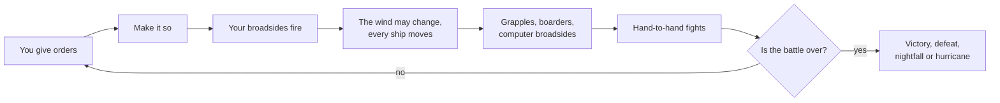
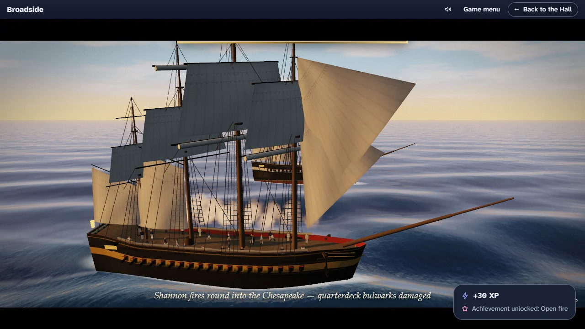
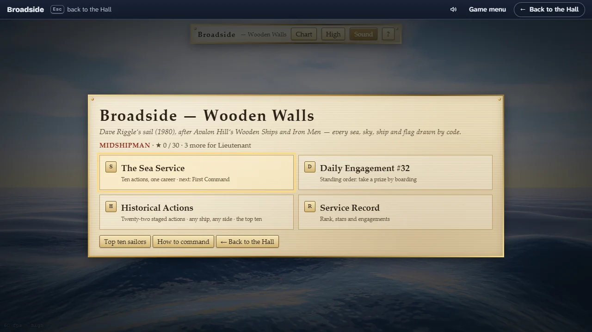

# How to play Broadside

## Goal

Win the action: every ship on the other side has struck her colours, been taken, sunk or blown up
while yours is still fighting. Along the way you earn points for the ships you take, and the best
captains go into the game’s top ten.

## Controls

Broadside is played with the keyboard or the mouse; every order has both. You can type orders on
the command line at the bottom of the screen, exactly as captains did in 1980, or click the buttons
above it: both edit the same orders. Keys are the game’s own and cannot be remapped from the Hall.

| Action                                      | Keyboard (type on the command line unless noted)   | Mouse                                            |
| ------------------------------------------- | -------------------------------------------------- | ------------------------------------------------ |
| Go to the command line                      | `/` or `:`                                         | Click it                                         |
| Helm order                                  | `3`, `l1r1r2`, `d` (see Sailing below)             | ↶ l, 1–7, r ↷, d and ⌫ in the Helm box           |
| Take the sailing master’s suggestion        | —                                                  | Take it                                          |
| Fire a broadside at the hull or the rigging | `f l h` (port, hull), `f r r` (starboard, rigging) | Hull or Rig under Port or Starboard              |
| Fire both broadsides at the hull            | `f`                                                | Hull on both sides                               |
| Load an empty broadside                     | `ld l d` (port, double), `ld b r` (both, round)    | R, D, C or G under that side                     |
| Unload both broadsides                      | `L`                                                | L                                                |
| Battle or full sails                        | `c` (switch), `c full`, `c battle`                 | Battle or Full                                   |
| Repair hull, guns or rigging                | `rp h`, `rp g`, `rp r`                             | ⚒ H, ⚒ G or ⚒ R                                  |
| Grapple or ungrapple a ship alongside       | `g b0`, `g b0 u`                                   | Grapple or Ungrapple under Close action          |
| Try to cut free of a fouled ship            | `u b0`                                             | Unfoul                                           |
| Send boarders (1 to 3 crew sections)        | `b b0 2`                                           | Board 1, 2 or 3                                  |
| Keep sections back to repel boarders        | `b repel 1`                                        | Repel 1, 2 or 3                                  |
| Recall all boarding parties                 | `B`                                                | Recall                                           |
| Report on the nearest ship, or all ships    | `i` (or `i b0`), `I`; `F f?` finds a French ship   | Click a ship, its label or its line in The Fleet |
| Earlier commands                            | ↑ / ↓ on the command line                          | —                                                |
| Make it so (play the turn)                  | Enter on an empty command line, or `.`             | Make it so ⏎                                     |
| Skip the turn’s playback                    | Space, Esc or Enter                                | —                                                |
| Chart view on or off                        | T (anywhere but the command line)                  | Chart                                            |
| Rendering quality, High or Low              | Q (anywhere but the command line)                  | High / Low                                       |
| Sound on or off                             | M (anywhere but the command line)                  | Sound                                            |
| Help                                        | ? (or `?` on the command line)                     | ? or How to command                              |
| Turn the camera (pan on the chart)          | ← ↑ → ↓                                            | Drag                                             |
| Zoom                                        | + / −                                              | The wheel                                        |
| Look at another ship, or your own           | 1–9, 0                                             | Click the ship                                   |
| Give up your command                        | Type `Q` or `quit` on the command line             | —                                                |
| New battle, or fight this one again (end)   | —                                                  | New battle, Fight it again                       |
| Leave for the Hall                          | Esc on the scenario list; Tab to the Hall’s strip  | Move to the top edge; ← Back to the Hall         |
| Back to the scenario list                   | Tab to the Hall’s strip                            | Move to the top edge; Game menu, then Leave      |

`b0`, `F1` and the like are a ship’s mark, shown on its label, in The Fleet and in the log: the
first letter of its nation (a capital when it carries full sails) and a number. A `!`, `~` or `#` in
place of the letter means the ship has struck, is sinking, or is on fire. You can also name a ship
by the start of its name. Mind the difference between the keys: Q on its own switches the quality
and reloads the page (your battle is kept), while `Q` typed on the command line gives up your
command.

## Rules

1. Give your orders: a helm order, which broadsides to fire and at what, what to load, sails,
   repairs, grapples and boarders. Nothing happens until you make it so.
2. Make it so. Your broadsides fire first, from where the ships are now.
3. The weather may change (it can only change on every seventh turn).
4. Every ship moves at once, a step at a time. Ships that collide foul each other.
5. Grapples are thrown, boarders cross, and the computer’s captains fire.
6. Boarders fight hand to hand.
7. Loading moves on, and the battle checks whether it is over.

### Sailing

The helm prompt reads like `move (4, 3)`: you may sail up to four squares this turn, counting
turns, and make up to three turns. A digit sails that many squares ahead; `l` and `r` turn the ship
45 degrees to port or starboard (the bow stays put and the stern swings round); `d` drifts, or does
nothing. Strings combine, so `l1r1r2` turns left, sails one, turns right, sails one, turns right and
sails two. Only the last helm order of a turn counts.

A square-rigger cannot sail into the wind, and a turn that takes you into it stops the move there.
Turning closer to the wind also cuts what is left of your allowance. The wind rose at the top right
shows how far you can sail on every heading, with full sails in brackets. A ship that makes no
headway for two turns starts to drift; a `'` in the prompt means you must sail ahead before you
can turn more than once.

### Gunnery

| Shot   | Reach (squares) | Good for                                                   |
| ------ | --------------- | ---------------------------------------------------------- |
| Round  | 10              | The all-round shot                                         |
| Double | 1               | Hitting hard at point-blank range; takes two turns to load |
| Chain  | 3               | Rigging only                                               |
| Grape  | 1               | The crew                                                   |

A broadside fires at the closest ship it bears on, friend or foe; the orders panel says which ship
that is, its range, whether you can rake her, and warns you when she is a friend. Beyond six squares
you can only aim at the rigging, and carronades reach no further than two. A rake, firing down the
length of a ship from ahead or astern, does extra damage, and a rake from astern most of all. Full
sails make you faster but double the damage your rigging takes. You may load only an empty
broadside; the broadsides you choose before the battle are loaded with care and hit a little harder
the first time. On the slate, `!` marks those careful loads and `*` a broadside still loading.

Heavy seas spoil the aim: in a gale or a full gale most ships fire at a penalty, and a ship of the
line that does shuts her lower gun ports. Full sails cannot be set in a full gale, nor in a gale on
a sloop or a brig.

### Close action

A ship within one square can be grappled (always between friends, one chance in three against an
enemy). Grappled or fouled ships can send up to three crew sections across, and you can keep
sections back to repel boarders; defenders fight twice as hard as attackers. Win the fight on her
deck and she is yours: some of your crew go aboard as a prize crew. If her prisoners ever outnumber
that prize crew six to one, they rise and take her back.

### Damage, striking and repairs

Shot strikes the hull, guns, crew and rigging. A ship whose hull is shot to pieces strikes her
colours; one in three struck ships starts to sink, and one in three catches fire and later blows up,
damaging ships close by. A mast whose rigging is shot away goes over the side. Repairs need all
hands: on a turn when you repair you cannot fire, load, change sail or turn. Every three turns of
work bring back up to two points, and a lost mast can only be jury-rigged back to two.

### How a battle ends

| End       | When                                                                           |
| --------- | ------------------------------------------------------------------------------ |
| Victory   | No ship on the other side is still fighting                                    |
| Defeat    | Your ship strikes, is captured, sinks or blows up                              |
| Nightfall | The battle reaches turn 200 with both sides still fighting                     |
| Hurricane | The wind rises to a hurricane: the storm turn plays, then every ship goes down |
| Given up  | You type `Q`: you hand over your command                                       |

The end screen shows your points and the top ten, then offers New battle (the scenario list), Fight
it again (the same scenario and ship, with the same random seed) and Look around, which closes the
screen so you can study the last scene. From there, the Hall’s Game menu brings back the scenario
list.

## Modes

Each battle is one scenario of the original, under its original number. Pick one, take command of a
ship, give your captain a name and choose your opening broadsides.

| No. | Scenario                      | Year | Ships | Wind at the start  | What to expect                                                                   |
| --- | ----------------------------- | ---- | ----- | ------------------ | -------------------------------------------------------------------------------- |
| 13  | Chesapeake vs. Shannon        | 1813 | 2     | 3, fresh breeze    | A frigate duel; the best first battle, as the Shannon                            |
| 10  | Constitution vs. Guerriere    | 1812 | 2     | 5, gale            | A frigate duel in heavy seas from the first turn                                 |
| 21  | The Lydia meets the Natividad | 1808 | 2     | 5, gale            | A frigate against a 50-gun two-decker in the Pacific; the one taken from a novel |
| 17  | Pellew vs. Droits de L’Homme  | 1797 | 3     | 5, gale            | Two frigates against a 74 in rising seas; it can build to a hurricane            |
| 18  | Algeciras                     | 1801 | 10    | 2, moderate breeze | A line battle of three nations, with 112-gun three-deckers                       |

Under More historical actions are seventeen more, from a sloop duel in 1778 to a winter chase in
1815, each with its own time of day and weather: three are fought by night, four under grey skies
and two on lakes. Scenarios 2, 3, 9 and 18 are fleet actions of ten ships. The full list of the
original’s thirty-two scenarios is there too; the ten fanciful ones (22 to 31) are shown but cannot
be played yet. Broadside has no daily challenge.

## Settings

| Setting            | Options                                 | Default                                                                |
| ------------------ | --------------------------------------- | ---------------------------------------------------------------------- |
| View               | 3D view · chart (T)                     | 3D view                                                                |
| Quality            | High · Low (Q)                          | High; remembered, and switching reloads the page with your battle kept |
| Sound              | On · off (M)                            | On, from your first key or click; remembered                           |
| Captain’s name     | Any name up to 19 characters            | The last name you used                                                 |
| Opening broadsides | Round, double, chain or grape, per side | Round                                                                  |

Broadside follows your system’s reduced-motion setting: no opening sweep over the fleet, a quicker
playback, the camera blends instead of cutting, never shakes, and changes shot at most every four
seconds. It has a single look; the Hall’s strip follows the Hall’s light or dark appearance.

## Scoring

Points come from ships you take. An enemy that strikes to your guns gives you her points value; one
you capture by boarding gives twice that (once, if she had already struck). If the prisoners rise
and retake a prize, you lose twice her value. The game’s own top ten, kept on this device, ranks
captains by net points: points won divided by the value of their own ship, so a small ship that
takes a big one ranks high. The Hall records your points (never below zero) as the battle’s score.

## Achievements (packages)

| Package             | How to earn it                                                           |
| ------------------- | ------------------------------------------------------------------------ |
| `open-fire`         | Fire your first broadside.                                               |
| `down-her-length`   | Rake an enemy ship.                                                      |
| `colours-come-down` | Bring an enemy ship to strike to your guns.                              |
| `the-day-is-yours`  | Win any action.                                                          |
| `see-it-through`    | Fight an action to its end, whatever the end, without giving up command. |
| `stern-rake`        | Rake an enemy from astern.                                               |
| `prize-crew`        | Take an enemy ship by boarding her.                                      |
| `heavy-weather`     | Win an action while the wind blows a gale or worse (5 or more).          |
| `line-of-battle`    | Win a fleet action of ten ships or more (scenarios 2, 3, 9 or 18).       |
| `a-brace-of-prizes` | Take two enemy ships in one battle, by gunfire or by boarding.           |

## XP

Every finished battle reports to the Hall. A victory is a win; a defeat (captured, sunk, blown up
or struck) is a loss; nightfall and the hurricane are draws, since neither side won. Giving up your
command with `Q` counts as quitting and earns no XP. On top of the battle’s XP, every enemy ship you
take earns 8 XP, up to 25 in one battle; packages earn 30 (core), 60 (extra) or 120 (rare). Weekly
goals can ask you to take a number of enemy ships (2 to 5) or fire a number of broadsides (20 to
60).

## Tips

- Start with Chesapeake vs. Shannon as the Shannon: an elite crew, a fresh breeze and a fair match.
- Look for the rake. Cross an enemy’s bow or, better, her stern, and fire as she lies end on.
- Load double shot before you close, and fire it when you are alongside; it needs two turns to load.
- Fight under battle sails. Full sails are for chasing, and they double the damage to your rigging.
- While you learn to sail, take the sailing master’s suggestion; it is the computer captains’ own
  reckoning, run for your ship.
- Watch the wind rose before you turn: heading closer to the wind cuts your allowance.
- A faster enemy can be slowed: aim at her rigging from long range, or use chain shot within three
  squares.
- Pull out of range before you repair; a repairing ship cannot fire back.
- Computer ships never repair but fire double shot every turn, so keep your distance until you can
  rake.
