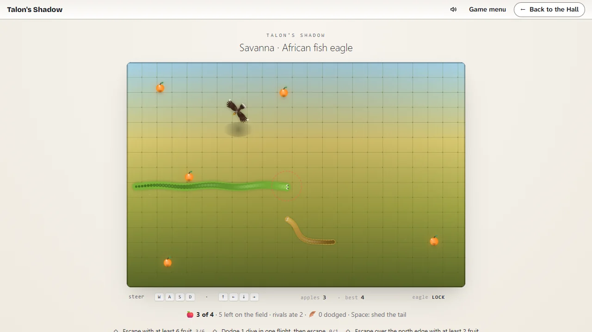

# Talon's Shadow

> Gather the fruit. Watch the shadow. Slip away over any edge.

## The hook

You are the snake. The field is scattered with fruit, and a bird of prey circles overhead. For a
while it only watches; then a red ring tightens round your head, and a moment later it dives at
the spot it marked. Keep moving and the talons come down behind you. Every fruit you carry makes
you longer and slower and the bird hungrier, rival snakes eat from the same harvest, and from the
River on a fence shaped like a letter stands in the way. Gather what you dare and slip away over
any edge to keep it; caught, you keep nothing. Bring home each region's goal to clear it, and
clear all eight to end the expedition.

## Where it comes from

The Berkeley `snake` of 1980 was a chase on a CRT terminal: you were an `I`, a six-square snake
hunted you, and you picked up money and left by the exit before it caught you. Before the
collection existed, the owner built this port of it for the browser and turned it round: you are
now the hunted snake, slithering after fruit, and the hunter is a bird of prey whose shadow is its
only warning. Eight painted looks came with it, from a golden savanna to a folded-paper diorama
and a moonlit wood. It joins the collection as built, beside its native reinvention _Full
Pockets_.

## What is new

- **An expedition with an end.** The port’s eight looks are now eight regions flown in order,
  from the patient African fish eagle of the Savanna to the silent horned owl of Midnight. Each
  has a goal of fruit to bring home; clearing it opens the next, and clearing Midnight ends the
  expedition.
- **Every fruit costs something.** Carrying makes the snake longer, slower and slower to turn,
  and the bird hungrier, as the 1980 manual had it: the richer you get, the hungrier the hunter.
- **A harvest, rivals and fences.** Each region’s fruit runs out (and fruit nobody takes
  withers); rival snakes share it, and the bird hunts whichever snake is nearest, rivals
  included; the edges stay closed until the fruit is gone, then open and glow, the bird turns ravenous and the flight soon
  ends. From the River on, a fence shaped like
  a letter (I, T, H, a plus, a walled yard, U, two H's) stands in the field.
- **A hunter on foot in every region.** A secretary bird on the savanna, a heron by the river, a
  jungle fowl, a courser, a circuit hen, a wild turkey, a paper hen and two night herons walk
  after the nearest snake, bob their heads and peck: a peck on the body knocks a fruit loose and
  sends the hunter after it, a peck on the head ends the flight.
- **Snakes that collide.** Run into a rival and you are caught; cut across a rival and it may run
  into you, spilling what it ate. The snake is quicker than the port's, so an empty one always
  outruns the hunters.
- **A tail to give up.** Space sheds the last third of the tail as a wriggling decoy, at the cost
  of a third of the fruit carried.
- **A fair dive.** Until the field is bare, a snake keeping straight on is always clear of the
  strike, however much it carries; the danger is in the turns.
- **Contracts and stamps.** Three contracts in every region (hauls, dodges, edges, quick and calm
  escapes, outeating the rivals, letting the bird take a rival); a stamp for each, 24 in all.
- **The field book and records.** Sixteen pages, a bird and a fruit for every region; the best
  escape in every region against its goal; the Daily Flights you have flown.
- **The Daily Flight.** One region a day for everyone, with the fruit and the bird’s patience
  drawn from the date; only the first flight counts, and it ends with a share line and no link.
- **Five challenges.** Fill the Field (grow until the field is full), King Drift (zigzag combos),
  Coil (close a loop round fruit and rivals), Survival (last as the hunt grows) and Courier (carry
  fruit to the burrow), each with a best and three stars.

## At a glance

|                 |                                                       |
| --------------- | ----------------------------------------------------- |
| Directory       | `/usr/games/arcade`                                   |
| Players         | 1                                                     |
| Session         | 2–10 minutes                                          |
| Daily challenge | yes                                                   |
| Sound           | none (the port was built silent)                      |
| Inspired by     | `snake` (1980), the Berkeley snake-and-treasure chase |

## More

- [How to play](HOW-TO-PLAY.md)
- [Changes from the original](CHANGES-FROM-ORIGINAL.md)
- [Architecture](ARCHITECTURE.md)
- [Notes](NOTES.md)
