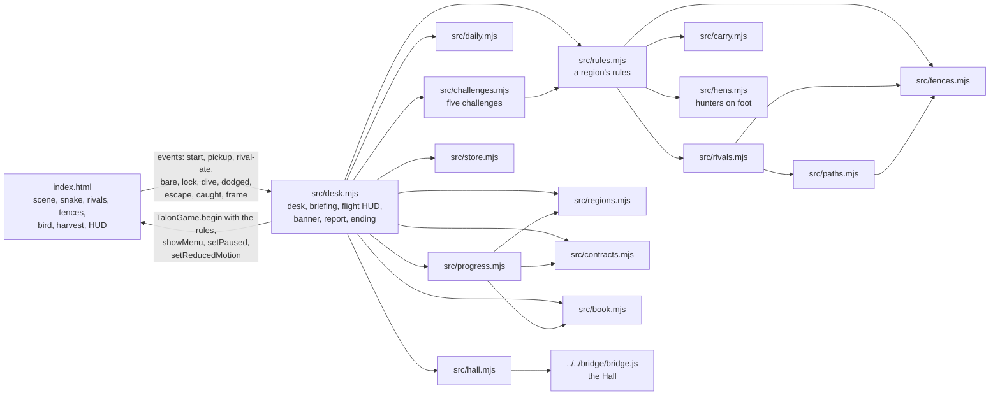
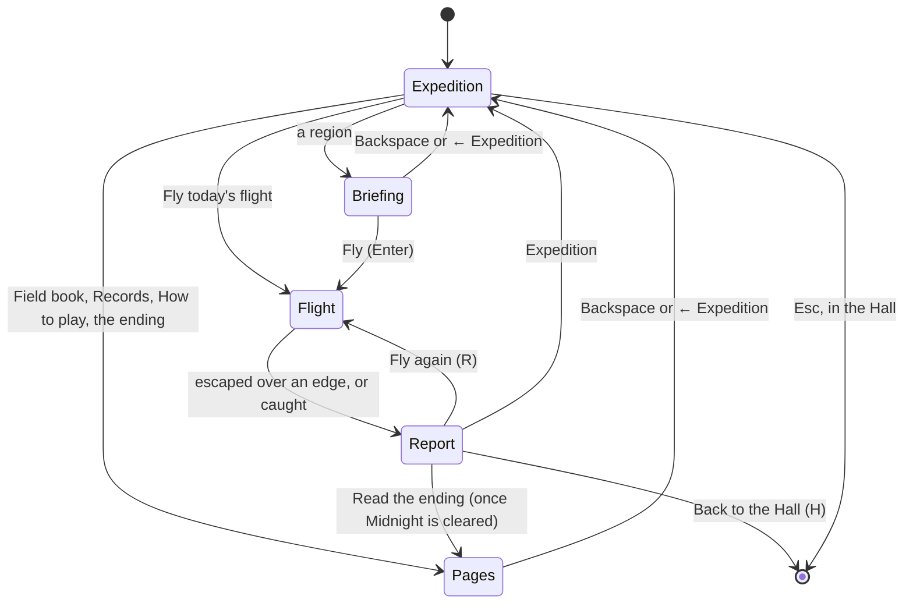
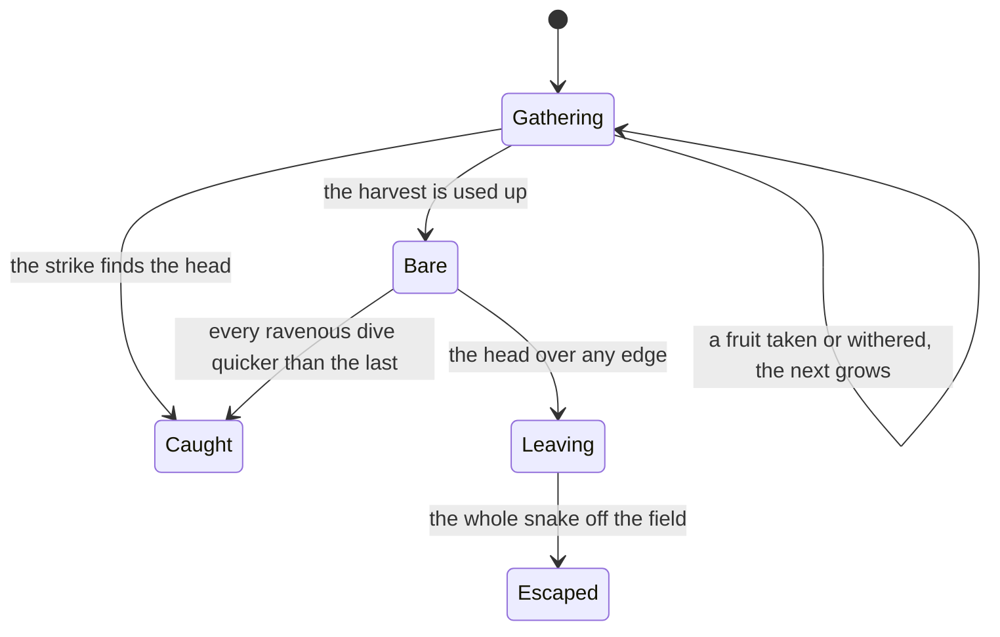

# Talon's Shadow — architecture

## Overview

An adopted, hosted game (ADR 0011): one static page (`app/index.html`) with the port’s whole game
in an inline script (a Canvas 2D scene, the snake, the bird, eight looks), no build step. The Hall
serves `app/` at `play/snake-classic/` and talks to it over the bridge. Around the page, a set of
small ES modules add the expedition desk and the rules of a flight in a region: its fence, its
harvest and rival snakes, and what carrying fruit does (ADR 0002). The page’s script gained a
narrow handle (`window.TalonGame`), a few events and calls into those rules at the moments it
already knew about; the way the snake slithers and the bird glides, locks on and strikes is the
port’s.

## Module map

| Path                     | Responsibility                                                                                                                                                      |
| ------------------------ | ------------------------------------------------------------------------------------------------------------------------------------------------------------------- |
| `app/index.html`         | The adopted page: the eight looks, the snake, the bird’s glide–lock–dive–strike–climb, fruit and the harvest, the fences and rivals drawn, HUD                      |
| `app/src/regions.mjs`    | The eight regions in order: look, bird, fruit, temper, fence, rivals, harvest, goal, the bird’s tuning; clearing and opening                                        |
| `app/src/rules.mjs`      | `flightRules(region)`: the object `TalonGame.begin` takes (`challengeRules` builds on it)                                                                           |
| `app/src/fences.mjs`     | The letter layouts, where the snake starts, clearance, pushing a head out of a fence                                                                                |
| `app/src/paths.mjs`      | Routes round the fences on a 20 px grid (breadth-first), and the farthest point of a route in sight                                                                 |
| `app/src/rivals.mjs`     | Rival snakes: entering from the corners, going for the nearest fruit, swallowing, leaving when the field is bare                                                    |
| `app/src/carry.mjs`      | What carried fruit does to the snake and the bird; the ravenous bird; the fair-dive check                                                                           |
| `app/src/hens.mjs`       | The hunters on foot: entering, stalking the nearest snake round fences, the warning, the peck, freezing under the bird, fruit underfoot, the fruit it knocked loose |
| `app/src/challenges.mjs` | The five challenges: their rules, modes (step, marks, status, result), stars; coverage, loops and the drift meter                                                   |
| `app/src/contracts.mjs`  | Three contracts a region, checked against a flight’s summary; stamp keys                                                                                            |
| `app/src/book.mjs`       | The field book: sixteen pages (our own notes) and how each is found                                                                                                 |
| `app/src/daily.mjs`      | The Daily Flight: number, seed, region, seeded draws, share line                                                                                                    |
| `app/src/progress.mjs`   | What a flight changes: best hauls, clears, stamps, pages, regions opened, the ending, the Daily record, packages                                                    |
| `app/src/desk.mjs`       | Every screen around a flight, the goal and harvest line and contract chips during it, the banner, keys, pause timing (`window.__talon`)                             |
| `app/src/store.mjs`      | Saves under `usr-games:snake-classic:`                                                                                                                              |
| `app/src/hall.mjs`       | Bridge glue: results, packages, title screen, pause, reduced motion, key art                                                                                        |
| `app/src/desk.css`       | The desk’s styles                                                                                                                                                   |

## State machine

A flight itself always ends, in one of two ways:

The page starts in a `menu` state: the scene of the last region flown is drawn behind the desk
and the bird circles without ever locking on. `TalonGame.begin({ theme, tuning, rules, random,
best })` sets the look, the bird’s tuning, the region’s rules, the random source (seeded for the
Daily Flight) and the best escape shown under the field, then restarts the flight. Without
`rules` the page plays by the port’s own: open ground, fruit without end, no rivals, and carrying
changes nothing.

## The rules a flight is given

`flightRules(region)` (`src/rules.mjs`) is all the page knows of a region beyond its look and the
bird’s tuning:

| Member                                              | The page uses it                                                                    |
| --------------------------------------------------- | ----------------------------------------------------------------------------------- |
| `fences`, `start`                                   | to draw the fence, and to place the snake below it                                  |
| `harvest`, `rivals`                                 | to count the fruit still to come, and to bring the rivals in                        |
| `exitsOnlyWhenBare`                                 | to keep the edges closed while fruit is left (the head slides along them)           |
| `fruitLifeMs`                                       | to wither a fruit no snake has taken in 24 s                                        |
| `carry(n)`                                          | every step of the snake (speed, turning, growth) and at each lock-on and dive       |
| `ravenous(n)`                                       | once the field is bare: the bird’s patience, lock and the n-th dive                 |
| `pushOut`, `isClear`                                | to stop a head at a fence, and to grow fruit only where a snake can reach it        |
| `makeRival`, `stepRival`                            | to bring in and move each rival, which reports the fruit it ate                     |
| `snakeSpeed`                                        | the snake’s pace (0.165 px/ms; the port’s 0.14 without the desk)                    |
| `contactKills`                                      | to end a snake whose head runs into another snake’s body                            |
| `hunters`, `hunterKind`, `makeHunter`, `stepHunter` | to bring in the region’s hunters, draw them in its look, and move them              |
| `canShed`                                           | to let Space shed the tail                                                          |
| `appleCount`, `selfCollision`, `flatBody`, `mode`   | a challenge’s fruit on the field, running into yourself, an even body, and its mode |

The bird hunts the nearest snake (ADR 0003): gliding, it looks for the snake nearest to it
every second and circles it, and settles on one when it locks on; the ring follows that head and
the strike takes any head under it. A rival it locks on to keeps straight on, half as fast again.

The dive takes a set time (`tuning.diveMs`, a little less as the bird gets hungrier) from
wherever it starts, falling with an ease-in curve, so a warning always means the same. Until the
field is bare, and for the first three dives after, `diveIsFair` (`src/carry.mjs`, checked for
every region in the tests) holds: the slowest snake keeping straight on moves farther than the
strike radius during the quickest dive.

Fruit grows at a spot clear of fences by 28 px, at least 90 px from every head, the player’s and
the rivals’, and from the other fruit, keeping the farthest of twelve tries. Rivals follow a route
round the fences (`src/paths.mjs`), recomputed every 0.7 s, steering for its farthest point in
sight; after a fruit they crawl at a third of their pace for 2 s.

## How the desk follows a flight

The page’s script emits events through `TalonGame.on(listener)`:

| Event            | Emitted when                                                                                      | What the desk does                                                |
| ---------------- | ------------------------------------------------------------------------------------------------- | ----------------------------------------------------------------- |
| `start`          | `begin` restarts the flight (with the fruit left)                                                 | shows the goal in the banner                                      |
| `pickup`         | the head touches a fruit (carried, left)                                                          | counts it; once the goal is reached, says so and lights the edges |
| `rival-ate`      | a rival eats a fruit (their total, left)                                                          | counts it                                                         |
| `withered`       | a fruit no snake took withers (left)                                                              | updates what is left                                              |
| `rival-taken`    | the strike takes a rival (the total taken)                                                        | counts it                                                         |
| `bare`           | the last fruit of the harvest is gone                                                             | the banner and the glowing edges: leave over any edge             |
| `edge-closed`    | the head meets a closed edge (at most every 4 s; fruit left)                                      | the banner: the edges are closed while fruit is left              |
| `leaving`        | the head goes over an open edge (which)                                                           | the banner: away, out of the bird’s reach                         |
| `lock`           | the bird’s patience runs out (whom it locked on to)                                               | counts a lock-on at the player (calm contracts)                   |
| `dive`           | the lock ends and the bird marks its target (whom for)                                            | —                                                                 |
| `dodged`         | a dive at the player missed and the bird climbs                                                   | counts a dodge                                                    |
| `escape`         | the whole snake has left over an open edge (which edge)                                           | ends the flight as an escape                                      |
| `caught`         | the strike, a peck to the head, a rival’s body or (Fill the Field) your own body (with the cause) | ends the flight as a catch; the report says how                   |
| `pecked`         | a peck lands on the body (carried, left)                                                          | counts it                                                         |
| `hunter-ate`     | a hunter pecks up a fruit (left)                                                                  | updates what is left                                              |
| `rival-out`      | a rival runs into a body (whether yours, cut off by you, left)                                    | counts it                                                         |
| `shed`           | Space shed the tail (fruit lost with it, carried)                                                 | the banner                                                        |
| `decoy-taken`    | a hunter or the bird took the shed tail                                                           | —                                                                 |
| `mode-say`       | a challenge has something to say                                                                  | the banner                                                        |
| `challenge-over` | a challenge’s clock ran out, or the field is full (why)                                           | ends the challenge: score, stars, report                          |
| `frame`          | every animation frame (with the canvas)                                                           | the key art, once, after 3 s on the desk                          |

With the desk in control the page shows none of its own overlays and ignores keys outside a
flight.

## Where visuals are defined

| Visual                                      | Defined in                                                                   | Change it by                                |
| ------------------------------------------- | ---------------------------------------------------------------------------- | ------------------------------------------- |
| The eight looks (palette, grid, background) | `index.html` `THEMES`, `renderStaticLayer`, `renderGrid`                     | a theme’s colours and gradient stops        |
| The snake and the rivals                    | `index.html` `renderSerpent` (from `renderSnake`, `renderRivals`)            | segment count, length, taper, glow          |
| The rivals’ colours                         | `index.html` `RIVAL_LOOK`                                                    | a theme’s head and tail colours             |
| The fences                                  | `index.html` `FENCE_LOOK`, `renderFences`, `drawFenceGrain`                  | a theme’s kind and colours                  |
| The birds                                   | `index.html` `renderEagleSprite` and its parts, `renderOwl`                  | per-theme `enemy` colours                   |
| The shadow and its ring                     | `index.html` `renderEagle`                                                   | the lock and dive shading                   |
| Fruit                                       | `index.html` `renderApple`                                                   | per-theme `apple` colours                   |
| Strike, pickup and catch sprays             | `index.html` `spawnStrike`, `spawnPickupBurst`, `spawnDeathBurst`            | counts, speeds, lifetimes                   |
| The hunters on foot                         | `index.html` `HUNTER_LOOK`, `drawHunter`, `drawHunterTail`, `drawHunterHead` | a region’s colours, legs, neck, crest, tail |
| A hunter’s warning                          | `index.html` `renderPeckWarnings`                                            | the ring’s size and colour                  |
| A shed tail                                 | `index.html` `renderDecoys`                                                  | its colour and fade                         |
| A challenge’s marks                         | `src/challenges.mjs` (`under`, `over` of each mode)                          | the mode                                    |
| The glowing edges (ways out)                | `index.html` `renderExits`                                                   | the band and its colour                     |
| Withering fruit                             | `index.html` `renderApple` (its last 6 s)                                    | `WITHERING_MS`                              |
| Desk, briefing, banner, report, ending      | `src/desk.mjs`, `src/desk.css`                                               | the desk                                    |

There is one look for the page, a light gallery frame round the field (listed in
`docs/KNOWN-ISSUES.md`); the regions bring the scenes from day to night. Each look has its own
fence: thorn hedge, reeds, bamboo, stone, neon bars, folded paper, a night hedge.

## Challenges

A challenge (ADR 0006) is a mode object in `src/challenges.mjs` with `setup` (its rules, built on
a region’s `flightRules`), `start`, `step`, `under` and `over` (marks below and above the snakes),
`status` (the line under the field) and `result` (the score and the report’s headline), and its
star thresholds. The page calls them through `TalonGame.modeApi`, a small handle on the field:
the snake, the fruit, rivals and hunters, the clock; taking fruit, adding hunters and rivals,
waking or rousing the bird and quickening its dives, choosing where fruit may grow, saying things
over the field, and finishing the game. The desk keeps each challenge’s best and stars in the
saved progress and reports a complete session to the Hall.

## Opening

The page’s HTML holds the desk’s opening card (the title and a bar) and the stylesheet, so the
first paint is the card. Every module of the desk has a `modulepreload` link in the head, fetched
side by side; a small script counts them in and fills the bar; `tests/page.test.mjs` checks no
module is missing. The scene behind starts in the look of the region flown last. When the desk
arrives it takes the card’s place.

## Hall integration

- **Results.** Every finished flight: `outcome` `win` (escaped, even empty-handed) or `loss`
  (caught), `score` (fruit escaped with, 0 when caught), `stats` (`fruitSecured`, `divesDodged`,
  `escapes`, `stamps`), `xpEvents` (`stamps` 3 each, `new-region` 5), `daily` for the first Daily
  Flight of the day, `durationSeconds` (the Hall’s pause excluded). Leaving mid-flight reports
  nothing.
- **Packages.** The ten in the manifest, offered by `install` in `hall.mjs` from
  `packagesEarned` in `progress.mjs`; `owl-light` is the end of the expedition.
- **Title screen.** The desk reports `title-screen`, so Esc there leads to the Hall; a flight,
  its briefing and its report are not title screens.
- **Pause and motion.** The Hall’s pause (and a hidden tab, `pauseWhenHidden`) freezes the page’s
  loop and stops the flight’s clock; reduced motion skips the fruit, catch and strike sprays,
  keeping the strike’s ring, and stills the reeds. The game has no sound.
- **Key art.** The scene behind the desk, three seconds after it opens, the bird circling.
- **Saves.** `usr-games:snake-classic:progress` at version 1; the page’s own
  `usr-games:snake-classic:best` (its overall best escape when opened outside the desk’s control).
- **Daily.** The number from the kit’s epoch (2026-09-01), the seed from the date (FNV-1a over
  `snake-classic:daily:<date>`, then mulberry32); `?date=YYYY-MM-DD` stands in for today when
  testing.

## Tests

| Test             | Command                                                    | What it proves                                                                                                                                                                                                                                                                                                                                                                                                                                                                                                                                                                                                           |
| ---------------- | ---------------------------------------------------------- | ------------------------------------------------------------------------------------------------------------------------------------------------------------------------------------------------------------------------------------------------------------------------------------------------------------------------------------------------------------------------------------------------------------------------------------------------------------------------------------------------------------------------------------------------------------------------------------------------------------------------ |
| Unit tests (20)  | `pnpm run test:hosted` (`app/tests/*.test.mjs`)            | Regions harder in order, harvests with room for goals and contracts, opening and clearing, the ending once, contracts and stamps, the Daily Flight, packages, the field book; fences clear of edges and the start, pushing out, carrying to its floors, a fair dive in every region, ravenous dives that end a flight, rivals that find every fruit round every fence and leave                                                                                                                                                                                                                                          |
| In the Hall (26) | `pnpm exec playwright test -c games/snake-classic`         | The desk as title screen, a flight to its report with the region cleared, being caught, R and H, the Daily share line, the hidden tab, the briefing, a fence that holds, rivals eating, closed edges that open on a bare field, the next region focused before the Daily Flight, collisions both ways, a peck on the body and on the head, shedding the tail, the challenges' page, a challenge to its stars, Fill the Field's end, a coil, the bird carrying off a rival, withering fruit, growing with fruit, a bare field and the ravenous bird, clearing Midnight and the ending, every way out, no foreign requests |
| Screenshots      | `SHOTS=1 pnpm exec playwright test -c games/snake-classic` | `docs/media/*-1280.webp` and `*-1920.webp`                                                                                                                                                                                                                                                                                                                                                                                                                                                                                                                                                                               |
| Balance          | `node games/snake-classic/scripts/balance.mjs [flights]`   | A simple bot flies every region (NOTES.md has the table); a stubborn bot that never leaves is always caught in the end                                                                                                                                                                                                                                                                                                                                                                                                                                                                                                   |
| Challenges       | `node games/snake-classic/scripts/challenges.mjs [games]`  | Each challenge played by a bot made for it: scores, stars, and that every game ends                                                                                                                                                                                                                                                                                                                                                                                                                                                                                                                                      |

The Hall tests move the head through `TalonGame.placeHead(x, y)` (the whole body moves with it),
as a quick and careful snake would; a dive is followed from inside the page. The balance check
uses `TalonGame.fastForward(ms, steer)`, which plays the real page’s rules without drawing.

## Kit candidates

None new: the desk follows the patterns of the other adopted games (store, daily numbering).
