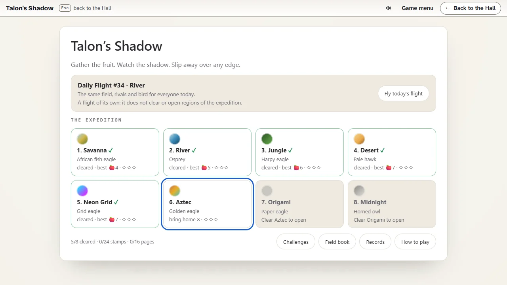
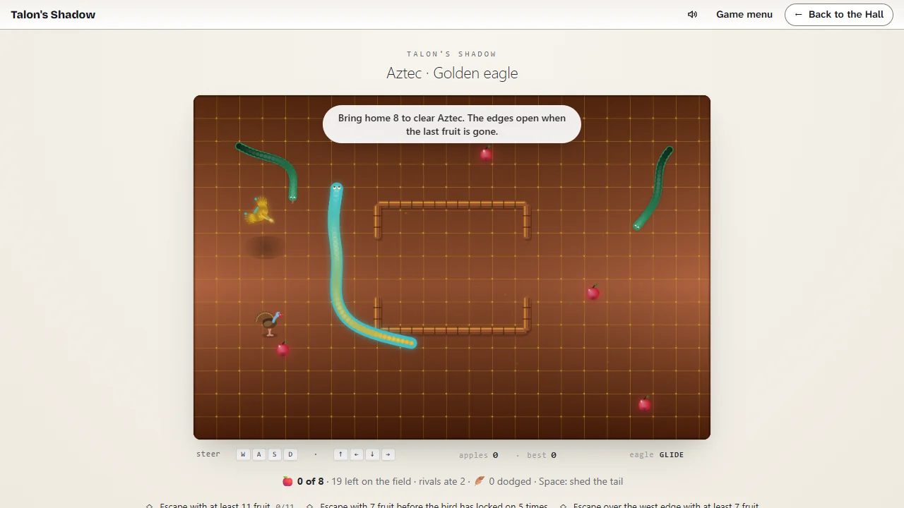
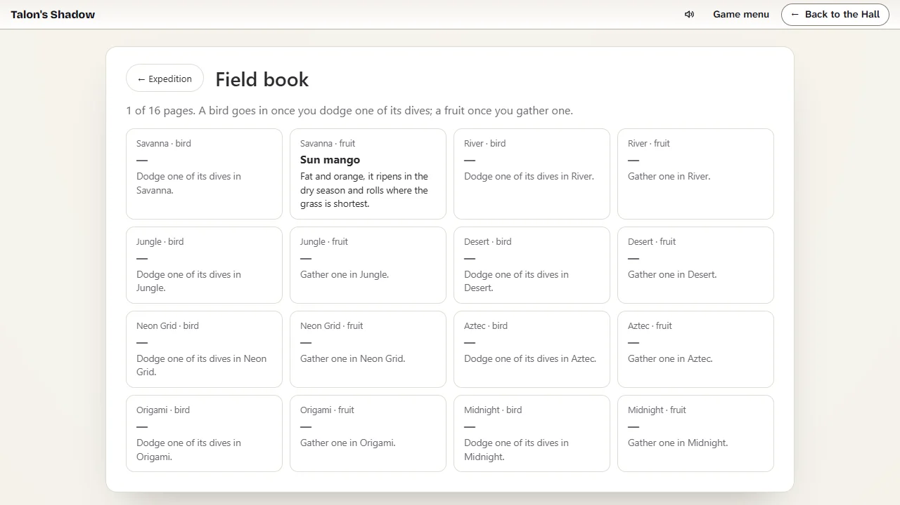

# Talon's Shadow — how to play

## The goal

Gather fruit while a bird of prey circles overhead and a hunter of the place stalks you on foot,
racing the rival snakes for the harvest. When the last fruit is gone, leave over any edge of the
field with everything you carry. Bring home a region's goal of fruit to clear it and open the
next; clear Midnight, the eighth and last, and the expedition is over. Beside the expedition,
five **challenges** are games of their own.

A flight always ends: you get away over an edge once the field is bare, or you are caught (by the
bird, by a hunter's peck to the head, or by running into a rival).
**While any fruit is left the edges are closed**: the snake slides along them as it does along a
fence. **When the last fruit is gone they open** and glow; touch one and the snake slithers off
the field, out of the bird's reach, and the flight ends once all of it has left.

## Controls

| Where               | Keys                      | What happens                                        |
| ------------------- | ------------------------- | --------------------------------------------------- |
| In flight           | `W` `A` `S` `D` or arrows | Steer the snake; it never stops, and turns smoothly |
| In flight           | the way you came          | The snake swings round in a U                       |
| In flight           | `Space`                   | Shed the last third of the tail as a decoy          |
| A region’s briefing | `Enter`                   | Fly                                                 |
| A challenge’s card  | `Enter`                   | Play                                                |
| Desk pages          | `Backspace`               | Back to the expedition                              |
| The report          | `R`                       | Fly the same region (or challenge) again            |
| The report          | `H`                       | Back to the Hall (inside the Hall)                  |
| The expedition desk | `Esc`                     | Back to the Hall (inside the Hall)                  |

Everything on the desk is a button: `Tab` moves between them and `Enter` or `Space` presses one.
The Hall’s strip above the game always has **Game menu** (the expedition desk, afresh) and **Back
to the Hall**. Switching to another tab holds the flight still until you come back.

## A flight

1. The snake starts in the middle of the field (below the fence, where there is one), heading
   east. It never stops moving: steer it from fruit to fruit. The page opens on a card with a
   bar that fills as the game arrives, then the expedition desk.
2. The bird hunts **whichever snake is nearest to it**, yours or a rival's, and glides in wide
   circles round it. After a while it **locks on**: a red ring tightens round that snake's head,
   and the line under the field reads `eagle LOCK`.
3. When the ring has closed, the bird **dives** at the spot where that head was. Its talons
   strike a small circle there. If the ring was round your head, keep going and do not turn back:
   a dive is always long enough for a snake keeping straight on to be clear of it, however much it
   carries. Any head under the strike is taken, yours or a rival's.
4. It climbs away, circles again and, after a while, locks on once more.
5. When the last fruit is gone, touch any edge of the field to **escape** with all the fruit you
   carry: the snake slithers off the field and the report follows once its tail is gone.
   Escaping empty-handed still counts as an escape, as it did in 1980.

## What you carry

Every fruit you carry makes the snake longer, a little slower and slower to turn, and makes the
bird hungrier: it waits less before it locks on and warns for less time before it dives. With ten
fruit the snake moves at three quarters of its pace and the bird waits about half as long. The
more you carry, the more an escape is worth, and the harder it gets: knowing when to leave is the
game.

## The hunter on foot

Every region has a bird that hunts on foot, chosen for the place:

| Region  | Hunter         | Region    | Hunter           |
| ------- | -------------- | --------- | ---------------- |
| Savanna | Secretary bird | Neon Grid | Circuit hen      |
| River   | Grey heron     | Aztec     | Wild turkey      |
| Jungle  | Jungle fowl    | Origami   | Paper hen        |
| Desert  | Desert courser | Midnight  | Two night herons |

It comes in from a corner a few seconds into the flight and walks after the nearest snake, round
the fences. When it is close, it **stops and bobs its head**, and a dashed red ring marks the spot
it aims at: that is the warning. Then it pecks.

- A peck on your **body** knocks a fruit loose, which lands a short hop away, and the hunter goes
  after that fruit before anything else: your moment to slip away (or to snatch it back).
- A peck on your **head** ends the flight.
- An empty snake outruns every hunter; with ten fruit or more you are no faster than the
  quickest of them.
- While the flying bird is low overhead, a hunter freezes. It pecks up fruit lying in its way, and
  pecks rivals too.

## Your tail

`Space` sheds the last third of your tail. It wriggles where it fell for six seconds, and the
hunters and the bird may go for it instead of you; a rival running into it is cut off. It costs a
third of the fruit you carry (rounded up), and the snake is that much shorter. The line under the
field says when you can shed again (fifteen seconds).

## The harvest, the rivals and the fences

Each region has a set **harvest** of fruit. Four or five lie on the field at a time; when one is
taken, the next appears somewhere else, until the harvest is used up. The line under the field
shows what is left.

**Rival snakes** (one in the Savanna, up to three at Midnight) come in from the corners and eat
from the same harvest. They are smaller and slower than you and pause to swallow after every
fruit. **A head that runs into another snake's body ends that snake**: run into a rival and you
are caught; cut across a rival's path and it may run into you, spilling up to two of the fruit it
ate. Rivals steer round bodies, but not always in time. The bird hunts them as readily as you: a
rival it locks on to keeps straight on and hurries, and one caught swallowing is often carried
off. Leading the bird to a rival is fair play.

Fruit that no snake takes **withers**: after 24 seconds on the field it shrinks, fades and is
gone, and the next grows elsewhere. So every harvest runs out, whoever eats it.

When the last fruit is gone **the field is bare**: the rivals leave, the edges open and glow, and the bird
turns **ravenous**. It locks on again almost at once. Its first three dives are as fair as ever,
time enough to reach an edge; after that every dive comes quicker than the one before, until
keeping straight on is no longer enough. Head for the nearest edge.

From the River on, a **fence** in the shape of a letter stands in the field. Nothing slithers
through a fence; a head that meets one slides along it. The bird flies over.

## The expedition

Eight regions are flown in order. Each has its own bird, hunter, fruit, harvest, rivals and fence;
further on, the birds lock on sooner and dive faster, the hunters walk quicker, the rivals are
more and quicker, and the goal is higher. Clearing a region opens the next, for good.

| Region    | Bird               | Goal | Harvest | Rivals | Fence                           |
| --------- | ------------------ | ---: | ------: | -----: | ------------------------------- |
| Savanna   | African fish eagle |    4 |      10 |      1 | none                            |
| River     | Osprey             |    5 |      12 |      1 | an I down the middle            |
| Jungle    | Harpy eagle        |    6 |      15 |      2 | a T                             |
| Desert    | Pale hawk          |    7 |      16 |      2 | an H                            |
| Neon Grid | Grid eagle         |    7 |      18 |      2 | a plus sign                     |
| Aztec     | Golden eagle       |    8 |      21 |      2 | a walled yard, gates east, west |
| Origami   | Paper eagle        |    8 |      25 |      3 | a U, open to the north          |
| Midnight  | Horned owl         |    9 |      30 |      3 | two H's                         |

Choosing a region opens its **briefing**: its bird and temper, the goal, the harvest and rivals,
the fence, your best escape there and its three contracts. Clearing Midnight brings the
**ending**, which stays on the expedition page to be read again; every region stays open
afterwards.

## Contracts and stamps

Every region has three contracts, shown under the field during a flight with their progress. A
contract is met by a flight that ends in an escape; each one met earns its **stamp** once and for
good (24 in all). The kinds:

| Contract | For example                                                       |
| -------- | ----------------------------------------------------------------- |
| A haul   | Escape with at least 6 fruit                                      |
| A dodge  | Dodge 1 dive in one flight, then escape                           |
| An edge  | Escape over the north edge with at least 2 fruit                  |
| Quick    | Escape within 40 seconds with at least 4 fruit                    |
| Calm     | Escape with 5 fruit before the bird has locked on 4 times         |
| Outeat   | Bring home more fruit than the rivals eat between them            |
| Decoy    | Let the bird carry off a rival, then escape with at least 6 fruit |

## The field book and the records

The **field book** has sixteen pages, a bird and a fruit for each region. A bird’s page is filled
the first time you dodge one of its dives; a fruit’s, the first time you gather one. The
**records** list your best escape in every region against its goal, your stamps and the Daily
Flights you have flown.

## The Daily Flight

Once a day the desk offers a flight that is the same for everyone: the day’s region (the eight
take turns, open on your expedition or not), with its fence and rivals, and the fruit and the
bird’s patience drawn from the date. Only the first Daily Flight of the day counts; it ends with a
share line such as `Talon's Shadow #33 · Savanna · escaped with 🍎6 · 🪶2` (the feather counts
dodged dives) and no link. Fly it again for fun afterwards if you like. The Daily Flight keeps
apart from the expedition: it has no goal, earns no stamps, sets no best escape and opens no
region, though the field book still learns from it.

## Challenges

Five games of their own, each on a field borrowed from a region, with a best score and three
stars to earn (kept for good). Open them with **Challenges** on the expedition page.

| Challenge      | The idea                                                                                                        | Stars                 |
| -------------- | --------------------------------------------------------------------------------------------------------------- | --------------------- |
| Fill the Field | Every fruit makes you much longer; fill the field with your body and never run into yourself                    | 25 · 50 · 75 % filled |
| King Drift     | Sixty seconds of zigzags: sharp turns the other way in quick succession build a combo; close calls count double | 900 · 2200 · 3800     |
| Coil           | Close a loop with your body: n fruit inside score n × n, a rival inside 15; ninety seconds                      | 30 · 90 · 180         |
| Survival       | The edges never open and the hunt grows every half minute; a point a second and a point a fruit                 | 180 · 380 · 480       |
| Courier        | Two minutes: carry fruit to the burrow on the west side; n delivered at once score n × n                        | 60 · 140 · 240        |

Each challenge's card explains its rules in full. Every one of them ends: the clock, your own body
or the hunt.

## Packages

| Package         | How                                                     |
| --------------- | ------------------------------------------------------- |
| Away with it    | Escape with at least one fruit                          |
| Empty-handed    | Escape carrying nothing at all                          |
| Not today       | Dodge five dives in a single flight                     |
| First stamp     | Meet a contract and earn its stamp                      |
| Daily flier     | Finish seven Daily Flights                              |
| Into the night  | Open Midnight, the last region                          |
| Full basket     | Escape with fifteen fruit or more                       |
| Field guide     | Fill every page of the field book                       |
| Stamp collector | Earn all twenty-four stamps                             |
| Owl light       | Clear Midnight, the last region, and end the expedition |
| Challenger      | Earn at least one star in every challenge               |
| Full field      | Fill the field to the last corner in Fill the Field     |

## Tips

- When the ring tightens round your head, straighten up and keep going: the strike lands where
  you were.
- Once you have the goal, the rest of the harvest is for contracts and records; the edges
  open only when it is all gone, and the bird grows hungrier with every fruit you carry.
- Watch the fence ahead before the bird locks on. A snake sliding along a fence is slow, and a
  snake in a corner has nowhere to go.
- Fruit inside the Aztec yard is safe from nobody: go in through one gate and out through the
  other.
- When a hunter bobs its head, turn away from the red ring. If it has pecked a fruit loose, let
  it have it and go.
- Shed your tail when a hunter is on your heels or the bird has locked on; the fruit it costs is
  less than the fruit you would lose.
- Rivals pause after every fruit. The fruit next to a swallowing rival is yours for the taking,
  and a swallowing rival is the bird's easiest catch: keep it between you and the bird.
- Count the fruit you carry against the goal under the field. Once you have it, the next fruit is
  for a contract or a record, and the bird is hungrier for it.
