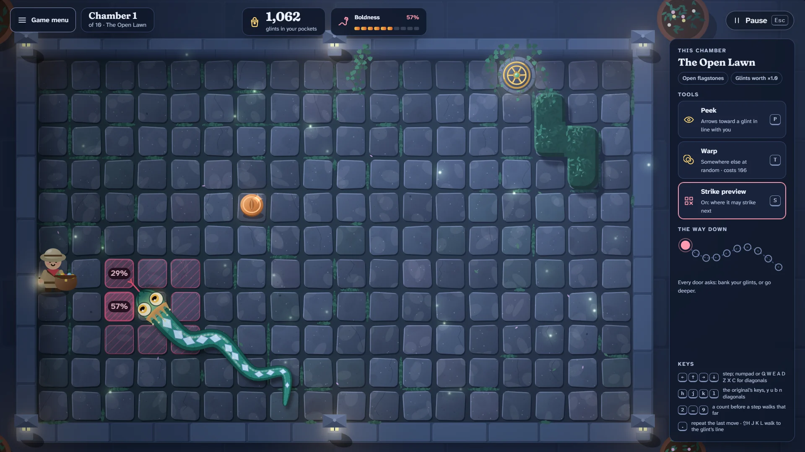

# Full Pockets

> Grab the glints. Mind the snake. Know when to leave.

## The hook

A sunken stone garden, a round bronze door, and one big, vain snake who adores shiny things.
Every step you take, it takes one too, and the fuller your satchel, the bolder it gets: with empty
pockets it never comes straight at you; with full ones it can hardly help itself. Every door asks
the same question: bank what you carry, or go one chamber deeper for richer glints.

## Where it comes from

`snake` is one of the Berkeley games, dated 1980: a turn-based chase on a CRT terminal, where an
`I` collected dollar signs while a six-letter snake followed it about, and a `#` in a corner let it
leave with its money. A comment in its code owned up to leaving the snake a little buggy on purpose
so it would not play too well, its pay per pickup came from a curve fitted partly by how play felt,
and when it caught you it rolled a lucky digit and winked at anyone carrying more than their best.

## What is new

- **A snake you can read.** Its crown and eyes brighten as your pockets fill, a meter shows the
  chance it heads straight for you, and the strike preview shades where it may land next.
- **Runs of ten chambers.** Hedges, lily pools it swims through two squares at a time, narrow
  corridors, twin glints, a snake asleep until your third glint, and a mirror chamber where peeking
  always shows the way. Each door: bank it, or go deeper.
- **The Lucky Break.** Caught, a sundial spins against the last digit of your pockets: about one
  chance in ten to scramble free. Nothing is ever staked.
- **The wink**, kept and celebrated: caught on your richest run ever, the snake winks first.
- **A Daily Run** of five chambers, the same for everyone, and **Classic**: the 1980 rules on one
  board, four-way walking, debts and all.
- **Sun Garden and Moon Garden**: the same garden at noon and by lantern light.

## At a glance

|                 |                          |
| --------------- | ------------------------ |
| Directory       | `/usr/games/arcade`      |
| Players         | 1                        |
| Session         | 3–10 minutes             |
| Daily challenge | yes: the Daily Run (#N)  |
| Inspired by     | `snake` (1980, Berkeley) |

## More

- [How to play](HOW-TO-PLAY.md)
- [Changes from the original](CHANGES-FROM-ORIGINAL.md)
- [Architecture](ARCHITECTURE.md)
- [Notes](NOTES.md)
