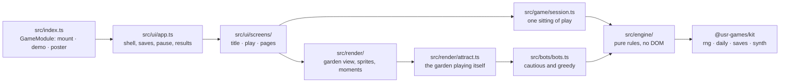
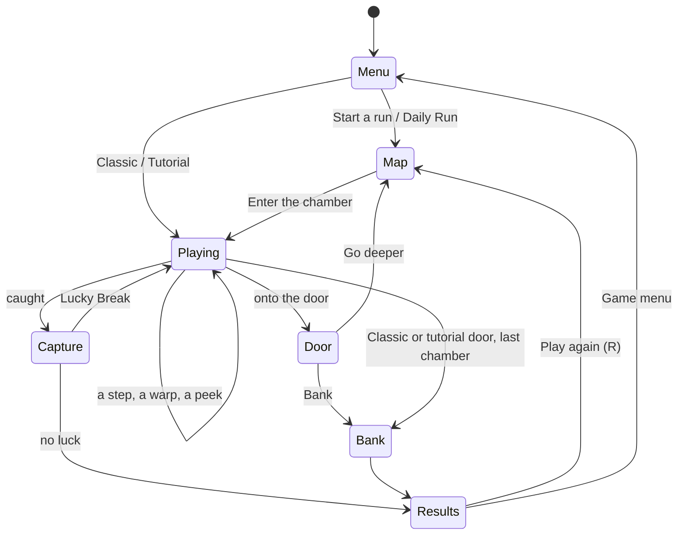

# Full Pockets — architecture

## Overview

Full Pockets is a **native** game: TypeScript mounted by the Hall through the kit contract, about
a thousand lines of pure engine and a Canvas 2D renderer ([ADR 0001](adr/0001-canvas-2d.md)) with
an HTML and SVG interface. No dependencies beyond `@usr-games/kit`.

## Module map

| Path                     | Responsibility                                                                                 |
| ------------------------ | ---------------------------------------------------------------------------------------------- |
| `src/index.ts`           | `mount`, `demo`, `poster`, `achievements` (the kit contract)                                   |
| `src/engine/snake.ts`    | The snake's `chase()`: aim, weights, the ten-bit draw, exact strike chances                    |
| `src/engine/round.ts`    | A chamber's state and its turn: steps, pickups, the door, warp, capture, the Lucky Break, peek |
| `src/engine/setup.ts`    | Placement: the original's careless Classic layout, a run's fair start                          |
| `src/engine/chambers.ts` | Chamber kinds, run plans, procedural ground (hedges, pools, corridors), connectivity           |
| `src/engine/run.ts`      | A run: seeded layouts per depth, going deeper with pockets carried                             |
| `src/engine/risk.ts`     | The exact capture risk of each of your steps (both strokes of a swim)                          |
| `src/engine/value.ts`    | The pickup hyperbola, pockets and debt arithmetic                                              |
| `src/bots/bots.ts`       | The cautious and greedy bots for balance and the attract mode                                  |
| `src/game/`              | Session, key map, saves and records, packages                                                  |
| `src/render/`            | The garden view and everything drawn on the canvas                                             |
| `src/ui/`                | Screens, HUD, cards, styles                                                                    |
| `src/audio/sounds.ts`    | Every sound, on the kit's synth                                                                |
| `dev/`                   | The workbench on port 5276, with a stand-in for the Hall and the hero scenes                   |

## State machine

## Engine

A `Round` is plain data: the garden (ground per square, the door), you, the glints, the snake's six
squares head first, its last heading, loot and penalty (the original's counts), a run's ledger of
glints, the chamber's rules and counters. `step(round, direction, rng)` returns the next round and
the events of the turn; nothing is mutated. Randomness comes from kit RNG streams:

| Stream                   | Used for                                                      |
| ------------------------ | ------------------------------------------------------------- |
| `<seed>:plan`            | The run's chamber kinds and names                             |
| `<seed>:chamber:<depth>` | That chamber's ground, door, start, glint and snake placement |
| `<seed>:play:<depth>`    | The snake's draws, new glints, warps and the Lucky Break      |
| `snake:daily:<date>`     | The Daily Run's seed (from the kit's `dailySeed`)             |

Each chamber's layout depends only on the seed and its depth, so a Daily Run is the same for
everyone however they played the chamber before.

## AI

There is no opponent beyond the snake, and the snake is the original's `chase()` (see
`src/engine/snake.ts`): it is random by design. The two bots in `src/bots/bots.ts` read the exact
capture risk of every step (`src/engine/risk.ts`) and walk the shortest way round hedges and the
snake's body; the cautious one takes two glints and banks, the greedy one takes `8 + depth / 2`
glints a chamber and always goes deeper. They are bounded by steps (a stuck bot throws), never by
the clock.

## Where visuals are defined

| Visual                                        | Defined in                                | Change it by                                          |
| --------------------------------------------- | ----------------------------------------- | ----------------------------------------------------- |
| Colours of both looks                         | `src/render/look.ts`                      | `PALETTES` and `SNAKE_COLOURS` (Sun and Moon)         |
| Terrace, rim, flagstones, moss, pools, hedges | `src/render/ground.ts`                    | One function per layer, painted once per chamber      |
| Water ripples, lanterns, sunlight, glow-worms | `src/render/ambience.ts`                  | `drawWater`, `drawLanterns`, `drawAtmosphere`         |
| The snake (body, scales, crown, eyes, moods)  | `src/render/snake.ts`                     | `drawSnake`; moods in `drawLid` and `drawMouth`       |
| The explorer and satchel                      | `src/render/explorer.ts`                  | `KIT` colours, `drawSatchel`, poses                   |
| Glints (two coins, three gems)                | `src/render/glint.ts`                     | `GEMS`; the tier per chamber in `src/render/scene.ts` |
| The door                                      | `src/render/door.ts`                      | `drawDoor`                                            |
| Strike preview and peek arrows                | `src/render/preview.ts`                   | Tint and hatching scale with the chance               |
| Coil, spill, pour, hoard                      | `src/render/moments.ts`, `garden-view.ts` | Geometry in `moments.ts`                              |
| Interface, cards, dial                        | `src/ui/styles.css`, `src/ui/hud.ts`      | Tokens per look at the top of the stylesheet          |

The canvas follows the Hall's appearance (light: Sun Garden, dark: Moon Garden) live. Under reduced
motion the snake and explorer jump between squares, nothing bobs or twinkles, and the moments are
quicker.

## Where sounds are defined

All in `src/audio/sounds.ts`, played on the kit's synth, quiet by default.

| Sound                | Plays when                                             |
| -------------------- | ------------------------------------------------------ |
| `step`, `bump`       | You step; you walk into a wall or a hedge              |
| `glint`              | A pickup; one step higher for every glint this chamber |
| `slither`            | The snake moves; thicker and lower as it grows bold    |
| `wake`               | A sleeping snake wakes                                 |
| `peek`, `warp`       | You peek; you warp                                     |
| `coil`, `tick`       | Caught; the dial passes a digit                        |
| `escape`, `scramble` | A Lucky Break; caught for good                         |
| `wink`, `bank`       | The wink; glints pouring into the vault                |

## Hall integration

- **Results** (`presentation: 'game'`): a bank is a `win` with the haul as `score`, a capture a
  `loss` with 0. `stats`: `glintsPicked`, `chambersDeep`, `banked`, `luckyBreaks` (the cron goals
  count the first and third). `xpEvents`: `chambers` (3 per chamber below the first, at most 15) and
  `lucky-break` (5). The tutorial reports nothing.
- **Daily**: the kit's number and seed; the first finished Daily Run of the day reports `daily: true`.
- **Share**: `Full Pockets #N · banked 💎1,240 at chamber 4 · 🍀1`, through the kit, no link.
- **Pause menu**: one item, the strike preview.
- **Saves** (version 1): `prefs` (strike preview, Classic size, the original's keys, tutorial seen)
  and `records` (best haul, deepest chamber, Classic bests per size, sixty days of Daily Runs,
  counters).
- **Demo and poster**: `demo()` runs the attract loop silently and pauses when hidden; `poster()`
  draws the snake coiled round a heap of glints, winking.
- **Test hook**: `window.__fp.play()` exposes the play screen's session for the browser tests.

## Tests

| Test                         | Command                                                        | What it proves                                                         |
| ---------------------------- | -------------------------------------------------------------- | ---------------------------------------------------------------------- |
| Engine rules (26)            | `pnpm vitest run --project snake`                              | Every rule of the original, the chamber rules, debt, peek              |
| Runs and fairness (7)        | (same)                                                         | Plans, connectivity, carried pockets, 365 fair Daily starts            |
| Balance (2, 1000 seeds each) | (same)                                                         | Cautious banks ≥ 95 %; greedy reaches chamber 5 in 30–50 %             |
| Gameplay in the browser (10) | `pnpm exec playwright test -c games/snake --project=workbench` | Tutorial, counts, mouse walk, warp, doors, Lucky Break, share, Classic |
| In the Hall                  | `pnpm exec playwright test -c games/snake --project=hall`      | Opening, results reaching the Hall, every way out                      |
| Hero frames, screenshots     | `--grep @hero`, `SHOTS=1 …`                                    | `docs/media/`                                                          |
| Balance report               | `npx tsx games/snake/scripts/balance.ts 1000`                  | The numbers in NOTES.md                                                |

## Kit candidates

- `src/ui/dom.ts`'s `h()` element builder (Zoomies has the same).
- `src/render/noise.ts` (seeded hash, colour mixing) for any procedural painter.
