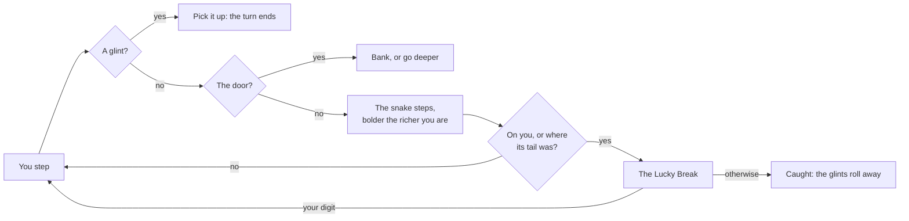

# How to play Full Pockets

## Goal

Pick up glints in a sunken garden and leave by the door with as many as you can carry, before the
snake coils round you. In a run, every door lets you bank your haul or go one chamber deeper.

## Controls

| Action                                      | Keyboard                                                                | Mouse                                         | Remappable |
| ------------------------------------------- | ----------------------------------------------------------------------- | --------------------------------------------- | ---------- |
| Step (eight ways in a run, four in Classic) | Arrow keys, number pad, Q W E / A D / Z X C, or `h j k l` and `y u b n` | Click a square next to you                    | yes        |
| Walk several squares                        | A count first: `3` then a step walks three                              | Click a square along a line, then click again | no         |
| Repeat the last move                        | `.`                                                                     | —                                             | yes        |
| Walk to the glint's column or row           | Shift with `H`, `J`, `K` or `L`                                         | —                                             | no         |
| Peek toward a glint (or the door)           | P                                                                       | Peek, in the side panel                       | yes        |
| Warp to a random square                     | T, then Enter to confirm                                                | Warp, then Warp                               | yes        |
| Strike preview on or off                    | S                                                                       | Strike preview, or the pause menu             | yes        |
| See the snake's boldness                    | —                                                                       | Right-click the snake                         | no         |
| At a door: bank or go deeper                | B or D                                                                  | Bank or Go deeper                             | no         |
| Skip the capture or the bank                | Enter or Space                                                          | —                                             | no         |
| Pause                                       | Esc                                                                     | Pause                                         | no         |
| Play again (results)                        | R                                                                       | Play again                                    | no         |
| Back to the Hall (results)                  | H                                                                       | Back to the Hall                              | no         |

Walking into a wall or a hedge just bumps: it costs no turn.

## Rules

1. You take a step. If you land on a glint you pick it up, and your turn ends there: the snake does
   not move. If you land on the door, you leave.
2. Otherwise the snake takes a step. It chooses among the eight directions at random, weighing
   each one: the direction straight at you weighs a tenth of your loot, the way it went last time
   a little more again, every other open way one. With empty pockets it never comes straight at
   you; the richer you are, the more it does. It never steps onto a glint or the door.
3. You are caught if any of its six squares is on you, or if you stand where its tail just was.

**Warp** drops you on a random square for a tenth of everything you have picked up so far. Keep
warping and your pockets can go into the red. **Peek** points arrows toward a glint, or the door,
when one is nearly in line with you.

**The Lucky Break.** When the snake catches you, a sundial spins. If it stops on the last digit of
your pockets, you scramble free with everything. It is a free chance, about one in ten; nothing is
staked. Caught carrying more than your best haul ever, the snake winks at you first.

## Modes

| Mode     | What changes                                                                                                          |
| -------- | --------------------------------------------------------------------------------------------------------------------- |
| Run      | Ten chambers down. Glints are worth more in each, the chambers narrow and the snake arrives bolder. Bank at any door. |
| Daily #N | Five chambers, the same for everyone today, numbered like every daily in the Hall. The first finished run counts.     |
| Classic  | The 1980 game: one open board of the size you choose, four-way walking, the door ends the game, debts allowed.        |
| Tutorial | A small lawn: step, grab a glint, peek, bank. About ninety seconds.                                                   |

**Chambers.** The open lawn always comes first and has no pools. Then hedges, lily pools (the
snake swims two squares a turn through them), narrow corridors, twin glints, a snake asleep until
your third glint in that chamber, and a mirror chamber where peeking always shows the way.

## Settings

| Setting             | Options                                    | Default |
| ------------------- | ------------------------------------------ | ------- |
| Strike preview      | on · off                                   | on      |
| The original's keys | listed in the side panel or not            | off     |
| Classic board       | 4 × 4 up to 78 × 22, the original's screen | 24 × 13 |

Sound, reduced motion and key remapping live in the Hall's settings.

## Scoring

What you bank is your score. A pickup is worth what the original paid on a board that size (the
shorter edge decides: 36 glints on any edge up to twelve, 25 on the original's 22-row screen),
times the chamber's rate in a run (×1.0 in the first chamber, ×2.8 in the tenth). Caught, you bank
nothing. The Daily Run's share line looks like
`Full Pockets #42 · banked 💎1,240 at chamber 4 · 🍀1`, with no link.

## Achievements (packages)

| Package         | How to earn it                                                  |
| --------------- | --------------------------------------------------------------- |
| `first-glint`   | Pick up your first glint.                                       |
| `banked`        | Bank a haul at a door.                                          |
| `peek-a-boo`    | Peek twenty times.                                              |
| `no-warp-run`   | Bank a run without warping once.                                |
| `daily-regular` | Finish seven Daily Runs.                                        |
| `root-denied`   | Hidden.                                                         |
| `lucky-break`   | Scramble free when the dial lands on your digit.                |
| `winked-at`     | Get caught carrying more than your best haul, and see the wink. |
| `in-the-red`    | End a Classic game owing glints.                                |
| `snake-charmer` | Leave a chamber where the snake never came within two squares.  |
| `greedy-guts`   | Pick up fifteen glints in one chamber.                          |
| `deep-pockets`  | Bank a haul at the door of the tenth chamber.                   |

## XP

Every finished run reports to the Hall: a bank is a win, a capture a loss. On top of the Hall's
own XP, a run earns 3 XP for every chamber below the first (up to 15) and 5 for a Lucky Break.
Weekly goals can ask you to pick up glints or bank hauls.

## Tips

- Pick up a glint when the snake is close: the turn ends before it moves.
- Glints and the door are squares the snake will never enter. Stand on neither, but stand near.
- The fuller your pockets, the more predictable the snake: it comes straight on. Lead it round a
  hedge.
- Keep away from lily pools when the snake is near them: it swims two squares at a time.
- Bank before you feel greedy. The door will still be there next run.
