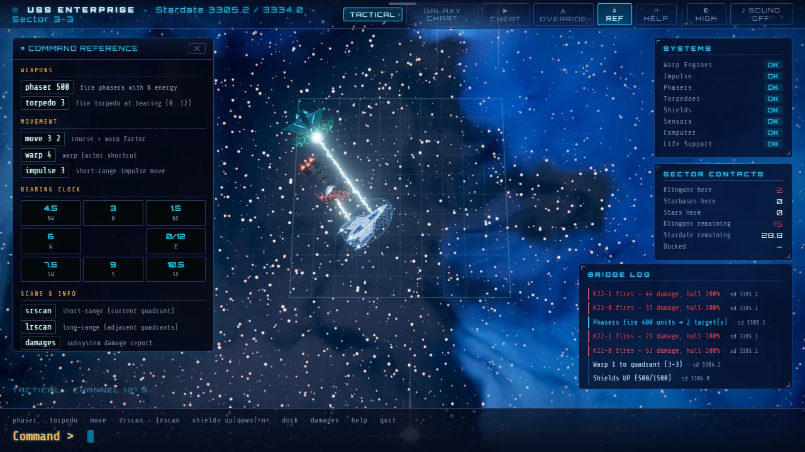

# Trek — Deep Space

> Clear the galaxy of hostile ships before time runs out.

## The hook

You command the last ship in a galaxy of 64 quadrants, and every order is a line you type:
`phaser 400`, `torpedo 4.5`, `move 1.5 2`. Each order spends energy and time, and every hostile
ship in the quadrant answers it with a volley of its own. The whole game is a budget: raise the
shields or save the energy for the guns, run for a starbase or press on, chart the next quadrant or
trust the last scan. When it comes together, six phaser banks fire at once, the beams find their
targets and the quadrant goes quiet.

## Where it comes from

`trek` is Eric Allman’s space command game from the BSD games. He wrote the C version at Berkeley in
May 1976, with help from Jeff Poskanzer and Pete Rubinstein; its manual page carries the Regents’
1980 copyright. His notes trace a long family tree: Mike Mayfield’s BASIC game, Kay Fisher’s
FORTRAN adaptation of it, and a FORTRAN version by David Matuszek and Paul Reynolds that he names
as his main inspiration. On a terminal you picked a length and a skill level, typed commands
answered by prompts, and read each quadrant as a ten-by-ten grid of letters. It borrowed its names
from a television series, and it was big for its day: more than twenty commands, a starbase that
could beam you aboard in an emergency, and a self-destruct that wanted the password you typed when
the game began.

## What is new

- Every quadrant is a place: its own nebula sky, generated from its coordinates, and a planet on
  the horizon in half of them.
- Original ships, built and lit in code: your long cruiser, four hostile classes with their own
  silhouettes, and a ring starbase more than five sectors across.
- Combat staged the way the original counted it: six phaser banks fire together, one beam per
  target; the torpedo tube waits until the bow is on its bearing; hits ring the shield with hexagons.
- A holographic galaxy chart with fog of war, and a warp tunnel between quadrants.
- A command line that explains itself: each line is described before you press Enter, a reference
  panel sits beside it, and an optional hint panel suggests what to type next.
- Three difficulty levels instead of length × skill, synthesised sound (off until you turn it on),
  and lighter looks for machines without a graphics card.

## At a glance

|                 |                       |
| --------------- | --------------------- |
| Directory       | `/usr/games/strategy` |
| Players         | 1                     |
| Session         | 15–40 minutes         |
| Daily challenge | no                    |
| Inspired by     | `trek` (1980)         |

## More

- [How to play](HOW-TO-PLAY.md)
- [Changes from the original](CHANGES-FROM-ORIGINAL.md)
- [Architecture](ARCHITECTURE.md)
- [Notes](NOTES.md)
