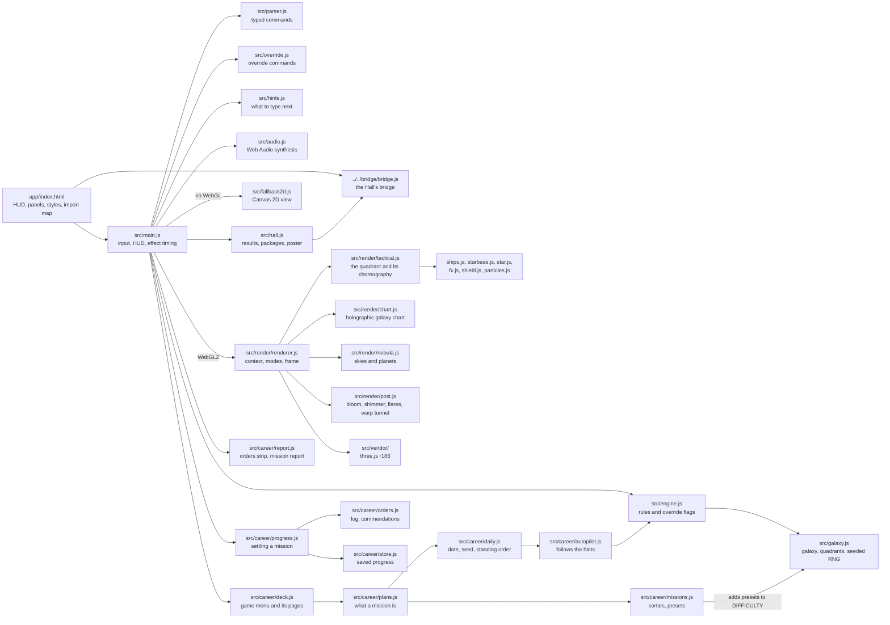
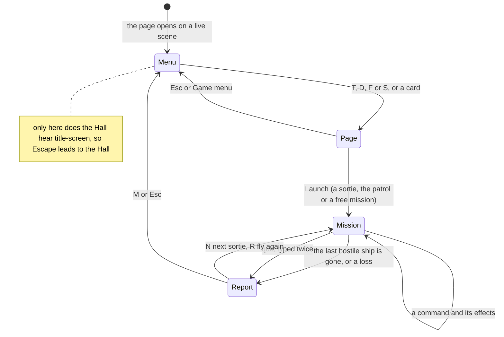

# Trek — Deep Space — architecture

## Overview

Trek is a **hosted** game: the owner’s finished procedural port (`trek`, procedural-web), adopted
as it was into `games/trek/app/`. It is vanilla ES modules with no build step; three.js r186 is
vendored in `src/vendor/` and loaded through an import map, and every look that matters (skies,
stars, shields, beams, fire, the chart, the post-processing) is hand-written GLSL. Without WebGL2
it draws a Canvas 2D view of the same game. The Hall serves the folder as it is
(`hosted-static`) at `play/trek/`. The rules are a small engine with no DOM (about 1,000 lines with
the galaxy model); everything else is presentation that plays the engine’s effects back. Deep Space
Command (`app/src/career/`, added on 2026-10-02) wraps the engine in a game menu with the Frontier
Tour, the Daily Patrol, free missions and a service record, without changing a rule. The upstream
design notes are in [`../app/docs/architecture.md`](../app/docs/architecture.md), its
change log against the original in [`../app/docs/diff-log.md`](../app/docs/diff-log.md) and its
decisions in [`adr/`](adr/).

## Module map

| Path                          | Responsibility                                                                                        |
| ----------------------------- | ----------------------------------------------------------------------------------------------------- |
| `app/index.html`              | The page: canvases, HUD panels, title and end screens, tutorial, all CSS, the import map              |
| `app/src/main.js`             | Keyboard and buttons, the command line, HUD text, effect timing, quality steps, URL options           |
| `app/src/engine.js`           | Game state and every command; the override flags                                                      |
| `app/src/galaxy.js`           | Galaxy and quadrant model, hostile classes, difficulty presets, the seeded RNG                        |
| `app/src/parser.js`           | The command grammar and its one-line descriptions                                                     |
| `app/src/override.js`         | The `override …` grammar, kept apart so `parser.js` stays untouched                                   |
| `app/src/hints.js`            | Suggested commands, most urgent first (the hint panel and `computer`)                                 |
| `app/src/audio.js`            | Every sound, synthesised with Web Audio                                                               |
| `app/src/render/`             | The WebGL2 renderer: scene, ships, effects, skies, chart, post chain, quality profiles                |
| `app/src/fallback2d.js`       | The same interface drawn in Canvas 2D                                                                 |
| `app/src/vendor/`             | three.js r186 (`three.module.js`, `three.core.js`) and its MIT licence                                |
| `app/src/fonts/`              | Self-hosted Orbitron and Share Tech Mono (added on adoption)                                          |
| `app/src/hall.js`             | The bridge glue (added on adoption)                                                                   |
| `app/src/career/missions.js`  | The ten sorties (setup, seed, briefing, commendations) and the patrol’s setup, added as presets       |
| `app/src/career/daily.js`     | Daily numbering, the day’s seed and standing order, the patrol rating and share line                  |
| `app/src/career/orders.js`    | The mission log (orders, docks, torpedoes, charting) and how commendations are judged                 |
| `app/src/career/autopilot.js` | Plays a mission by the hints alone; proves sorties and patrols winnable                               |
| `app/src/career/plans.js`     | A mission plan: preset, seed, name and commendations of a sortie, a patrol or a free mission          |
| `app/src/career/progress.js`  | Settles a finished mission into the tour, the patrol log and the service record                       |
| `app/src/career/ranks.js`     | Ranks by tour stars                                                                                   |
| `app/src/career/store.js`     | Saves under `usr-games:trek:` in the collection’s `{ v, data }` envelope                              |
| `app/src/career/deck.js`      | The game menu and its pages: tour and briefings, patrol, free mission, service record                 |
| `app/src/career/report.js`    | The orders strip on the HUD and the mission report                                                    |
| `app/lab.html`, `src/lab.js`  | An art-direction bench for skies and ships; not part of the game, and the build leaves `lab.html` out |

## State machine

The tutorial (`?`) opens over any of these and keeps Escape for itself. The first mission on a
device opens it automatically. The report waits for the last shot to play out: `main.js` delays it
by the effect duration the renderer returns, between half a second and four seconds, and then
ignores Enter and Space for 0.7 s so the Enter of a last order is not taken as a choice.

## Deep Space Command

`galaxy.js` must stay byte-identical to the baseline, so the career never changes the generator:
`missions.js` adds one named preset per sortie (and one for the patrol) to the exported
`DIFFICULTY` table when it loads, and a sortie is that preset plus a fixed seed. `main.js` keeps
the mission’s **plan** (`plans.js`) for the whole mission, so “fly it again” is the same plan once
more. Every carried-out command goes through `noteOrder`, which counts orders (commands that act:
phaser, torpedo, move, dock, shields), docks, torpedoes fired and the ships they disabled, the
lowest hull and the quadrants charted. Commendations are judged against that log and the final
state when the mission ends (`judgeCommendation`); mid-mission, `commendationStatus` feeds the
orders strip.

**Winnable by design.** `autopilot.js` types the hint panel’s first command every turn, as
`tests/autoplay.test.js` does, with a fixed escape cycle should the advice ever repeat itself.
Sortie seeds were chosen with `app/scripts/tour-search.mjs` among wins that needed no escape, and
the day’s patrol seed is the first of the date’s seeds (FNV-1a of `trek:daily:<date>`, then +1,
+2…) that the autopilot wins without one, searched in about a millisecond a try and cached for the
visit. A year of patrols (2026-09-01 onwards) needed no fallback beyond the search. Since the
engine is deterministic, typing the hint panel’s first suggestion each turn replays the
autopilot’s winning line exactly.

**The hint panel is a testing aid.** It has no button and no help line; Ctrl+Alt+C shows or hides
it, and `?cheat=1` opens it at start. Its visibility is not remembered. It only advises, so it does
not mark a mission. The Captain’s Override (`!`) is unchanged and still marks the mission.

**Saved progress** (`store.js`), under `usr-games:trek:` so the Hall’s “Forget everything” clears
it: `tour` (per sortie: won, three stars), `patrols` (per date: number, won, rating, stars, orders,
stardates used; only the first patrol of a day, won, lost or abandoned) and `record` (missions, victories, ships
disabled, orders, patrols flown). A mission with `game.cheated` set saves nothing.

URL options for captures and tests: `autostart=1` with `mission=daily` or `mission=<sortie id>`
launches that mission (a free one otherwise), and `day=YYYY-MM-DD` pins the date the menu and the
patrol use.

## Engine

`createGame({ difficulty, seed })` builds an 8×8 galaxy of quadrants from a Mulberry32 RNG
(`makeRng` in `galaxy.js`), seeded from `Math.random()` unless the page is opened with `?seed=N`.
Each quadrant keeps only counts until the ship first enters it; `populateQuadrant` then places its
hostile ships, starbase and stars on the 10×10 sector grid, so the galaxy you meet depends on your
route as well as the seed. `executeCommand(game, cmd)` applies a parsed command at once and returns
`{ ok, effects }`: the state is already final, and the effects (`phaser`, `torpedo`, `impulseMove`,
`warpMove`, the hostile volleys, `dock`, `shield`, scans) tell the renderer what to show. Pictures run
behind the rules on purpose; the renderer marks a ship that the engine has already removed as
“doomed” so it stays on screen until its explosion.

The engine is a spiritual successor to the original, written anew: no C code or text was copied.
It is shared with the owner’s painted port of the same game, so `galaxy.js`, `parser.js` and
`hints.js` are byte-identical to that port and pinned by SHA-256 in the tests, and `engine.js`
differs only by the override flags. Every override hook is a guard `ov(game, flag)`; with every
flag off, a regression test replays 120 seeded games through a frozen copy of the shared engine and
expects identical state, effects and RNG after every step. The first override used sets
`game.cheated` for the rest of the mission.

Visual randomness never touches the game’s RNG: `render/rng.js` seeds its own streams from stable
inputs (quadrant coordinates, ship ids), so rendering cannot change the game.

## Hostile ships

There is no planning AI. Hostile ships hold their sectors. After each phaser volley, torpedo or
move, every hostile ship in the quadrant fires once (none while you are docked), for a random
amount in its class’s range, weakened by 8% per sector of distance; shields absorb first, the rest
reaches the hull, and a hit on the hull has a 40% chance to damage one of eight systems. The class
is rolled when a quadrant is first populated: warship 65%, battlecruiser 22%, warbird 10%, super
3% (`ENEMY_STATS` and `SPAWN_WEIGHTS` in `galaxy.js`).

## Where visuals are defined

| Visual                                                 | Defined in                                                 |
| ------------------------------------------------------ | ---------------------------------------------------------- |
| Quadrant skies (one per quadrant), planets, star field | `app/src/render/nebula.js` (`skyParams`, `planetParams`)   |
| The player’s cruiser and the four hostile classes      | `app/src/render/ships.js`, with `geom.js`, `parts.js`      |
| Hull plating (drawn on a runtime canvas)               | `app/src/render/hulltex.js`                                |
| The ring starbase                                      | `app/src/render/starbase.js`                               |
| Stars in a sector (granulation, corona, light)         | `app/src/render/star.js`                                   |
| Phaser beams, bolts, torpedoes, explosions, pings      | `app/src/render/fx.js`, `particles.js`                     |
| Shield bubble and its hexagon ripples                  | `app/src/render/shield.js`                                 |
| The quadrant scene, camera, turns and effect timing    | `app/src/render/tactical.js` (`play`)                      |
| Galaxy chart and its fog of war                        | `app/src/render/chart.js`                                  |
| Bloom, heat shimmer, lens flares, warp tunnel, grading | `app/src/render/post.js`                                   |
| Shared noise and hashes                                | `app/src/render/glsl.js`                                   |
| Quality profiles and GPU detection                     | `app/src/render/core.js` (`PROFILES`)                      |
| The view without WebGL                                 | `app/src/fallback2d.js`                                    |
| HUD, panels, title, tutorial, end screen, colours      | `app/index.html` (custom properties at the top of the CSS) |
| Fonts                                                  | `app/src/fonts/fonts.css`                                  |

The ships are original designs (the player’s “Vanguard”; “Talon”, “Hammer”, “Stingray” and
“Trident” for the warship, battlecruiser, warbird and super classes). Trek has one dark look and
does not read the Hall’s tokens. The renderer picks High on a GPU and Lite on a software
rasteriser, steps High → Low below 28 fps and Low → Lite below 18 fps (each after three seconds)
unless the player pinned a quality, and switches to the 2D view without WebGL2. Reduced motion
comes from the system (`prefers-reduced-motion`) or `?reduced=1`: no drift, bobbing or shake, a
fade instead of the warp tunnel, and gentler flashes.

## Where sounds are defined

Every sound is synthesised in `app/src/audio.js`; there are no audio files. Sound is muted until
the player turns it on with the ♪ button, and the audio graph is only built then.

| Sound                                     | Patch in `audio.js`   | Plays when                                                           |
| ----------------------------------------- | --------------------- | -------------------------------------------------------------------- |
| Bridge drone, air hum, rare console blips | `_ambience`           | All the time while sound is on                                       |
| Phaser                                    | `_phaser`             | The banks fire                                                       |
| Torpedo                                   | `_torpedo`            | A torpedo leaves the tube                                            |
| Explosion                                 | `_explosion`          | A ship is disabled or a starbase is hit                              |
| Disruptor                                 | `_disruptor`          | Hostile ships fire                                                   |
| Shield ring                               | `_shieldHit`          | A shot lands on the shields                                          |
| Hull clang                                | `_hullHit` (`impact`) | A shot reaches the hull, a torpedo hits a star, a command is refused |
| Alert klaxon                              | `_klaxon`             | Hostile ships appear in your quadrant (`playEffects` in `main.js`)   |
| Warp, impulse                             | `_warp`, `_impulse`   | The ship has come about and moves                                    |
| Scan                                      | `_scan`               | `srscan`, `lrscan`                                                   |
| Shields                                   | `_shield`             | Shields raised, lowered or charged                                   |
| Dock, refit                               | `_dock`, `_resupply`  | Docking; an override refit or switch                                 |

The renderer triggers most of them from its effect timeline (`render/tactical.js`), so each sound
lands with its picture.

## Hall integration

All of it lives in `app/src/hall.js`, plus the bridge script tag in `index.html` and its calls in
`main.js`.

| Trek moment                                                        | Bridge message                                                                                                           |
| ------------------------------------------------------------------ | ------------------------------------------------------------------------------------------------------------------------ |
| The game menu shows or hides (`#title-screen.shown`, `#deck` page) | `title-screen { active }`, true only on the menu’s first page, from a `MutationObserver`                                 |
| `endGame` (a win, a loss, or an abandoned mission)                 | `result { outcome, score, stats, xpEvents, daily, durationSeconds }`                                                     |
| After every command (`noteCommand` at the top of `playEffects`)    | packages `opening-volley`, `true-aim`, `safe-harbour`, `sector-secured`, `double-volley`, `full-survey`, `flagship-down` |
| A won mission                                                      | packages `mission-accomplished`, `steady-hand`, `hardest-level`, `hold-together`, `self-reliant`                         |
| A settled mission                                                  | packages `first-sortie`, `on-patrol`, `promoted`, `full-marks`, `tour-complete`                                          |
| Game menu or report: ← Back to the Hall                            | `navigate { to: 'hall' }`                                                                                                |
| A frame drawn six seconds after the first mission starts           | `poster`, through `posterFromCanvas` on `#gl`, once per visit                                                            |

- **Outcome.** `win` when every hostile ship is gone; `loss` when the stardates, the hull, life
  support or the energy ran out; `quit` for a mission abandoned with `quit` typed twice, which
  earns no XP.
- **Score.** The ships disabled (`game.kills`), in every mode, so the Hall’s best stays comparable.
  The patrol rating stays in the game.
- **Daily.** `daily: true` for a Daily Patrol, practice runs included.
- **Stats.** `shipsDisabled`, `quadrantsCharted` (quadrants newly charted during this mission) and
  `commendations` (earned this mission), feeding the weekly goals “Disable {n} hostile ships”
  (10–30), “Chart {n} quadrants” (20–60) and “Earn {n} commendations” (3–9).
- **XP events.** `ships-disabled`: 2 XP per ship, at most 25; `commendations`: 3 XP each.
- **Override missions.** When `game.cheated` is set, the result carries the outcome with no score,
  zero stats and no XP events, and no packages are installed.

`main.js` calls `noteMissionStarted` in `startMission`, `noteCommand` at the top of `playEffects`,
`reportMission` in `endGame` once the mission is settled, and offers the poster right after
`view.frame(t)`, in the same task as the drawing, because the WebGL canvas may be cleared once the
frame is shown. Escape on the game menu leads to the Hall; on its pages it goes back to the menu,
and the tutorial keeps it for itself. Trek ignores pause,
appearance and settings messages: it is turn-based, has one look and keeps its own sound switch.
Opened on its own, the bridge script is missing and `hall.js` does nothing.

## Tests

| Test            | Command                                                             | What it proves                                                                                                                                                                                                                                                                                                                                                                                                                                            |
| --------------- | ------------------------------------------------------------------- | --------------------------------------------------------------------------------------------------------------------------------------------------------------------------------------------------------------------------------------------------------------------------------------------------------------------------------------------------------------------------------------------------------------------------------------------------------- |
| Unit tests (96) | `pnpm run test:hosted` (or `node --test tests/*.test.js` in `app/`) | The eight upstream files (engine, parser, hints, an autoplay that wins by following the hints, the overrides, shortcut clashes, zero raster, and the baseline regression that replays 120 seeded games and pins three source files by hash), plus `career.test.js`: every sortie and a month of patrols won by the hints alone, daily numbering and standing orders, commendations, ranks, saving, override missions saving nothing, the report’s buttons |
| In the Hall (7) | `pnpm exec playwright test -c games/trek`                           | Opens on its game menu with no outside requests; the menu’s pages keep Escape; abandoning a mission asks first and reports to the Hall; Back to the Hall; Game menu; browser Back; Escape on the game menu                                                                                                                                                                                                                                                |
| Screenshots     | `SHOTS=1 pnpm exec playwright test -c games/trek`                   | `docs/media/` (the game menu, the Frontier Tour, a phaser volley, the galaxy chart, a mission report), on the machine’s GPU                                                                                                                                                                                                                                                                                                                               |

The screenshot spec drives the game through its URL options: `?seed=428&difficulty=standard`
fixes the galaxy, `help=0` skips the tutorial, `autostart=1` starts a free mission (or the one
`mission=` names) and `cmds=…` types a list of commands separated by semicolons (`view` switches to
the chart). The upstream browser
scripts in `app/scripts/` (smoke checks, timings, screenshots) belong to the workbench: the build
leaves them out and the collection’s checks do not run them. `compare.mjs` expects the painted port
beside this one and cannot run here, since only this port was adopted.

Set `HALL_PORT` when the Hall’s usual port (5173) is taken. On its own,
`pnpm --dir games/trek/app serve` serves Trek at `http://localhost:5208/`.

## Kit candidates

None: hosted games talk to the Hall only through the bridge.
