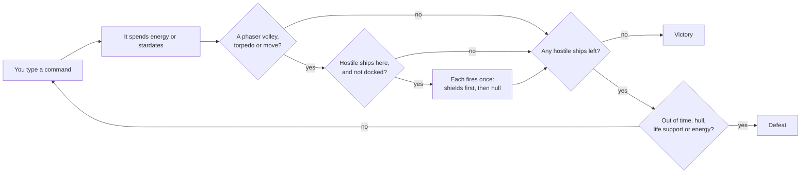
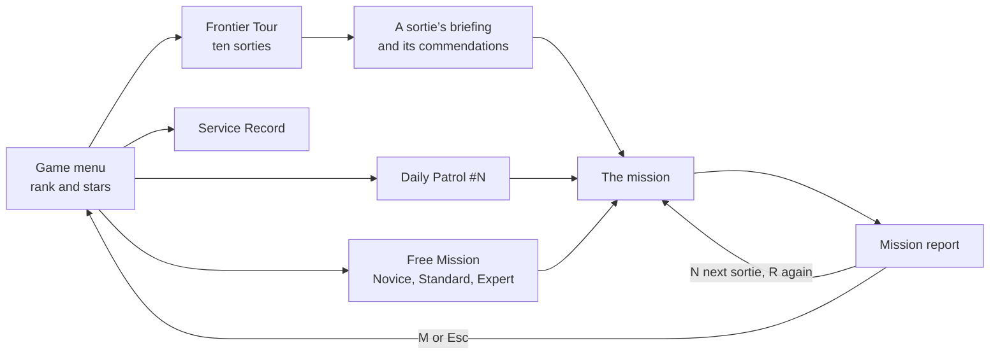
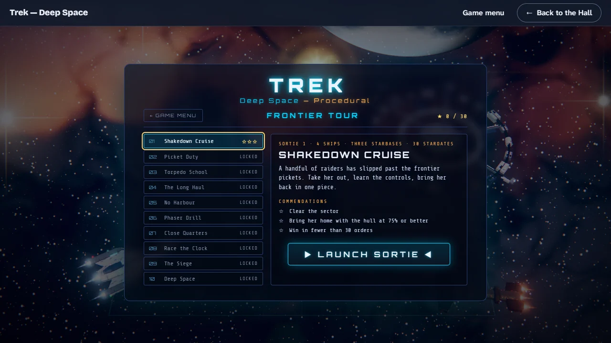
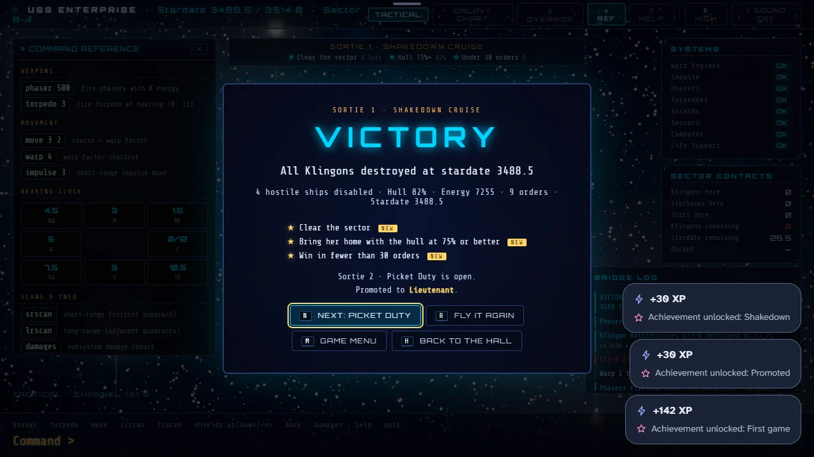

# How to play Trek — Deep Space

## Goal

Find and disable every hostile ship in the galaxy before the stardates run out. The galaxy is a
grid of 8×8 quadrants, each a grid of 10×10 sectors. You win when the last hostile ship is gone;
you lose if time runs out, your hull is destroyed, life support fails or your energy runs dry.

## Controls

Trek is played by typing commands at the `Command >` line. The game menu, its pages and the mission
report work with the keyboard or the mouse; the buttons along the top switch views and panels. Keys
are the game’s own and cannot be remapped from the Hall.

| Action                                      | Keyboard                                                 | Mouse                                       |
| ------------------------------------------- | -------------------------------------------------------- | ------------------------------------------- |
| Open a page of the game menu                | T tour, D daily patrol, F free mission, S service record | The four cards                              |
| Move between buttons on the menu and pages  | Arrow keys (Tab works too), then Enter                   | —                                           |
| Back to the game menu from one of its pages | Esc                                                      | ← Game menu                                 |
| Launch the sortie, patrol or mission shown  | Enter on ▶ LAUNCH                                        | ▶ LAUNCH SORTIE, LAUNCH PATROL, BEGIN       |
| Type a command                              | Letters, digits, space, `.` and `-`                      | —                                           |
| Run the command                             | Enter                                                    | —                                           |
| Delete the last character                   | Backspace                                                | —                                           |
| Clear the command line                      | Esc                                                      | —                                           |
| Tactical view or galaxy chart               | V (only while the command line is empty)                 | Tactical, Galaxy Chart                      |
| Tutorial                                    | ?                                                        | ? help                                      |
| Close the tutorial                          | Esc or ?                                                 | ✕ close                                     |
| Command reference panel                     | `\`                                                      | ≡ ref                                       |
| Override panel (see Settings)               | ! (or type `override`)                                   | ⚠ override                                  |
| Rendering quality                           | —                                                        | ◐ high, ◑ low or ○ lite                     |
| Sound on or off (off at the start)          | —                                                        | ♪ sound                                     |
| On the mission report                       | N next sortie, R fly again, M (or Esc) game menu, H Hall | The report’s buttons                        |
| Copy a daily patrol’s share line            | S on its report                                          | Copy share line                             |
| Leave for the Hall from the game menu       | Esc                                                      | ← Back to the Hall                          |
| Leave for the Hall during a mission         | Tab to the Hall’s strip                                  | Move to the top edge; ← Back to the Hall    |
| Start afresh                                | Tab to the Hall’s strip                                  | Move to the top edge; Game menu, then Leave |

### Commands

Type the command and its numbers on one line, then press Enter. While you type, the line above
the prompt says what the command will do, or what is wrong with it.

| Command                      | Short form   | What it does                                                                                               | Costs                                             |
| ---------------------------- | ------------ | ---------------------------------------------------------------------------------------------------------- | ------------------------------------------------- |
| `phaser 400`                 | `p 400`      | Fires that much energy at every hostile ship in the quadrant at once, shared equally, weaker with distance | The energy fired; 0.1 stardate                    |
| `torpedo 4.5`                | `t 4.5`      | Launches one torpedo on a clock bearing; it stops at the first thing in its path                           | One torpedo and 50 energy; 0.1 stardate           |
| `move 3 2`                   | `m 3 2`      | Course 3, warp 2: a jump of two quadrants. A warp below 1 is an impulse move inside the quadrant           | Energy of warp² × 10; stardates equal to the warp |
| `warp 2 3`                   | `w 2 3`      | The same move with the warp first; without a course it heads east                                          | As `move`                                         |
| `impulse 3`                  | `i 3`        | Four sectors along the course, inside the quadrant                                                         | 2 energy; 0.3 stardate                            |
| `shields up`, `shields down` | `s u`, `s d` | Raises the shields (500 in them if they were empty) or lowers them                                         | 50 energy to raise; 0.05 stardate                 |
| `shields 300`                | `s 300`      | Moves energy into the shields, up to their limit of 1,500                                                  | The energy moved; 0.05 stardate                   |
| `srscan`                     | `sr`         | A short-range scan pulse (the tactical view always shows the quadrant)                                     | Nothing                                           |
| `lrscan`                     | `lr`         | Charts the eight quadrants around you on the galaxy chart                                                  | 0.05 stardate                                     |
| `damages`                    | `d`          | The damage report of all eight systems, in the line above the prompt                                       | Nothing                                           |
| `computer`                   | `c`          | Up to three suggested commands, in the line above the prompt                                               | Nothing                                           |
| `dock`                       | —            | Docks at a starbase in a neighbouring sector, diagonals included                                           | 0.5 stardate                                      |
| `help`, `help torpedo`       | `h`          | The command list, or one command, in the line above the prompt                                             | Nothing                                           |
| `quit`                       | `q`          | Asks first; typed again, it abandons the mission                                                           | The mission                                       |

Bearings and courses are read like a clock face laid on its side: **0 (or 12) is east, 3 is north,
6 is west and 9 is south**, and fractions point in between (1.5 is north-east). The reference panel
shows the clock. A warp always costs at least half a stardate.

## Rules

1. You start in a quadrant with no hostile ships, with 10,000 energy, ten torpedoes, a full hull
   and the shields lowered and empty. The quadrants around you are already charted.
2. Each command spends energy and stardates (see the table above).
3. After a phaser volley, a torpedo or a move, every hostile ship in your quadrant fires once. Raised
   shields take the damage first; whatever gets through hits the hull, and may damage one of your
   systems. After a warp, the ships in the new quadrant fire as you arrive.
4. Docked at a starbase, you are not fired on. Docking refills everything at once: energy, shields,
   torpedoes, hull and every system.
5. You win when the last hostile ship in the galaxy is gone.

**Phasers** share the energy equally among all hostile ships in the quadrant; each share loses 6%
for every sector between you and the target. A ship whose own energy reaches zero is disabled. **Torpedoes** disable any hostile ship they hit, however strong;
a star swallows them, and a starbase in their path is destroyed.

**Systems.** Your eight systems (warp engines, impulse, phasers, torpedoes, shields, sensors,
computer and life support) read OK, WEAK (damage 1–3) or DAMAGED (4 or more). Damaged phasers,
torpedo tubes or long-range sensors stop working; badly damaged warp engines leave you impulse
only; and life support past damage 7 ends the mission. Docking repairs them all.

**Hostile ships** come in four classes. They hold their sectors and fire every turn; tougher ships
hit harder. There are never more than three in a quadrant, and no starbase starts in a quadrant
that holds them.

| Class                  | How common | Energy to wear down | Damage per shot |
| ---------------------- | ---------- | ------------------- | --------------- |
| Warship (Talon)        | 65%        | 200–400             | 25–65           |
| Battlecruiser (Hammer) | 22%        | 450–700             | 40–90           |
| Warbird (Stingray)     | 10%        | 350–550             | 35–80           |
| Super (Trident)        | 3%         | 900–1,200           | 70–130          |

Their shots also weaken with distance, by 8% a sector.

**Defeat** comes four ways: the stardates run out, the hull reaches zero, life support fails, or
your energy is exhausted (checked when hostile ships fire). Typing `quit` twice abandons the
mission; the report then reads ABANDONED.

## Modes

The title screen is the game menu, Deep Space Command. It shows your rank and stars and offers four
cards.

### Frontier Tour

Ten sorties, each a fixed galaxy with its own briefing and three commendations to earn. The first
is always open; winning a sortie opens the next. Every sortie can be won, and any of them can be
flown again for the stars still missing.

| #   | Sortie           | Hostile ships | Starbases | Stars | Stardates | Commendations besides the win               |
| --- | ---------------- | ------------- | --------- | ----- | --------- | ------------------------------------------- |
| 1   | Shakedown Cruise | 4             | 3         | 15    | 30        | Hull at 75% or better; fewer than 30 orders |
| 2   | Picket Duty      | 6             | 3         | 20    | 30        | Never dock; 10 stardates to spare           |
| 3   | Torpedo School   | 6             | 2         | 20    | 30        | 3 ships disabled by torpedo; hull 60%+      |
| 4   | The Long Haul    | 9             | 2         | 25    | 34        | Chart 30 quadrants; never dock              |
| 5   | No Harbour       | 7             | 0         | 20    | 30        | 3,000 energy in reserve; hull 50%+          |
| 6   | Phaser Drill     | 10            | 3         | 25    | 30        | Phasers only; fewer than 60 orders          |
| 7   | Close Quarters   | 12            | 3         | 34    | 30        | Hull 50%+; 6 stardates to spare             |
| 8   | Race the Clock   | 12            | 3         | 25    | 24        | 5 stardates to spare; never dock            |
| 9   | The Siege        | 16            | 4         | 25    | 34        | Hull 40%+; fewer than 90 orders             |
| 10  | Deep Space       | 20            | 3         | 30    | 34        | Hull 50%+; 3 stardates to spare             |

An **order** is a command that acts: a phaser volley, a torpedo, a move, docking or a shield
command. Scans, reports, `computer` and `help` are free. While you fly, a strip at the top of the
screen lists the mission’s commendations: ◇ still open, ◆ met, ✕ lost for good.

### Daily Patrol

One galaxy a day, the same for every player, numbered like the Hall’s daily challenges (#1 was
1 September 2026). Twelve hostile ships, three starbases, 25 stars and 30 stardates. Its three
commendations are the win, the day’s standing order (a different one each weekday) and a hull at
50% or better.

| Day       | Standing order              |
| --------- | --------------------------- |
| Monday    | Never dock                  |
| Tuesday   | Win in fewer than 45 orders |
| Wednesday | Fire 4 torpedoes or fewer   |
| Thursday  | Hull at 60% or better       |
| Friday    | 8 stardates to spare        |
| Saturday  | Chart 32 quadrants          |
| Sunday    | Phasers only                |

The first patrol you fly each day, won, lost or abandoned, is the one on record; fly it again as often as you like.

### Free Mission

A new galaxy every time, at one of three levels. Free missions earn no stars but count in the
service record.

| Level    | Hostile ships | Starbases | Stars | Stardates |
| -------- | ------------- | --------- | ----- | --------- |
| Novice   | 8             | 3         | 20    | 40        |
| Standard | 15            | 4         | 25    | 30        |
| Expert   | 25            | 3         | 30    | 22        |

Standard is chosen when the game opens.

## Settings

All of them live in the bar along the top.

| Setting         | Options                                                  | Default                                  |
| --------------- | -------------------------------------------------------- | ---------------------------------------- |
| Sound           | On or off                                                | Off; turning it on always takes a click  |
| Quality         | High, Low or Lite; a flat 2D view where WebGL is missing | Chosen for your machine, lowered if slow |
| Reference panel | Shown or hidden                                          | Shown                                    |
| Override panel  | Switches that bend the rules (see below)                 | Every switch off                         |

The panels and the quality you pick are remembered on this device. The **override panel** has
switches for a revealed map, endless energy or torpedoes, shields nothing gets through, a frozen
clock, one-shot phasers, instant warp and a full refit anywhere. Using any of them marks the
mission for good: the game stamps it on the report, saves no stars, patrol or record for it, and
the Hall records no score, ships, XP events or packages for it. `computer` only gives advice and
does not mark a mission.

Trek follows your system’s reduced-motion setting: no camera drift, bobbing or shake, and a fade
instead of the warp tunnel. It has a single dark look; the Hall’s strip follows the Hall’s light or
dark appearance.

## Scoring

Every mission ends on a report: VICTORY, DEFEAT or ABANDONED, why, how the ship stood (ships
disabled, hull, energy, orders, stardate) and each commendation, earned ★ or missed ☆, with a “new”
tag on a star earned for the first time.

**Stars and rank.** Each commendation earned on the Frontier Tour is a star, thirty in all. Stars
are kept for good, and so is the rank they bring:

| Rank                 | Stars |
| -------------------- | ----- |
| Ensign               | 0     |
| Lieutenant           | 3     |
| Lieutenant Commander | 7     |
| Commander            | 12    |
| Captain              | 18    |
| Commodore            | 24    |
| Admiral              | 30    |

**Patrol rating.** A won patrol scores 1,000, plus 25 for each stardate to spare, 4 for each point
of hull, 15 for each torpedo left, 300 for the standing order and 150 for the sound hull, minus 3
for each order given. A patrol not cleared scores 40 for each ship disabled. The report gives a
share line such as `Trek — Deep Space · Daily Patrol #32 · ★★☆ · 1,830`, with no link.

**Service record.** Missions flown, victories, hostile ships disabled, orders given, daily patrols
and the best patrol rating, on this device.

The Hall takes the number of hostile ships you disabled as the mission’s score and keeps your best.

## Achievements (packages)

| Package                | How to earn it                                                         |
| ---------------------- | ---------------------------------------------------------------------- |
| `opening-volley`       | Disable your first hostile ship.                                       |
| `true-aim`             | Disable a hostile ship with a torpedo.                                 |
| `safe-harbour`         | Dock at a starbase.                                                    |
| `sector-secured`       | Clear a quadrant that held three hostile ships, the most one can hold. |
| `mission-accomplished` | Win a mission.                                                         |
| `steady-hand`          | Win a mission at the standard level.                                   |
| `double-volley`        | Disable two ships with one phaser volley.                              |
| `hold-together`        | Win after your hull fell to 25% or less.                               |
| `self-reliant`         | Win a mission without docking once.                                    |
| `full-survey`          | Chart all 64 quadrants in one mission.                                 |
| `hardest-level`        | Win at the expert level.                                               |
| `flagship-down`        | Disable a ship of the super class, the toughest hull there is.         |
| `first-sortie`         | Win the first sortie of the Frontier Tour.                             |
| `on-patrol`            | Clear the sector on a Daily Patrol.                                    |
| `promoted`             | Earn enough commendations to make Lieutenant.                          |
| `full-marks`           | Earn all three commendations on one sortie or patrol.                  |
| `tour-complete`        | Win all ten sorties of the Frontier Tour.                              |

Missions in which the override panel was used earn no packages.

## XP

Each mission reports to the Hall when it ends. A win counts as a win and a defeat as a loss; a
mission you abandon counts as quit and earns no XP. On top of the session’s XP, a mission earns 2
XP for every hostile ship disabled (up to 25) and 3 XP for every commendation earned; the Hall caps
a session’s extras at 30. A daily patrol counts as the day’s daily challenge in the Hall. Weekly
goals can ask you to disable a number of hostile ships (10–30), chart a number of quadrants
(20–60) or earn a number of commendations (3–9). A quadrant counts as charted the first time it
appears on your chart in that mission.

## Tips

- Raise the shields before you warp into a quadrant the chart shows in red: its ships fire as you
  arrive.
- Close in before you fire phasers. A target eight sectors away takes about half the energy one
  next to you does.
- Save torpedoes for the heavy classes: a torpedo disables a super as surely as a warship. Check the
  bearing for stars and starbases first.
- Warp is cheap in energy for short hops (warp 1 costs 10) but each one costs a whole stardate; on
  Expert, plan the route on the chart before you go.
- Dock when the hull or the systems are hurting: one `dock` repairs everything.
- `computer` always has a suggestion, including the exact bearing for a torpedo or the course to
  the nearest starbase.
- Read the briefing before you launch: a commendation such as “never dock” or “phasers only”
  changes how you should fly the whole sortie.
