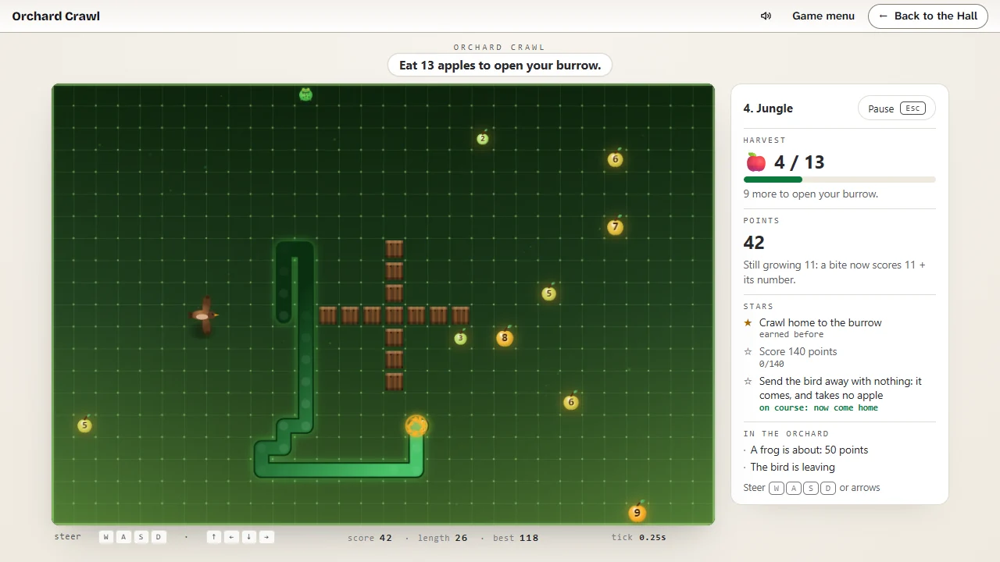

# Orchard Crawl

> Numbered apples, hungry neighbours, a burrow to crawl home to.

## The hook

You are a glowing worm in an orchard where every apple carries a number. The number is how much
it feeds you: eat a 7 and you grow by seven over your next seven moves. Every bite scores all the
growing you still have to do, so an apple eaten while you are still digesting the last one scores
the two together. Big numbers score more and make you longer; small ones keep you short and quick
on your turns. Eat the orchard’s harvest and a burrow opens somewhere you can reach. Crawl in and
you are home, safe from the frog-chasing, apple-stealing, wasp-hatching, gardener-walking world
outside, and the orchard is cleared. Clear all eight to end the season.

## Where it comes from

Michael Toy wrote `worm` at UC Santa Cruz, and it came out with the Berkeley games (its source
carries the Regents’ copyright of 1980). It is the growing-worm game in its first form: a
worm of letters creeping across a terminal, the digits 1 to 9 scattered one at a time, growth by
the digit eaten and a score that adds up all the growth still to come. Before the collection
existed, the owner built this port of it for the browser: the same rules on a glowing 30 by 20
grid with an apple drawn round every digit, eight painted looks, three speeds and six fences, and
then a Wild mode with ten apples at once and the creatures that came to live among them. It joins
the collection as built, beside its native reinvention _Noodle Nine_.

## What is new

- **A season with an end.** The port’s eight looks are now eight orchards crawled in order, each
  bringing in one new thing: the 1980 rule of one apple at a time, then the full orchard and its
  frog, fences, the thief bird, wasps from spoiled apples, a rival worm, the gardener, and at
  Midnight everyone at once. Clear Midnight and the season ends.
- **The harvest and the burrow.** An orchard asks for a number of apples, not a number of points;
  once you have eaten them a burrow opens, a warm light on the grass with a small arrow by your
  head pointing the way. Crawl in to come home. Stay out longer for points, if you dare.
- **Three stars an orchard.** One for coming home, one for the orchard’s points, one for its feat,
  always about what the orchard brings in: chain a bite, catch the frog, come home short, send the
  bird away empty, eat the over-ripe apples, make the rival crash, outlast the gardener.
- **The almanac.** Eight pages, from the numbered apple to your burrow, each drawn by the game
  itself and filled in the first time you really meet what it is about. The ones you have not met
  stay as shadows.
- **The Daily Orchard.** One orchard a day for everyone, its apples and creatures drawn from the
  date; your first finished crawl of the day counts and ends with a share line and no link.
- **Challenges.** Single crawls with one goal each: fill a small bed to the last cell, or the
  whole orchard for a medal at every quarter; King Drift (draw a zigzag with your body, follow a
  zigzag lane through the hedge, never go straight too long), weighted so the hardest is worth
  most; grow to an exact length; eat the numbers in order; turn only right; one huge bite.
- **The free orchard.** The port as it always played, with all its choices: one apple at a time or
  a full orchard, its three paces, its six fences, its creatures and its eight looks.
- **Sound, a pause and two appearances.** Crunches pitched by the number, the frog’s two notes, the
  bird’s chirp, a wasp’s buzz, the gardener’s steps and a chime when the burrow opens, all made in
  code; Esc pauses a crawl; the page follows the Hall into its light or dark appearance.

## At a glance

|                 |                                                |
| --------------- | ---------------------------------------------- |
| Directory       | `/usr/games/arcade`                            |
| Players         | 1                                              |
| Session         | 2–12 minutes                                   |
| Daily challenge | yes                                            |
| Sound           | yes, made in code, following the Hall’s volume |
| Inspired by     | `worm` (1980), the Berkeley growing-worm game  |

## More

- [How to play](HOW-TO-PLAY.md)
- [Changes from the original](CHANGES-FROM-ORIGINAL.md)
- [Architecture](ARCHITECTURE.md)
- [Notes](NOTES.md)
