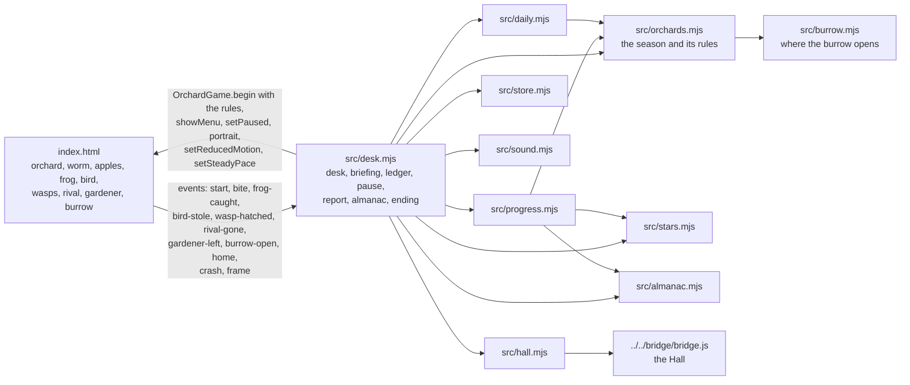
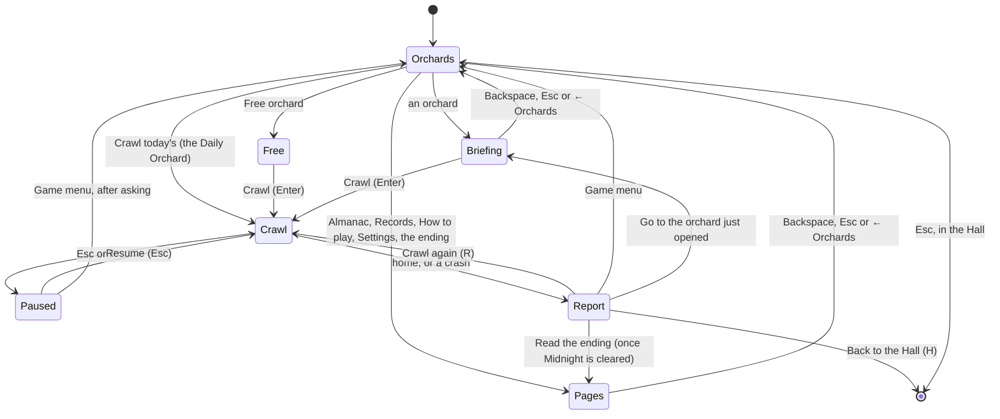
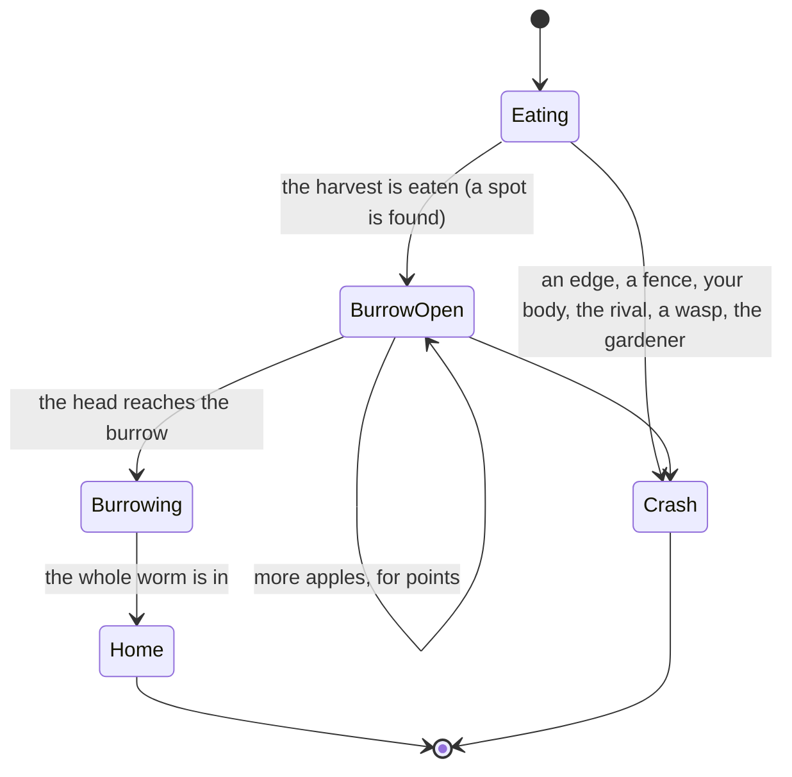

# Orchard Crawl — architecture

## Overview

An adopted, hosted game (ADR 0011 of the collection): one static page (`app/index.html`) with the
port’s whole game in an inline script (a Canvas 2D orchard, the worm, the apples, the frog, the
bird, the wasps, the rival worm, the gardener, eight looks, six fences), no build step. The Hall
serves `app/` at `play/worm-classic/` and talks to it over the bridge. Around the page, a set of
small ES modules add the orchard desk and the season: eight orchards, each a set of the port’s own
settings plus a harvest that opens a burrow (ADR 0001 of this game). The page’s script gained a
narrow handle (`window.OrchardGame`), a game clock that stands still while paused, three seeded
draw streams, the burrow, and events at the moments it already knew about; the way the worm
crawls, grows, scores and crashes, and the way every creature moves, is the port’s.

## Module map

| Path                     | Responsibility                                                                                                                                                                           |
| ------------------------ | ---------------------------------------------------------------------------------------------------------------------------------------------------------------------------------------- |
| `app/index.html`         | The adopted page: the eight looks, the grid, the worm and its tick, apples, rot, the frog and every creature, fences, the burrow, HUD                                                    |
| `app/src/orchards.mjs`   | The eight orchards in order (look, what each brings in, apples, fence, creatures, harvest, points, feat), the season’s timings, `crawlRules`, `freeRules`, opening and the season’s end  |
| `app/src/burrow.mjs`     | `placeBurrow`: a reachable cell 6 to 14 steps from the head, off the outer ring, with room round it (breadth-first search)                                                               |
| `app/src/stars.mjs`      | A crawl’s summary, the three stars of an orchard and the feats                                                                                                                           |
| `app/src/almanac.mjs`    | The eight almanac pages (our own notes) and how each is found                                                                                                                            |
| `app/src/challenges.mjs` | The challenges: families and tiers, each a set of rules for the page, a judge of bites and moves, a status line and an outcome; the zigzag measure, the zigzag lane, the weighted points |
| `app/src/daily.mjs`      | The Daily Orchard: number, the three seeded draw streams, orchard, share line                                                                                                            |
| `app/src/progress.mjs`   | What a crawl changes: stars, bests, clears, orchards opened, the season’s end, pages, the Daily record, totals, packages                                                                 |
| `app/src/desk.mjs`       | Every screen around a crawl, the ledger beside the field during it, the news line, the pause menu, the report, keys, the Hall’s pause (`window.__orchard`)                               |
| `app/src/sound.mjs`      | Every sound, synthesised with Web Audio; the game’s switch and the Hall’s level                                                                                                          |
| `app/src/store.mjs`      | Saves under `usr-games:worm-classic:`                                                                                                                                                    |
| `app/src/hall.mjs`       | Bridge glue: results, packages, title screen, pause, reduced motion, sound, appearance, key art                                                                                          |
| `app/src/desk.css`       | The desk’s styles, light and dark through the page’s tokens                                                                                                                              |
| `scripts/bot.js`         | A careful bot (breadth-first search, room checks) for the balance check and the browser tests                                                                                            |
| `scripts/balance.mjs`    | Serves `app/`, opens it headless and lets the bot crawl every orchard through `OrchardGame.fastForward`                                                                                  |

## State machine

A crawl in the season always ends, in one of two ways; in the free orchard only the second:

## The page and the desk

- **The handle.** `window.OrchardGame` offers `showMenu(theme)` (the desk is open; a worm crawls
  the orchard on its own behind it), `begin({ theme, rules, streams, best })`, `abandon`,
  `setPaused`, `setReducedMotion`, `setSteadyPace`, `peek()`, `steer(dx, dy)`, `plant(x, y, n)`,
  `fastForward(limit, steer, step, until)` and `portrait(kind, canvas, theme)`, and announces itself
  with an `orchard-ready` event. `rules` is the port’s own settings object (`mode`, `speed`,
  `fence`, `enemyBird`, `enemyWasps`, `enemyRival`, `enemyGardener`) plus `harvest`, `placeBurrow`
  and `timing`.
- **The clock.** Every timer in the page (apples ripening, the frog’s visits and hops, the bird,
  the wasps, the gardener, the rival) reads the page’s own clock, which only advances while the
  game is not paused. The port read `performance.now()`, so a paused orchard went on ripening.
- **The challenges’ rules** (all off in the season and the free orchard): a smaller board
  (`board`, drawn scaled to fit with a hedge round it), fences given cell by cell (`fenceCells`,
  drawn as a hedge with `fenceStyle: 'hedge'`), a set `start`, the pool’s size and numbers
  (`poolSize`, `initialValues`, `appleValue`, `evenApples`), whether eaten apples come back
  (`respawn`, `keepStolen`), a limit on going straight (`maxStraight`), right turns only
  (`turns`) and a burrow open from the start (`burrowAt`). The page announces every move
  (`moved`); the desk asks the challenge what a move or a bite means and ends the crawl through
  `OrchardGame.succeed` or `OrchardGame.fail`.
- **Draws.** Three streams: the apples’ numbers, where things appear, and the creatures’ comings
  and goings. Daily Orchards seed them from the date (`daily.mjs`); a placement drawn again does not
  shift the numbers. Sparks, drifting motes and stars stay on `Math.random`.
- **The tick** is the port’s `doTick`, with three additions: the head reaching the burrow ends the
  crawl (`enterBurrow`), a bite and a frog are announced, and the harvest opens the burrow.
- **Starting.** Before its first paint the page takes its appearance from the Hall’s frame (its
  colour scheme, through `window.frameElement`; the system’s on its own) and shows only a title
  card with a progress bar (`<html class="is-starting">`); the desk removes the class once the
  game menu is drawn. The desk’s modules are preloaded together, and the bridge script is
  deferred so it never holds up the page’s own script.
- **Without the desk** (`controlled()` false, the page opened without its modules) the port’s own
  overlay and restart still work.

## Where things are drawn

| What                                    | Where (in `app/index.html` unless noted)                                                                                                                                                 | To change it                                                   |
| --------------------------------------- | ---------------------------------------------------------------------------------------------------------------------------------------------------------------------------------------- | -------------------------------------------------------------- |
| The eight looks (colours, glows, drift) | `THEMES`                                                                                                                                                                                 | edit a theme’s entry                                           |
| Background, grid, moon (cached)         | `renderStaticLayer`, rebuilt per look and per pixel scale                                                                                                                                | as the port                                                    |
| The worm                                | `renderWorm` (one stroke for the glow, one for the gradient body)                                                                                                                        | the look’s `worm*` colours                                     |
| Apples, their numbers, rot              | `renderApple`, `appleColorForValue`                                                                                                                                                      | the look’s `apple*` colours                                    |
| Frog, bird, wasp, gardener, rival       | `renderFrog`/`drawFrogBody`, `renderBird`, `renderWasp`, `renderGardener`, `renderRival`                                                                                                 | the drawing code; the bird is drawn 1.5×, the wasp at radius 7 |
| Fences                                  | `renderFences`                                                                                                                                                                           | wood colours in the function                                   |
| The burrow and its pointer              | `renderBurrowBelow` (glow, soil, mouth: under the worm), `renderBurrowAbove` (the dark swallowing the body and the near edge, while it goes in; the eyes at home), `renderBurrowPointer` | `burrowShape` for the size; colours in the functions           |
| Almanac and briefing portraits          | `drawPortrait` (the same drawing code, into a 160×120 frame)                                                                                                                             | the zoom and offsets per kind                                  |
| The page frame, light and dark          | the `:root` tokens in `index.html`; `src/desk.css`                                                                                                                                       | the tokens                                                     |
| Sounds                                  | `src/sound.mjs` (`play.*`)                                                                                                                                                               | each sound’s notes and envelopes                               |

The canvas keeps the port’s 900×600 drawing units and holds as many pixels as it is shown with (up
to three per unit), so the orchard stays sharp in a large window.

## Tests

- `app/tests/challenges.test.mjs`: the zigzag measure, the lanes reachable end to end, every bed
  fillable (its free cells even on a chessboard), the judges of exact length, order, the big bite
  and the zigzag, the whole orchard’s medals, the weighted points and the tiers opening, and what
  a challenge crawl changes in the progress.

- `app/tests/season.test.mjs` (node:test, run by `pnpm run test:hosted`): the orchards, what each
  brings in, the rules handed to the page, opening and the season’s end, where the burrow opens,
  the stars and feats, the almanac, the Daily Orchard’s numbering and independent streams, the
  share line, what a crawl home, a crash and a Daily Orchard change, and that every package the
  game can earn is in the manifest.
- `e2e/worm-classic.spec.ts` (Playwright, port 5309): the orchards page as title screen with no
  foreign requests, a crawl home with its stars and the next orchard, a crash, R and H, the Daily
  Orchard’s share line, the pause menu and leaving from it, a hidden tab, a briefing, the free
  orchard, the almanac, the end of the season, the Hall’s light and dark appearance, the strip and
  every way out.
- `e2e/shots.spec.ts` (`SHOTS=1`): the documentation screenshots in `docs/media/`.
- `scripts/balance.mjs`: the balance check (NOTES.md).
