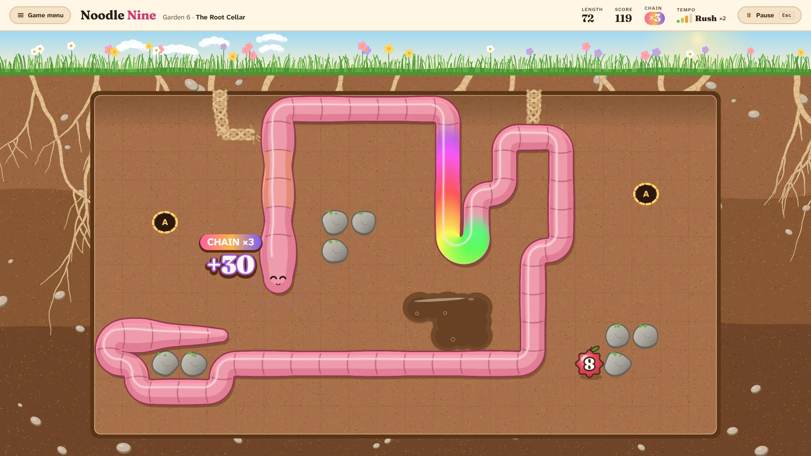
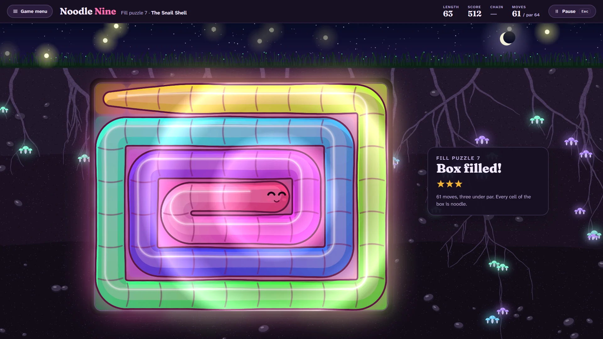
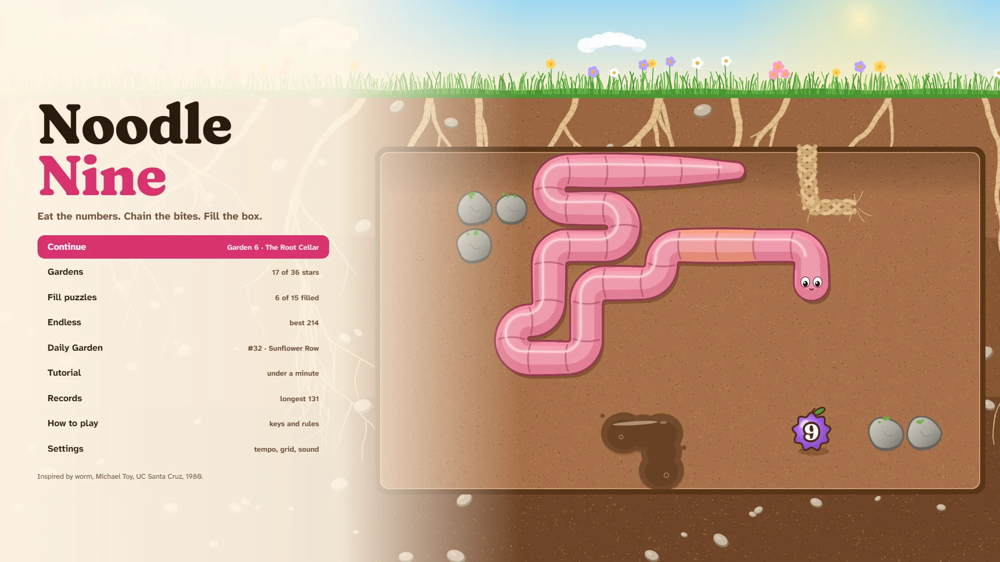
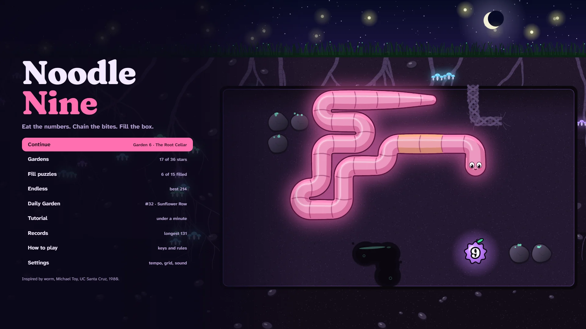
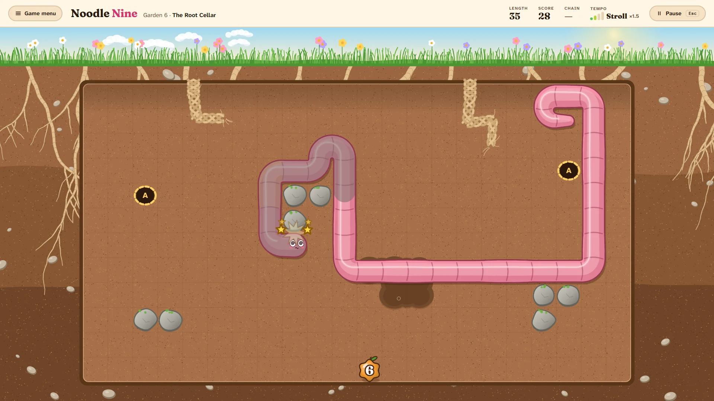
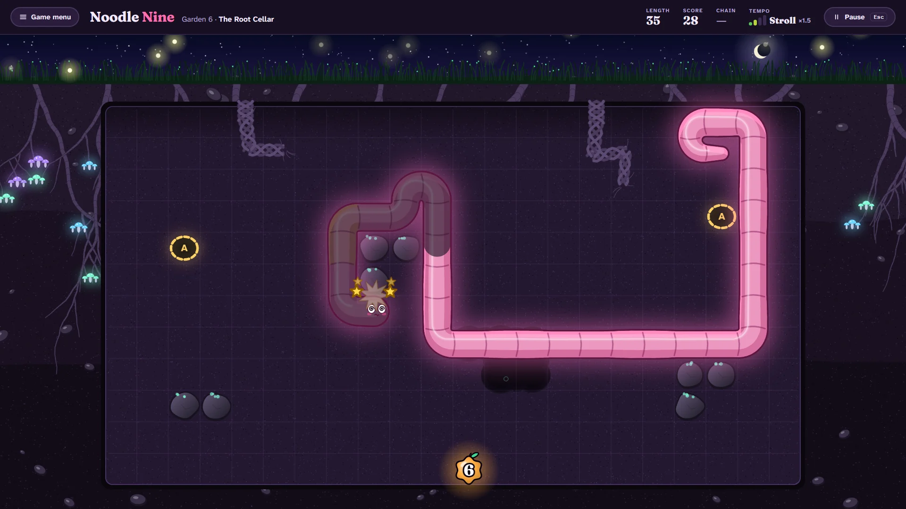

# Noodle Nine

> Eat the numbers. Chain the bites. Fill the box.

## The hook

A squishy, glossy noodle with a cheeky face lives in a bed of warm soil. Numbers grow there like
fruit, one at a time, from a tiny 1 to a fat purple 9. Eat one and the noodle grows by that much,
a cell at a time, the bulge of the meal travelling down its body. Bite again before the bulge is
gone and it is a chain: every bite scores all the growth still to come, so a 9 followed quickly by a
5 is worth far more than 5. Left alone, the noodle creeps; press the keys and it speeds up, and a
bite taken at a quicker tempo is worth more again. How fast you go is up to you. So is how close to
the edge.

## Where it comes from

`worm` is one of the smallest programs in the BSD games: Michael Toy wrote it at UC Santa Cruz, and
its source carries the Regents' copyright of 1980. A worm of `o`s with an `@` for a head crawled
round a box of stars on a terminal, one step a second, eating the digit on the screen and growing
by its value. Two things hid in its few hundred lines. Its score added up the whole growth still to
come at every bite, so eating quickly paid far more than anyone meant it to. And if you ever filled
the entire box with worm, it said you had won: a screen almost nobody saw.

## What is new

- **The accident becomes the game.** Chains are shown as they happen: the count climbs, the
  bulges ride down the body, and a long chain sends a rainbow from head to tail.
- **Tempo is a choice.** Creep, stroll, rush or zoom: your own pace sets the points of every bite.
  Classic tempo keeps the 1980 clock, a step a second.
- **Twelve gardens**, each with one new idea: rocks, roots you can chew through (they grow back),
  a tunnel, sticky mud, one to nine in order, a garden at night, big bites only, one-way soil and
  more. Three stars each.
- **Fifteen fill puzzles.** Small boxes where filling every cell is the whole point, each with a
  fixed run of numbers, every one proved solvable by a solver.
- **A Daily Garden** the same for everyone, shared as three squares and no link; **Endless** with
  the original's rules in an open bed; a tutorial under a minute.
- **A kind ending.** The noodle bonks, sees stars, goes a little limp, and is fine.

## Two looks

**Garden Bed** is a sunny cross-section of a vegetable bed: grass and flowers along the top, warm
loam, pebbles and roots. **Glow Soil** is the same bed at night, and everything alive in it glows:
the noodle, the fruit, the toadstools, the fireflies over the grass. Neither is the other with the
colours inverted.

| Garden Bed                                                                   | Glow Soil                                                  |
| ---------------------------------------------------------------------------- | ---------------------------------------------------------- |
|                     |  |
|  |          |

## At a glance

| Players | Session      | Modes                                                            | Daily                   |
| ------- | ------------ | ---------------------------------------------------------------- | ----------------------- |
| 1       | 2–10 minutes | Gardens (12), Fill puzzles (15), Endless, Daily Garden, Tutorial | One garden for everyone |

Keys: arrows, W A S D or H J K L to steer, Shift to dash, Esc to pause. Full controls in
[HOW-TO-PLAY](HOW-TO-PLAY.md).
