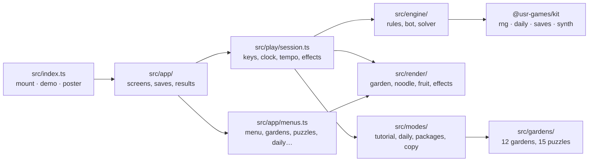
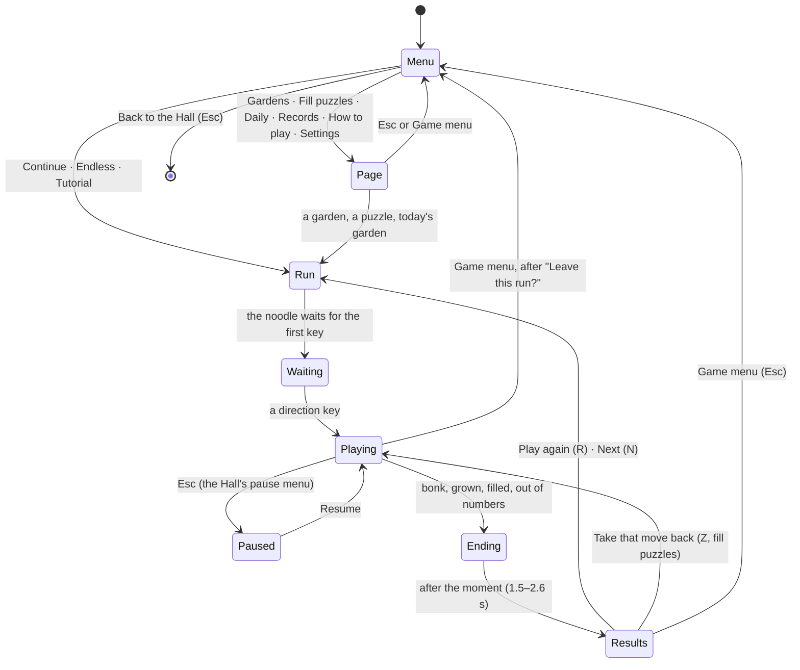

# Noodle Nine — architecture

## Overview

A native game for the Hall (`kind: native`): TypeScript, drawn with Canvas 2D
([ADR 0001](adr/0001-garden-in-canvas-2d.md)), no dependencies beyond `@usr-games/kit`. The engine
is pure (no DOM) and deterministic: every random draw comes from a kit RNG with a named seed.

## Module map

| Path                     | Responsibility                                                                                                                                   |
| ------------------------ | ------------------------------------------------------------------------------------------------------------------------------------------------ |
| `src/index.ts`           | The kit contract: `mount`, `demo` (house noodle in an open bed), `poster`, `achievements`                                                        |
| `src/app/app.ts`         | `NoodleApp`: which screen, starting runs, the end of a run (records, packages, `reportResult`, the results card), pause-menu items, results keys |
| `src/app/menus.ts`       | The game menu over the attract garden; the garden map, fill puzzles, Daily Garden, records, how to play, settings                                |
| `src/app/saves.ts`       | Versioned save slots: settings, progress, daily history, Endless records per tempo, counters                                                     |
| `src/play/session.ts`    | One run: keys and the mouse, the idle clock, tempo, dashes, mud, puzzle undo, the tutorial's steps, effects, the end moment, the bar             |
| `src/play/auto.ts`       | `AutoGarden`: the house noodle playing on its own (title screen, Hall demo)                                                                      |
| `src/play/sound.ts`      | Synthesised patches: bites, chain chimes, tempo whoosh, dash, chew, bonk, fanfares                                                               |
| `src/engine/game.ts`     | The rules: a move, a bite, a dash, roots, goals, the fill and the loss                                                                           |
| `src/engine/board.ts`    | A garden's cells from its map; tunnels; the 1980 starting worm                                                                                   |
| `src/engine/tempo.ts`    | Tempos, multipliers, idle intervals, the pace meter                                                                                              |
| `src/engine/bot.ts`      | The house noodle's choice of move                                                                                                                |
| `src/engine/solver.ts`   | The fill solver                                                                                                                                  |
| `src/gardens/gardens.ts` | The twelve gardens, the tutorial box, the Endless box, the attract garden                                                                        |
| `src/gardens/puzzles.ts` | The fifteen fill puzzles (data written by `scripts/design-puzzles.ts`)                                                                           |
| `src/modes/`             | Garden and puzzle games and their stars, the Daily Garden, the tutorial, packages, end-of-run words                                              |
| `src/render/`            | Everything drawn on the canvas (see below)                                                                                                       |
| `src/ui/`                | The top bar, the title screen's layout, cards (results, confirm, coach), the stylesheet                                                          |
| `dev/`                   | The workbench: `?game` plays the whole game outside the Hall; `?scene=` stages hero and check scenes                                             |
| `scripts/`               | `design-puzzles.ts`, `balance.ts`                                                                                                                |

## State machine

## Engine

`move(game, dir, { multiplier })` is the 1980 order of a move: if nothing is left to digest the tail
moves up, otherwise a unit of growth is used; the cell ahead is read (through a tunnel mouth, the
far mouth); a digit is eaten (`growing += value`, `score += growing × multiplier`), anything solid
ends the run; the head moves in. It returns events (`moved`, `bite`, `bump`, `chewed`, `regrew`,
`lost`, `filled`, `grown`) for the session to show and sound.

- A reverse into the neck is a `bump` and changes nothing (before the first move, the way the body
  lies decides what "back" is).
- A **chain** counts bites taken while still digesting: `chain = carried > 0 ? chain + 1 : 1`, and
  it lapses when digestion runs out.
- **Dashes**: `startDash` takes the first step and arms 8 (across) or 4 (up and down) more;
  `continueDash` takes them one at a time. A bite, a root or mud ends a dash.
- **Roots** are chewed open (`game.chewed`, each with the move it grows back on), end a dash and
  restart the chain; they grow back `ROOT_REGROW` moves after the tail leaves, unless something is
  in the way.
- **Goals**: a garden is `grown` when length plus growth to come reaches its goal; a box is `filled`
  when every open cell is under the body; a fixed run that is eaten, digested and has not filled the
  box ends as `out-of-numbers`.
- Digits: the value first, then a random free cell (not a tunnel mouth, not one-way soil), as in
  1980; or the next of a fixed run, at its cell when the run gives one.

Randomness: one kit RNG per game. Gardens are seeded `garden:<id>:<time>` (a fresh layout of
digits each try), the Daily Garden with the kit's daily seed for `worm`, Endless with the time, the
tutorial with `tutorial`, puzzles need none. `cloneGame` copies the RNG state, so the bot and the
staging can look ahead without disturbing a game.

## The house noodle and the solver

`chooseMove` (`src/engine/bot.ts`) looks for the shortest way to the digit through cells that are
free or will have been left by the tail in time, and takes it only if the noodle could still reach
its own tail afterwards; otherwise it takes the step that leaves the most room. Budgets are in cells
searched. It plays the title screen, the Hall's demo, the balance runs and the hero staging.

`solveFill` (`src/engine/solver.ts`) proves a fill puzzle: a depth-first search on a compact copy of
the rules, moves undone in place, with a move cap, a memory of positions searched and the pruning
described in [NOTES.md](NOTES.md). `scripts/design-puzzles.ts` builds each puzzle backwards from a
route through every cell and keeps it only if the route fills the box and the solver finds its own
way within par.

## The session: time and tempo

`PlaySession` runs one `requestAnimationFrame` loop. Real-time modes (gardens, Endless, the Daily
Garden) take an idle step every `IDLE_INTERVAL[starting tempo]` ms (`CLASSIC_INTERVAL`, 1000 ms, in
Classic tempo), twice that with the head in mud. Every direction key moves at once and restarts the
wait. A key held for 260 ms (420 ms in turn-based modes) repeats every 105 ms. A dash steps every
42 ms; a turn pressed during a dash, or too soon in mud, waits in a one-key queue. Fill puzzles and
the tutorial move only on keys.

Tempo: `Pace` counts moves over the last 1.5 s; the tempo is the faster of the starting tempo and
`tempoFor(moves a second)` (stroll from 2.5, rush from 4.5, zoom from 7). A bite is multiplied by
the tempo at that moment, or ×1 in Classic.

The noodle **glides**: `lead` (0–1) is how far the latest move has got over about 60–160 ms, and
`vacated` is the cell the tail left; the renderer draws the head part-way into its new cell and the
tail part-way out of the old one.

## Where visuals are defined

Every colour the canvas uses comes from `src/render/look.ts` (`GARDEN_BED`, `GLOW_SOIL`); the
screens around it use the CSS custom properties of `src/ui/noodle.css`, set per `data-look`. The two
looks are designed separately. Reduced motion stops the glide between cells, the fireflies' drift,
the fruit's bob and the attract garden's play (the run itself is the same).

| Visual                                                               | Defined in                                                                           | Change it by                                                                 |
| -------------------------------------------------------------------- | ------------------------------------------------------------------------------------ | ---------------------------------------------------------------------------- |
| Sky, grass, flowers, soil, pebbles, fungi, the bed and its rim, grid | `src/render/scenery.ts` (`backdrop`, cached per size, look, garden)                  | the `paint*` functions; colours in `look.ts`                                 |
| Rocks, roots (braids), mud puddles, one-way soil, tunnel mouths      | `src/render/terrain.ts`                                                              | `paintRock`, `paintRootNetwork`, `paintMudPatch`, `paintFlow`, `paintTunnel` |
| Chewed roots                                                         | `paintChewedRoot` in `terrain.ts`                                                    | drawn each frame over the backdrop                                           |
| The noodle: tube, saddle, shade, rings, gloss, face, glide, tunnels  | `src/render/noodle.ts`                                                               | `radiusAt` (shape), `drawNoodle` (layers), `paintFace`                       |
| Number-fruit                                                         | `src/render/fruit.ts`                                                                | lobes, colours (`look.fruit`), the numeral                                   |
| Popups, juice, mosaic, ripple, the bonk                              | `src/render/effects.ts`                                                              | sizes and timings at the top of each function                                |
| Night garden's dark and the lit rim                                  | `drawNight` in `src/render/view.ts`                                                  | the radii of the light, the rim alpha                                        |
| Fireflies                                                            | `drawFireflies` in `view.ts`                                                         | count and drift                                                              |
| Bed previews on the cards                                            | `src/render/preview.ts`                                                              |                                                                              |
| Layout of the bed in the canvas                                      | `src/render/layout.ts`                                                               | `LayoutOptions` (shares of width and height, largest cell)                   |
| Top bar, menu, pages, cards                                          | `src/ui/play-screen.ts`, `title-screen.ts`, `cards.ts`, `app/menus.ts`, `noodle.css` |                                                                              |
| Emblem                                                               | `manifest.json` (`emblem`, SVG path data)                                            |                                                                              |
| Poster                                                               | `poster` in `src/index.ts`                                                           | `POSTER_BODY`, the frame it draws                                            |

## Sound

`src/play/sound.ts`, every patch built from oscillators and noise by the kit's synth; quiet, and
silent when the game's Sound setting is off (the Hall sets the volume). Bites run from a high pip for
a 1 to a deep plop for a 9; the chain chime climbs a pentatonic scale; the whoosh brightens with the
tempo.

## How to add a garden

1. Add a `GardenSpec` to `GARDENS` in `src/gardens/gardens.ts`: a map in the board's characters,
   a straight start, a goal, a chain target, and optionally a digit range, a fixed run, the
   count-up bonus or night.
2. `pnpm --filter @usr-games/game-worm exec tsx scripts/balance.ts` and tune the goal and chain
   target until it is grown on at least 90 % of runs and three-starred on 15–35 %.
3. `gardens.test.ts` checks the map is well formed and every open cell is in reach, and repeats the
   balance.

## How to add a fill puzzle

1. Add a recipe to `RECIPES` in `scripts/design-puzzles.ts` (box, rocks, starting length, how many
   cells the starting tail frees, a seed for the route, a digit range). Keep the box's two
   chessboard colours within one of each other; the script refuses otherwise.
2. Run it and paste its output into `PUZZLES` in `src/gardens/puzzles.ts`.
3. `puzzles.test.ts` replays every route and has the solver prove every puzzle within par.

## Tests

| Command                                                 | What it checks                                                      |
| ------------------------------------------------------- | ------------------------------------------------------------------- |
| `pnpm --filter @usr-games/game-worm exec vitest run`    | Engine faithfulness, puzzles and solver, gardens and balance, words |
| `pnpm exec playwright test -c games/worm`               | The game on its workbench and in its own Hall, and the frame rate   |
| `pnpm exec playwright test -c games/worm --grep @shots` | The documentation screens (`SHOTS_SIZE=1920` for 1920 × 1080)       |
| `pnpm exec playwright test -c games/worm --grep @hero`  | The hero frames                                                     |

The workbench (`pnpm --filter @usr-games/game-worm dev`, port 5275): `?game` plays the whole game
with a stand-in for the Hall (`&appearance=dark`, `&reduced=1`, `&date=YYYY-MM-DD`, `&mute=1`);
results, packages and shares go to `window.__noodleLog`. `?scene=anatomy` draws the noodle large
for checking its shape, `?scene=perf` a 300-cell noodle for the frame rate.
