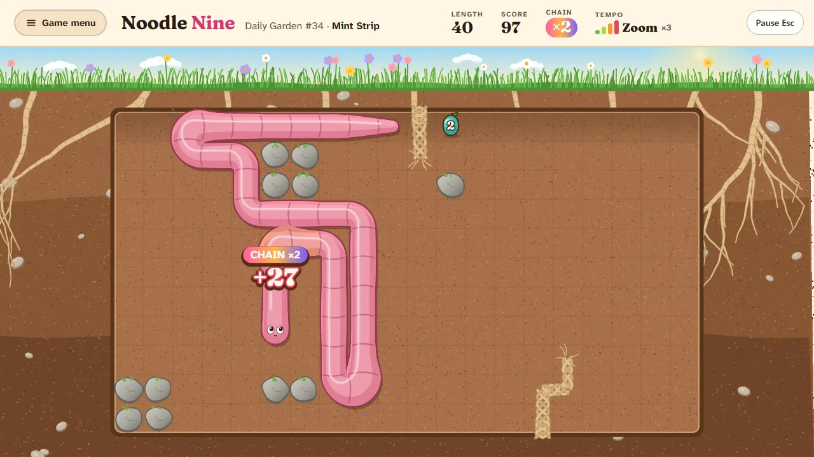
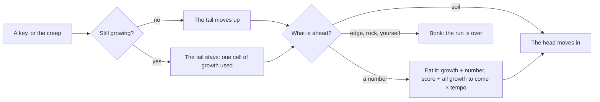

# How to play Noodle Nine

## Goal

Steer a noodle to the numbers growing in the garden. Each one you eat makes you longer by its
value. In a garden, grow to its length; in a fill puzzle, cover every cell of the box; in Endless
and the Daily Garden, grow as long and score as high as you can before you bonk.

## Controls

| Action                            | Keyboard                       | Mouse                              |
| --------------------------------- | ------------------------------ | ---------------------------------- |
| Turn and take a step              | Arrow keys, W A S D or H J K L | —                                  |
| Keep going, faster                | Hold a direction               | —                                  |
| Dash (9 across, 5 up or down)     | Shift + direction              | Click a cell in line with the head |
| Classic tempo on or off (Endless) | Space                          | Pause menu: Classic tempo          |
| Take a move back (fill puzzles)   | Z or Backspace                 | Results card: Take that move back  |
| Pause                             | Esc                            | Pause button                       |
| Menus: move, choose, back         | Arrow keys, Enter, Esc         | Click                              |
| Play again (results)              | R                              | Play again                         |
| Next garden or puzzle (results)   | N                              | Next                               |
| Back to the Hall (results)        | H                              | Back to the Hall                   |

A tap is always one step; holding a key repeats it after a moment. Turning straight back into your
own neck is refused with a soft bump.

## Rules

1. The noodle waits until your first key. After that it creeps on by itself, a step at a time, in
   the way it last went. Every key you press moves it at once and starts the wait again.
2. One number is in the garden at a time. Eat it and the noodle grows by that many cells, one cell
   a move, from the tail end (the tail stays put while you grow). A new number appears somewhere
   free.
3. Each bite scores **all the growth still to come**, not just the number. Bite again while you are
   still digesting (the bulges travelling down the body) and it is a **chain**: a 9 and then a 5 two
   moves later scores 9, then 12.
4. Your **tempo** multiplies every bite: Creep ×1, Stroll ×1.5, Rush ×2, Zoom ×3. It is set by how
   fast the noodle has been going over the last moment and a half, so pressing and holding the keys
   raises it. The meter in the top bar shows it.
5. The run ends when the noodle bonks into the edge of the bed, a rock or itself, or enters one-way
   soil against its flow. Chasing your own tail is fine while you are not growing: the tail moves
   out of the way first.

### In the gardens

| Garden feature | What it does                                                                                    |
| -------------- | ----------------------------------------------------------------------------------------------- |
| Rock           | In the way for good                                                                             |
| Root           | You chew through it, but a mouthful ends a dash and starts your chain over; it grows back later |
| Mud            | Slow going: half the creep, and no speeding up; a dash stops in it                              |
| One-way soil   | Arrows show the way: enter it only going that way                                               |
| Tunnel mouth   | Step into one, come out of the other with the same letter                                       |
| Night          | Dark but for your own glow and the numbers; the edge of the bed stays faintly lit               |

## Modes

- **Tutorial**: three lessons in under a minute (steer, dash, chain). The noodle waits for your
  keys, and a bonk only starts the lesson again.
- **Gardens**: twelve beds, each bringing in one idea. Grow each to its length; finishing one opens
  the next.
- **Fill puzzles**: fifteen small boxes. The numbers always come in the same order and to the same
  places; eat them all and fill every cell. The noodle waits for your keys, and Z takes a move
  back. The first three are open; each one filled opens another.
- **Endless**: the 1980 rules in an open bed, until you bonk. Space switches to **Classic tempo**,
  the original's clock: a step a second when you leave it alone, and no multiplier.
- **Daily Garden**: one bed and one run of numbers for everyone today, played until you bonk. Your
  first run of the day is the one that counts; you can share it as three squares.

## Settings

| Setting           | What it changes                                                                |
| ----------------- | ------------------------------------------------------------------------------ |
| Starting tempo    | How fast the noodle goes when you leave it alone (Creep, Stroll, Rush or Zoom) |
| Classic tempo     | Endless at the 1980 clock; Space switches it during a run                      |
| Grid lines        | Faint lines between the cells                                                  |
| Number shapes     | Each fruit has as many bumps as its value, so colour is never the only clue    |
| Sound             | The game's sounds on or off (the Hall sets the volume)                         |
| Motion and volume | Reduced motion and the volume follow the Hall's settings                       |
| Forget my data    | Clears Noodle Nine's stars, records and daily history on this device           |

The pause menu also offers Classic tempo (in Endless), Grid lines, and in a fill puzzle, Start the
puzzle again.

## Scoring

- A bite scores (growth still to come after the bite) × tempo multiplier, rounded. In Classic tempo
  the multiplier is always ×1.
- In Counting Row, eating one to nine in order adds a **count-up bonus** of 99 (× tempo).
- **Garden stars**: grow it; reach its chain; grow it without a dash.
- **Fill puzzle stars**: fill the box; fill it within a few moves of par; fill it at par or better.
- **Daily Garden squares**: length 50 (🟨 from 38), a chain of 3 (🟨 for 2), no dash on a run that
  also reached its length (🟨 for one or two dashes on a run close to it).

Share line: `Noodle Nine #42 · length 87 · best chain ×6 · 🟩🟩🟨` (never a link).

## Achievements (packages)

| Package        | How to earn it                                         |
| -------------- | ------------------------------------------------------ |
| First bite     | Eat your first number                                  |
| Chain of three | Bite three times without ever finishing your digestion |
| Fill the box   | Fill every cell of a fill puzzle                       |
| Daily regular  | Play seven Daily Gardens                               |
| Dash dancer    | Eat a number at the end of a dash                      |
| Count-up       | Eat one to nine in order                               |
| Night noodle   | Grow the garden that has no light                      |
| Zoomer         | Grow a garden with a bite at zoom tempo                |
| Slowpoke       | Earn all three stars in a garden without leaving creep |
| Chain of seven | Bite seven times in one chain                          |
| Box master     | Fill all fifteen fill puzzles                          |
| Ninety-nine    | Grow a noodle ninety-nine cells long                   |

## Tips

- The bulges are your clock: while one is still on its way down, the next bite chains.
- Big numbers make long chains possible: a 9 gives you nine moves to find the next one.
- In a fill puzzle, the place where the next number appears is a hint about the route.
- When the bed gets crowded, follow your own tail: it always moves out of the way in time, unless
  you are still growing.
- A dash is quick but blunt: it stops on a number, in mud, and at a root.
