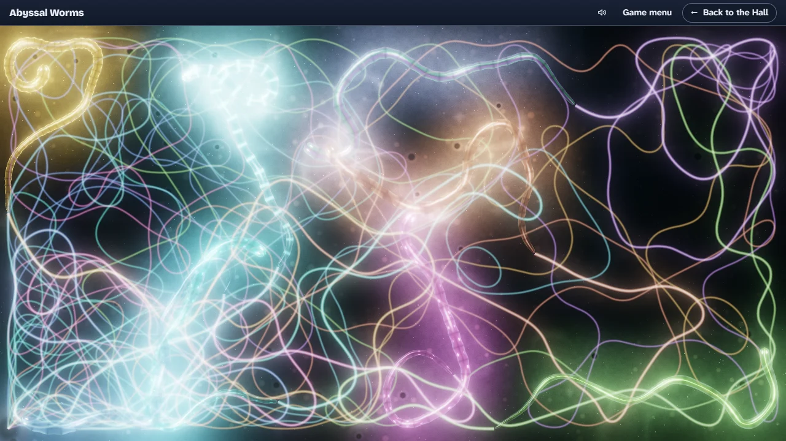

# Abyssal Worms

> Glowing worms crawling the floor of a deep, dark sea.

## The hook

Far below the last of the daylight, worms glow as they crawl. Each one lights the silt around it,
flares where it crosses another, and with trails on leaves a wake of light that cools and fades.
You never steer them; nobody ever did. Every turn they take is the one a 1980 terminal program
chose, cell for cell, and you can open that terminal beside them and watch it happen. Add worms,
stretch them, scatter the floor with letters for them to eat, or just sit back and watch. Now and
then the abyss does something worth noting, and a ring of light marks it on the floor: catch it
for your logbook, meet the eight species one by one, and take the day’s Daily Dive.

## Where it comes from

`worms` is one of the screensavers in the BSD games. Eric P. Scott wrote it at Caltech’s High
Energy Physics group in October 1980; its manual page describes it as a Unix version of a DEC-2136
program of the same name. On a terminal each worm was a short chain of one repeated character,
crawling one cell at a time, turning at random and kept on screen by tables of the turns allowed at
every edge and corner. Options set how many worms, how long, how fast, whether they left a dotted
trail, and whether the screen started full of the word WORM for them to chew through.

## What is new

- Eight species of glowing worm, one for each of the original’s eight body characters, each with
  its own colours, markings and pulse.
- A sea floor lit only by the worms: rippled silt, burrows, drifting marine snow, and a flare of
  light wherever two worms cross.
- Smooth bodies that glide between steps, yet match the original’s screen exactly at every step.
- Trails become a luminous wake; the WORM field becomes faint plankton writing, eaten letter by
  letter.
- The 1980 terminal is still here, as a classic view and as a split view with a divider to drag,
  both showing the very same worms.
- Every original option works live from a settings panel, and you can type a command line the way
  the old program took it.
- **A logbook.** Sightings marked on the floor by a ring of light (two paths crossing, a worm
  crossing its own body, a worm in a far corner, a bloom of light round one worm), logged with a
  click or `L` while they last; a journal of the eight species, met by clicking a worm (or `J`);
  postcards that keep a scene you like and open it again.
- **The Daily Dive.** The same abyss for everyone each day, and three kinds of sighting to find in
  it, with a share line and no link. Nothing is ever rewarded for leaving the abyss running on its
  own: every entry needs you to be watching.

## At a glance

|                 |                            |
| --------------- | -------------------------- |
| Directory       | `/usr/games/toys`          |
| Players         | 1                          |
| Session         | 1–10 minutes               |
| Daily challenge | yes (the Daily Dive)       |
| Inspired by     | `worms` (1989 manual page) |

## More

- [How to play](HOW-TO-PLAY.md)
- [Changes from the original](CHANGES-FROM-ORIGINAL.md)
- [Architecture](ARCHITECTURE.md)
- [Notes](NOTES.md)
