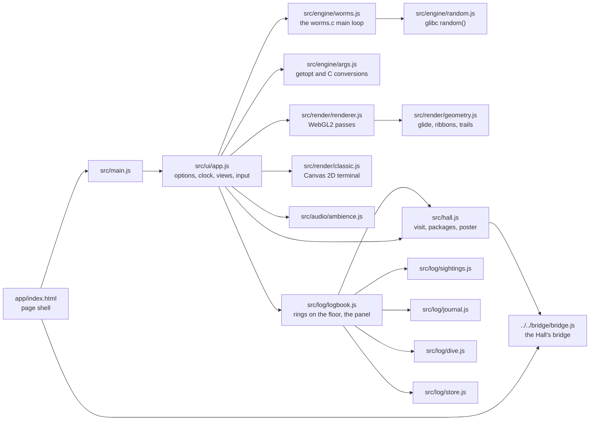
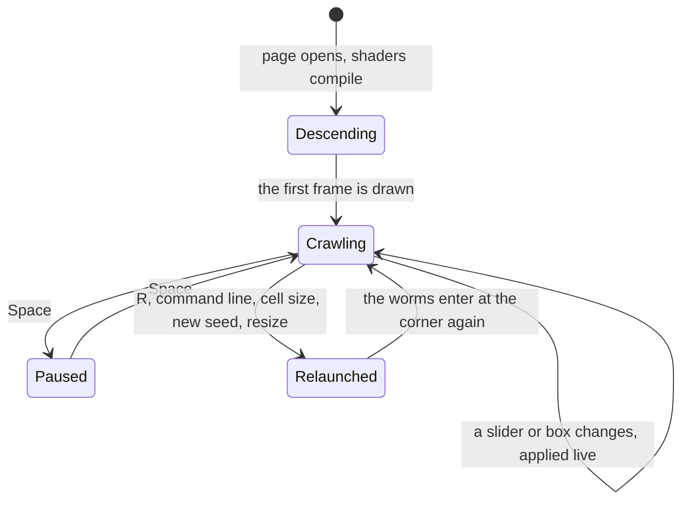

# Abyssal Worms — architecture

## Overview

Abyssal Worms is a **hosted** game: the finished port the owner built earlier (`worms`, fancy-web),
adopted as it was into `games/worms/app/` and run by the Hall in a same-origin frame at
`play/worms/`. It is plain ES modules with no build step. The abyss is drawn with raw WebGL2 and
GLSL in seven passes; the classic terminal is Canvas 2D, which is also the fallback without WebGL2.
The engine is a faithful JavaScript port of the original C main loop, under 300 lines. The upstream
design notes are kept in [`../app/docs/architecture.md`](../app/docs/architecture.md) and its
decisions in [`adr/`](adr/).

## Module map

| Path                        | Responsibility                                                                     |
| --------------------------- | ---------------------------------------------------------------------------------- |
| `app/index.html`            | The page: two canvases, the split divider, toolbar, settings panel                 |
| `app/src/engine/worms.js`   | The world, `step()`, the nine turn tables, live `-n -l -t -f` changes, step timing |
| `app/src/engine/args.js`    | `parseArgs` with GNU `getopt` behaviour and C `strtoul`/`atoi`; `formatArgs`       |
| `app/src/engine/random.js`  | glibc’s `random()`; seed 1 is the original’s sequence                              |
| `app/src/render/`           | WebGL2 helpers, the pass graph, glide geometry, species, the classic view          |
| `app/src/audio/ambience.js` | Synthesised drone, bubbles and crossing chimes                                     |
| `app/src/ui/app.js`         | The controller: frame loop, step clock, views, settings, keys, idle fade, quality  |
| `app/src/ui/styles.css`     | Layout and the night look                                                          |
| `app/src/ui/fonts/`         | Self-hosted Inter and JetBrains Mono (added on adoption)                           |
| `app/src/hall.js`           | The bridge glue (added on adoption)                                                |
| `app/src/log/sightings.js`  | Watches each step for the four sightings; its own seeded chance and timing         |
| `app/src/log/journal.js`    | The eight species’ pages (our own notes); which worm is under a cell               |
| `app/src/log/dive.js`       | The Daily Dive: number, seed, worms, length, the three sightings, share line       |
| `app/src/log/store.js`      | The log under `usr-games:worms:log`: sightings, species, dives, postcards          |
| `app/src/log/logbook.js`    | The rings on the `#marks` canvas, the logbook panel, its toast, the keys B, L, J   |

## State machine

The view (Abyssal, Split or Classic) is independent of this: every view reads the same world.
The logbook is independent too: it opens over any state, and a Daily Dive or a postcard is a
relaunch with the dive’s or the postcard’s seed and options.

## The logbook

The logbook was added in the collection, around the engine and never inside it. After every
step, `app.js` hands the world to `logbook.afterStep`; `SightingWatch` looks at it (two heads on
one cell, a head on its own body, a head in a far corner, or, on its own timetable, a bloom) and
may start a sighting. Its chances and quiet spells come from its own mulberry32 generator, seeded
from the scene’s seed, so the worms move exactly as before and a Daily Dive’s blooms come at the
same moments for everyone at the same window size. A sighting lasts 4.5 s; a bloom’s ring
follows its worm, the others stay where they happened. The rings are drawn on a Canvas 2D layer
(`#marks`) above the abyss, so they show in every view.

Nothing is logged unless the player clicks a ring (or presses L) or a worm (or presses J): the
toy never rewards the abyss for running unwatched.

## Engine

`worms.js` keeps exactly the C program’s state (per worm an orientation, a head index and ring
buffers of positions; a reference count per cell; the terminal’s characters), and `step()` is one
pass of its loop. It also records the cells blanked, placed and eaten each step for the renderer and
the sound; that record never feeds back into movement. `random.js` reproduces glibc’s generator
from seed 1, the original’s unseeded start, so the port makes the binary’s own screens. A step
takes `-d` ms, or `max(33, 12.5 × worms)` ms without it (9600-baud pace), at least 150 ms under
reduced motion. The frame loop catches up at most 12 steps a frame and draws each worm gliding
between steps, equal to the grid at every step boundary (upstream ADR 003).

## Where visuals are defined

| Visual                                             | Defined in                                                       | Change it by                         |
| -------------------------------------------------- | ---------------------------------------------------------------- | ------------------------------------ |
| The eight species: colours, markings, pulse, width | `app/src/render/species.js`                                      | Editing the `SPECIES` table          |
| Worm bodies, rim light, gut pulse, crossing flare  | `app/src/render/shaders/worm.js` (`WORM_VS`, `WORM_FS`)          | The worm shader                      |
| Light the worms cast on the floor                  | `worm.js` (`LIGHT_FS`), blurred by `post.js` (`BLUR_FS`)         |                                      |
| Luminous trails                                    | `worm.js` (`TRAIL_FS`), strips from `app/src/render/geometry.js` |                                      |
| Sea floor, burrows, caustics, the WORM plankton    | `app/src/render/shaders/floor.js`                                | The floor shader                     |
| Marine snow                                        | `app/src/render/shaders/post.js` (`SNOW_VS`, `SNOW_FS`)          |                                      |
| Bloom and the final grade                          | `post.js` (`PREFILTER_FS`, `DOWN_FS`, `UP_FS`, `COMPOSITE_FS`)   | Exposure and bloom in `ui/app.js`    |
| Pass order, cell textures, Low and High quality    | `app/src/render/renderer.js`                                     |                                      |
| The classic terminal                               | `app/src/render/classic.js`                                      | Its three phosphor colours           |
| Toolbar, settings panel, notices                   | `app/src/ui/styles.css`                                          | CSS custom properties at the top     |
| Fonts                                              | `app/src/ui/fonts/fonts.css`                                     | Swap the woff2 files and the credits |

Abyssal Worms has one night look and does not read the Hall’s tokens. Reduced motion comes from the
system (`prefers-reduced-motion`) or `?motion=0` at start-up and, in the Hall, from the Hall’s
setting, live. A software renderer gets Low quality at once, and slow frames on High switch to Low
once, with a notice.

## Where sounds are defined

All sound is synthesised in `app/src/audio/ambience.js` (no audio files), and nothing is created
until sound is first turned on: by the player, or in the Hall by the Hall’s sound when it is not
muted. The master level is the ambience’s `volume` (its designed 0.8, scaled in the Hall).

| Sound                 | Defined in                                           | Plays when                                             |
| --------------------- | ---------------------------------------------------- | ------------------------------------------------------ |
| Drone and deep rumble | `start()`: low oscillators and generated brown noise | Always, while sound is on                              |
| Bubbles               | `bubble()`, from `update()`                          | Every 0.6–3.2 s, one or three, panned toward a worm    |
| Crossing chime        | `chime()`, from `crossing()`                         | A head lands on an occupied cell (at most every 1.6 s) |

## Hall integration

All of it lives in `app/src/hall.js`, plus one script tag in `index.html` and, in
`app/src/ui/app.js`, one import, calls at six moments the controller already knew about, the
hand-over of the ambience and two setters (`followHall`) and a hold check (`isHeldStill`) at the top
of the frame loop. The logbook (`src/log/`) calls `noteSighting`, `noteJournal` and
`noteDiveFinished` in `hall.js`.

| Abyssal Worms moment                                      | Bridge message                                                                                                    |
| --------------------------------------------------------- | ----------------------------------------------------------------------------------------------------------------- |
| The first key press or click                              | `result { outcome: 'complete', durationSeconds }`, once per visit                                                 |
| The classic view is chosen                                | `achievement back-to-the-terminal`                                                                                |
| The split divider is dragged or moved with the arrows     | `achievement side-by-side`                                                                                        |
| Trails are switched on                                    | `achievement luminous-trail`                                                                                      |
| 1,000 letters eaten while the field is on                 | `achievement plankton-feast`                                                                                      |
| Eight or more worms set in the settings or a command line | `achievement full-spectrum`                                                                                       |
| A command line is accepted                                | `achievement command-line`                                                                                        |
| A sighting is logged; all four kinds logged               | `achievement first-sighting`; `achievement every-sighting`                                                        |
| All eight species met                                     | `achievement naturalist`                                                                                          |
| A Daily Dive finished (once a day)                        | `achievement daily-diver`; `result { outcome: 'complete', stats: { diveSightings, divesFinished }, daily: true }` |
| The first abyss frame drawn 5 s after opening             | `poster`, from `#abyss` through `posterFromCanvas`                                                                |

Abyssal Worms sends no title-screen signal: it has no title screen, and the Hall’s strip carries
the ways out. It does not act on appearance messages (it has one look). Since bridge 1.1 it follows
the Hall’s sound, motion and pause:

| In `hall.js`                              | What it does                                                                                                                                                                                                          |
| ----------------------------------------- | --------------------------------------------------------------------------------------------------------------------------------------------------------------------------------------------------------------------- |
| `onSound` → `applyHallSound`              | Sets the ambience’s `volume` to the Hall’s volume scaled from its own 0.8 (`soundLevel`) and turns sound on, or off while the Hall is muted; the speaker button and M still work until the Hall’s sound changes again |
| `startAmbienceOnGesture`                  | If the browser held audio back, the first key or click in the frame starts it                                                                                                                                         |
| `onReducedMotion` → `applyHallMotion`     | Sets `S.motion` live through the setter `app.js` hands over, and toggles `data-reduced-motion` on the root, where `styles.css` repeats its one reduced-motion rule                                                    |
| `pauseWhenHidden`, `onPause` / `onResume` | The Hall’s pause and a hidden tab hold the frame loop (`isHeldStill`) and suspend the audio context; on resume the worms carry on exactly, and the player’s own pause (Space) and mute (M) survive                    |

Opened on its own, the bridge script is missing, `hall.js` does nothing and the abyss starts silent
as before.

## Tests

| Test             | Command                                                               | What it proves                                                                                                                                                                                                                                                             |
| ---------------- | --------------------------------------------------------------------- | -------------------------------------------------------------------------------------------------------------------------------------------------------------------------------------------------------------------------------------------------------------------------- |
| Unit tests (41)  | `pnpm run test:hosted` (or `node --test "tests/*.test.js"` in `app/`) | Upstream (33): screens and command-line errors match captures of the real binary; glibc `random()`; invariants; glide; zero raster. The logbook (8, `tests/log.test.js`): the engine untouched, rarity and spacing, determinism, logging, the journal, the dive, the store |
| In the Hall (19) | `pnpm exec playwright test -c games/worms`                            | Opens with no outside requests; a key press is the visit; sound, motion and pause follow the Hall; the keyboard; a sighting logged, a species met, a Daily Dive finished, a postcard kept and opened; every way out                                                        |
| Screenshots      | `SHOTS=1 pnpm exec playwright test -c games/worms`                    | `docs/media/title-1280.webp`, `play-1280.webp`, `signature-1280.webp`, `logbook-1280.webp`, on the machine’s GPU                                                                                                                                                           |

The screenshots stage each scene with the game’s own `?args`, `?cell`, `?warm` (steps to run before
the first frame) and `?view` parameters. The suite starts its own Hall on port 5311
(`HALL_PORT` to move it). On its own, `pnpm --dir games/worms/app start` serves Abyssal Worms at
`http://localhost:5203/`.

## Kit candidates

None: hosted games talk to the Hall only through the bridge.
