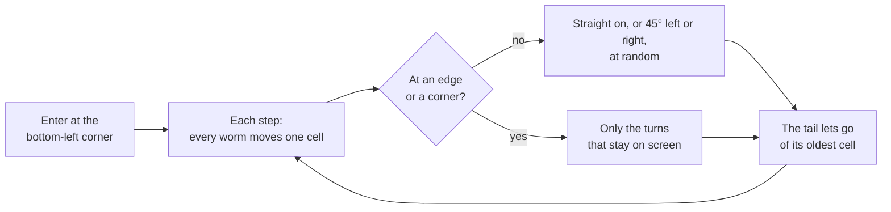
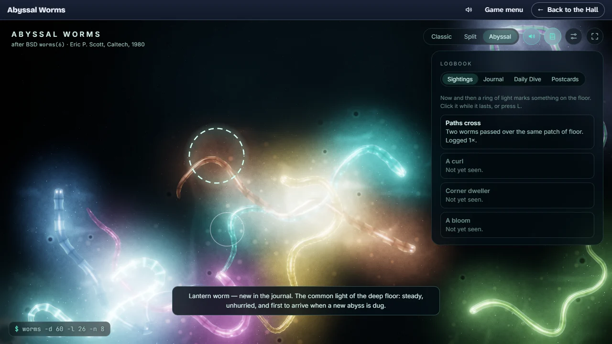

# How to play Abyssal Worms

## Goal

There is nothing to win and nothing to lose. Abyssal Worms is a screensaver: the worms crawl on
their own, exactly where the 1980 program would have sent them, and you choose how many there are,
how long they grow, how fast they go and what they leave behind. A good visit is one where you find
a look you like and let it run. If you would like something to look for, keep a logbook: catch the
sightings the abyss marks on the floor, meet the eight species, and take the day’s Daily Dive.

## Controls

The toolbar fades after about three seconds without input and comes back when you move the mouse
or press a key. Keys are the game’s own and cannot be remapped from the Hall; the letter keys are
ignored while you are typing in a settings field.

| Action                                | Keyboard                                     | Mouse                                     |
| ------------------------------------- | -------------------------------------------- | ----------------------------------------- |
| Open or close the settings            | S (Esc also closes them)                     | The settings button (sliders icon)        |
| Open or close the logbook             | B (Esc also closes it)                       | The logbook button (book icon)            |
| Log the sighting on show              | L                                            | Click the ring of light while it lasts    |
| Meet a worm (the journal)             | J (the next worm each time)                  | Click a worm                              |
| Classic terminal view on or off       | C                                            | Classic                                   |
| Split view on or off                  | V                                            | Split                                     |
| Back to the abyss                     | C or V again                                 | Abyssal                                   |
| Move the split divider                | Tab to the divider, then ← / →               | Drag the divider                          |
| Pause or resume the worms             | Space                                        | —                                         |
| Restart with the same options         | R                                            | Restart, in the settings                  |
| Sound on or off (see Settings)        | M                                            | The speaker button                        |
| Fullscreen                            | F                                            | The fullscreen button                     |
| How many, how long, how fast          | Tab to a slider in the settings, then ← / →  | The `-n`, `-l` and `-d` sliders           |
| Letter field, trails                  | Tab to the box, then Space                   | The `-f` and `-t` boxes                   |
| Start from a command line             | Type after `$ worms` in the settings, then ↵ | —                                         |
| Cell size, quality, a new random seed | Tab to them in the settings                  | The lower half of the settings            |
| Leave for the Hall                    | Shift+Tab to the Hall’s strip                | ← Back to the Hall on the Hall’s strip    |
| Start Abyssal Worms afresh            | Shift+Tab to the Hall’s strip                | Game menu on the Hall’s strip, then Leave |

## Rules

The worms follow the original program’s rules, unchanged:

1. Every worm enters at the bottom-left corner, heading up and to the right.
2. On each step every worm moves one cell. In open water it carries straight on or turns 45° to
   either side, at random; at an edge or a corner only the turns that keep it on screen are
   allowed.
3. A worm has a fixed length: as its head moves on, its tail lets go of its oldest cell.
4. A cell goes dark only when the last worm on it has left, so a crossing never cuts a worm in two.
5. With the letter field on, the screen starts full of the word WORM and every letter a worm
   crawls over is eaten. With trails on, the cells a worm leaves keep a mark.

## Modes

| View    | What you see                                                                                  |
| ------- | --------------------------------------------------------------------------------------------- |
| Abyssal | The deep-sea floor, with the worms as glowing bodies. This is where it opens.                 |
| Classic | The terminal exactly as the 1980 program drew it, in phosphor green on black.                 |
| Split   | Classic on the left, abyss on the right, the same worms in both; drag the divider to compare. |

The Daily Dive (in the logbook) is the daily challenge; see below.

## Settings

| Setting     | Options                                                        | Default                                |
| ----------- | -------------------------------------------------------------- | -------------------------------------- |
| `-n` worms  | 1–256 (the slider stops at 64; type more in the box beside it) | 3                                      |
| `-l` length | 2–1024 cells (the slider stops at 256)                         | 16                                     |
| `-d` delay  | Terminal pace, or 1–1000 ms a step                             | Terminal pace                          |
| `-f` field  | on · off                                                       | off                                    |
| `-t` trail  | on · off                                                       | off                                    |
| Cell size   | 8–36 px                                                        | 14 px                                  |
| Quality     | Low · High                                                     | High (Low on a machine without a GPU)  |
| Seed        | Restart · New seed                                             | Seed 1, the original program’s own run |

Terminal pace is how fast a 9600-baud terminal could draw the worms: about 12.5 ms a step for each
worm, never quicker than 33 ms. Sliders and boxes change the worms live; a command line, a new cell
size or a new seed starts a fresh launch, and so does resizing the window, like opening a new
terminal. Abyssal Worms follows the Hall’s reduced-motion setting as soon as you change it (on its
own, your system’s): no shimmer, sway or drifting snow, and no more than about seven steps a second.
In the Hall its sound follows the Hall’s: on at the Hall’s volume, silent while the Hall is muted,
and the speaker button and M still work during the visit (if the browser held the sound back, your
first key or click starts it). On its own it starts silent. While the Hall pauses, or the tab is
hidden, the abyss holds still and quiet and carries on exactly where it was; your own pause and
mute stay as you left them. It has a single night look; the Hall’s strip follows the Hall’s light
or dark appearance.

## The logbook

**Sightings.** Every now and then (between about 7 and 16 seconds apart, and never while one is
showing) the abyss does something worth noting, and a ring of light marks it on the floor for
four and a half seconds. Click inside the ring, or press L, to log it. There are four kinds:

| Sighting       | What happened                                                                                  |
| -------------- | ---------------------------------------------------------------------------------------------- |
| Paths cross    | Two worms passed over the same patch of floor                                                  |
| A curl         | A worm crossed its own body, tying a loose knot of light                                       |
| Corner dweller | A worm reached one of the three far corners (not the bottom-left one, where every worm enters) |
| A bloom        | One worm glows brighter for a while; its ring travels with it                                  |

**The journal.** Each of the eight species (one for each of the original’s eight body
characters) has a page. Click a worm, or press J to meet the worms one after another, and its
species goes into the journal with a line about it.

**The Daily Dive.** One abyss a day for everyone: the same seed, number and length of worms, and
so the same blooms at the same moments (on the same window size). Start it from the logbook and
find the three kinds of sighting it asks for; it ends with a share line such as
`Abyssal Worms Dive #33 · found 3 of 3 · 🫧🫧🫧` and no link. Your first finished dive of the day is
the one that counts; Back to my abyss returns to the scene you left.

**Postcards.** Keep this scene saves the seed and options you are watching (up to twelve
postcards); Open brings that scene back.

The logbook only fills while you are watching: every entry needs a click or a key from you.

## Scoring

None. Abyssal Worms is a toy.

## Achievements (packages)

| Package                | How to earn it                                                          |
| ---------------------- | ----------------------------------------------------------------------- |
| `back-to-the-terminal` | Switch to the classic view.                                             |
| `side-by-side`         | Move the divider in the split view.                                     |
| `luminous-trail`       | Turn trails on.                                                         |
| `plankton-feast`       | With the letter field on, let the worms eat 1,000 letters in one visit. |
| `full-spectrum`        | Set eight worms or more, so every species is in the water at once.      |
| `command-line`         | Start the worms from a command line typed in the settings.              |
| `first-sighting`       | Log a sighting: click the ring of light while it lasts.                 |
| `every-sighting`       | Log all four kinds of sighting.                                         |
| `naturalist`           | Meet all eight species and put them in the journal.                     |
| `daily-diver`          | Find the three sightings of a Daily Dive.                               |

## XP

Abyssal Worms is a toy, so the Hall gives it a small, flat amount of XP once a day, for a visit in
which you press a key or click. Moving the mouse only wakes the toolbar, and leaving the worms
running earns nothing more. Each package is worth 15 XP. A finished Daily Dive is the game’s daily
challenge: the first one of the day is reported to the Hall as completed. Abyssal Worms reports
no XP events and no weekly goals.

## Tips

- `-n 20 -l 64 -t` fills the sea with long worms and their trails.
- Small cells make a larger terminal and slimmer worms; large cells make a few slow giants.
- The letter field is most fun with a short delay: try `-f -d 20` and watch the channels open up.
- Seed 1 replays the original’s run exactly on the same window size; New seed starts a different
  dance.
- In the split view, watch a worm cross the divider and turn from characters into light.
