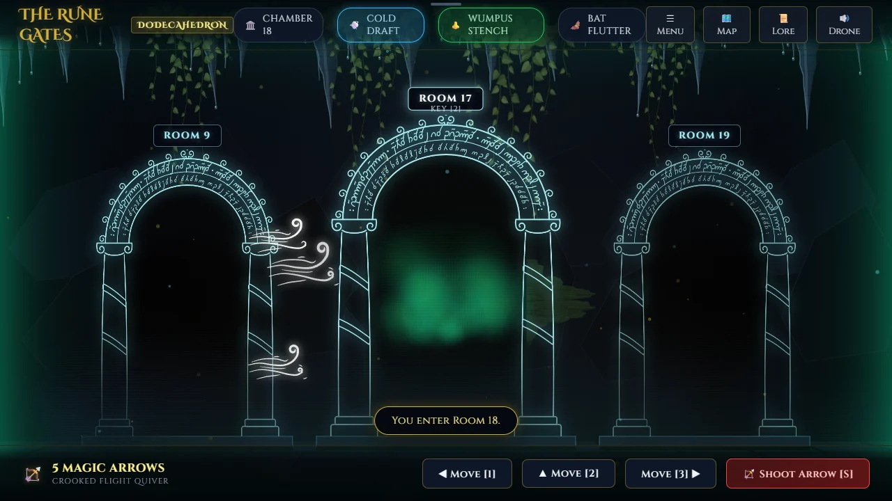

# The Rune Gates

> Read the draft, the stench and the wings. Loose a crooked arrow.

## The hook

Every chamber of the deep halls has three rune gates, glowing pale blue and written over in a
script nobody has read. Behind one of them, somewhere, a wumpus is asleep. A cold wind curling out
of a gate means a bottomless pit lies that way; wings mean super-bats; a green stench means the
beast is close. Walk carefully, work out its chamber, then name up to five chambers and loose a
crooked arrow through the tunnels. Around the hunt sits a delver's life: twelve delves to clear,
three quests in every briefing, a chronicle of each delve kept in your ledger, a codex of lore to
fill, and the same Daily Delve as everyone else.

## Where it comes from

Gregory Yob wrote _Hunt the Wumpus_ in 1973: twenty caves on the corners of a dodecahedron,
bats, pits and crooked arrows. The BSD games kept it as `wump`, contributed by Dave Taylor in
1989, which also dug random caves with one-way tunnels. Before the collection existed, the owner
built this port of it for the browser: rune-lit gates, wind that curls out of the tunnel towards a
pit, moss and hanging vines, a drone in the stone, and the original's rules of the hunt. It joins
the collection as built, beside its native reinvention _Hush the Wumpus_.

## What is new

- **Our own rune halls.** The port was first themed on a well-known fantasy saga; in the collection
  its names are its own, and the gates, the vines, the wind and the stalactites are all drawn in
  code, the gates inscribed in a script invented for them.
- **A delver's career.** Twelve delves through four halls, ranks from Lamp-bearer to Master of the
  Rune Gates, each delve opening the gate to the next.
- **Quests and seals.** Three quests in every briefing; a seal for each one met on a delve whose
  wumpus you slay.
- **The chronicle and the ledger.** Every delve is written up afterwards, step by step, and kept.
- **The lore codex.** Sixteen pages about the halls and what lives in them, each found by doing
  something for the first time.
- **The Daily Delve.** One cave a day for everyone, with a share line and no link.

## At a glance

|                 |                                              |
| --------------- | -------------------------------------------- |
| Directory       | `/usr/games/strategy`                        |
| Players         | 1                                            |
| Session         | 3–10 minutes                                 |
| Daily challenge | yes                                          |
| Inspired by     | `wump` (1989), after Gregory Yob's 1973 hunt |

## More

- [How to play](HOW-TO-PLAY.md)
- [Changes from the original](CHANGES-FROM-ORIGINAL.md)
- [Architecture](ARCHITECTURE.md)
- [Notes](NOTES.md)
