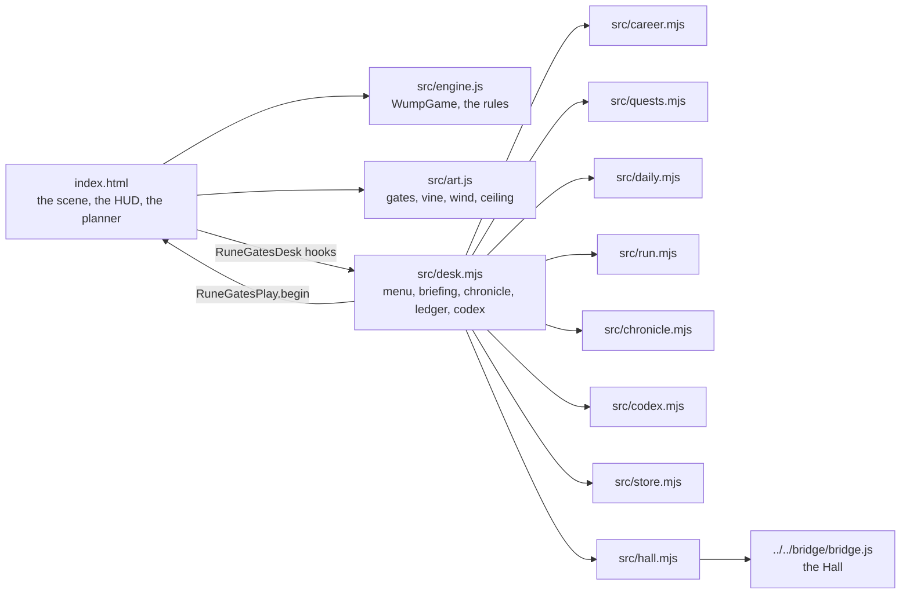
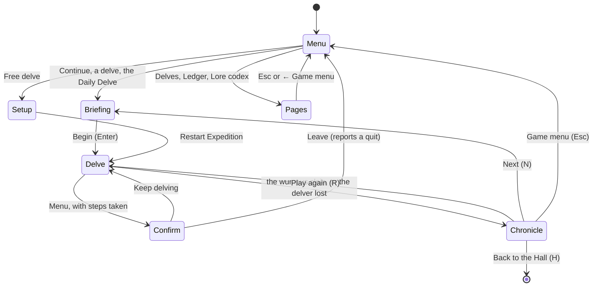

# The Rune Gates — architecture

## Overview

An adopted, hosted game (ADR 0011): a static page (`app/index.html`) with five stacked Canvas 2D
layers, a Web Audio drone and a pure engine (`app/src/engine.js`), no build step. The Hall serves
`app/` at `play/wump-classic/` and talks to it over the bridge. Around the page's own script, a set
of small ES modules add the career, the quests, the chronicle, the codex and the Daily Delve; the
rules of the hunt are untouched.

## Module map

| Path                    | Responsibility                                                                                       |
| ----------------------- | ---------------------------------------------------------------------------------------------------- |
| `app/index.html`        | The adopted page: canvases, HUD, planner, chart, lore, setup; the scene and its animation loop       |
| `app/src/engine.js`     | The adopted engine: caves (the twenty-chamber plan or dug by chance), hazards, moves, arrows, temper |
| `app/src/art.js`        | Art drawn in code in place of the port's raster images; the delvers' script                          |
| `app/src/desk.mjs`      | Every screen around a delve, and what the page tells it (`window.RuneGatesDesk`)                     |
| `app/src/career.mjs`    | The twelve delves, ranks, unlocking, stars                                                           |
| `app/src/quests.mjs`    | Quest kinds, their wording and their checks                                                          |
| `app/src/daily.mjs`     | The Daily Delve: number, seed, cave by weekday, quests, share line                                   |
| `app/src/run.mjs`       | One delve as it happens: counts and events from the engine's answers                                 |
| `app/src/chronicle.mjs` | The written account of a delve; the ledger                                                           |
| `app/src/codex.mjs`     | The sixteen lore pages and how each is found                                                         |
| `app/src/store.mjs`     | Saves under `usr-games:wump-classic:`                                                                |
| `app/src/hall.mjs`      | Bridge glue: results, packages, title screen, pause, sound, key art                                  |
| `app/src/desk.css`      | The desk's styles; `app/src/fonts/` the self-hosted Cinzel                                           |

## State machine

The page opens with `<body data-desk="menu">` and a cave already drawn; `desk.mjs` lays the menu
over it. `RuneGatesPlay.begin(options)` replaces the game with a new `WumpGame` and redraws.

## How the desk follows a delve

The page calls four hooks, each a single line added to the adopted script:

| Hook                                              | Where in `index.html`                       | What the desk does                                      |
| ------------------------------------------------- | ------------------------------------------- | ------------------------------------------------------- |
| `noteMove(target, res, game)`                     | `handlePlayerMove`, after `game.moveTo`     | counts the step, a bump, a bat ride, an outcrop; senses |
| `noteShot(path, res, game)`                       | `firePlannedArrow`, after `game.shootArrow` | counts the arrow, a waking, the slaying path            |
| `finishRun(win, title, message, game)`            | `showOutcomeModal`                          | seals, career, daily, ledger, codex, packages, result   |
| `noteMap()`, `noteDrone(on)`, `noteNewGame(game)` | the chart, the drone, the setup dialog      | the chart quest, the drone's page, free delves          |

`ownsKeys()` keeps the game's keys quiet while a page of the desk is open.

## Where visuals are defined

| Visual                                            | Defined in                                                                      | Change it by                                         |
| ------------------------------------------------- | ------------------------------------------------------------------------------- | ---------------------------------------------------- |
| The rune gate (arch, inscription, pillars)        | `src/art.js` `gate()`                                                           | `inscribeArc`, `drawPillar`; the phrases in `gate()` |
| The delvers' script                               | `src/art.js` `GLYPHS`, `ALPHABET`                                               | glyph paths and marks                                |
| The hanging vine                                  | `src/art.js` `vine()`, `drawLeaf`                                               | the runner, the strands, the leaf shades             |
| The wind                                          | `src/art.js` `WIND_STROKES`, `drawWind`                                         | each stroke's path, width, start and duration        |
| Ceiling and stalactites                           | `src/art.js` `drawCeiling`, `stalactite`                                        | the depths' sizes and shades                         |
| Cave background, floor, mist, spores, bats, arrow | `index.html` (`renderWildCavernBackground`, `renderSolidStoneFloor`, `animate`) | the adopted code                                     |
| Moss and rock textures                            | `assets/*.svg` (Openclipart, public domain)                                     | —                                                    |
| HUD, planner, dialogs                             | `index.html` styles                                                             | the adopted CSS                                      |
| Menu and pages                                    | `src/desk.mjs`, `src/desk.css`                                                  | the desk                                             |

There is one look, night in the deep halls (listed in `docs/KNOWN-ISSUES.md`).

## Where sounds are defined

All in `index.html`, synthesised with Web Audio: the drone (two low sines, off until turned on),
the bowstring, the victory fanfare and the wumpus's roar. Every sound passes one master gain
(`masterGain`), which in the Hall follows the Hall's volume and mute through
`RuneGatesPlay.setSoundLevel` (1, as designed, at the Hall's default volume; 0 while muted); the
Drone button stays the delver's choice. The Hall's pause suspends the audio context
(`RuneGatesPlay.pauseSound`).

## Hall integration

- **Results.** Every finished delve: `outcome` `win` (the wumpus slain) or `loss`, `score` (50 +
  10 per arrow left + 15 per seal), `stats` (`wumpusesSlain`, `moves`, `arrowsLeft`, `batRides`,
  `seals`), `xpEvents` (`slain` 10, `seals` 3 each, `promotion` 6), `daily` for the first Daily
  Delve of the day, `durationSeconds`. A delve left half-way reports `quit`.
- **Packages.** The twelve in the manifest, offered by `installPackages` in `desk.mjs`.
- **Title screen.** The game menu reports `title-screen`, so Esc there leads to the Hall; the
  page's own Esc that closes a dialog calls `preventDefault`, so the bridge leaves it alone.
- **Sound, motion and pause (bridge 1.1).** `onSound` in `hall.mjs` turns the Hall's sound into a
  level (`soundLevel(sound)`) and hands it to `onHallSound` in `desk.mjs`, which calls
  `RuneGatesPlay.setSoundLevel`; on its own the game never hears it and plays as designed. The
  Hall's pause still suspends the audio context through `onHallPause`. The game has no
  reduced-motion path for the Hall's setting to reach (an open issue).
- **Key art.** The cave behind the menu, flattened from the five layers, two and a half seconds
  after the page opens.
- **Saves.** `usr-games:wump-classic:` `career`, `ledger`, `codex`, `daily`, `drone`, each at
  version 1.
- **Daily.** The number from the kit's epoch (2026-09-01), the seed from the date;
  `?date=YYYY-MM-DD` stands in for today when testing.

## Tests

| Test                    | Command                                                   | What it proves                                                                                                                                      |
| ----------------------- | --------------------------------------------------------- | --------------------------------------------------------------------------------------------------------------------------------------------------- |
| The port's engine tests | `pnpm run test:hosted`                                    | Its eleven rules tests, unchanged                                                                                                                   |
| The desk's tests        | the same (`app/tests/*.test.mjs`)                         | Career, quests, daily, a run through the engine, chronicle, codex                                                                                   |
| In the Hall             | `pnpm exec playwright test -c games/wump-classic`         | Menu, a career delve to its chronicle and the Hall's result, the Daily Delve's share line, leaving a delve, Esc, every way out, no foreign requests |
| Screenshots             | `SHOTS=1 pnpm exec playwright test -c games/wump-classic` | `docs/media/*-1280.webp`                                                                                                                            |

## Kit candidates

None new: the desk follows the patterns of Control Room 1986 (store, daily numbering), which could
move into the bridge for hosted games one day.
