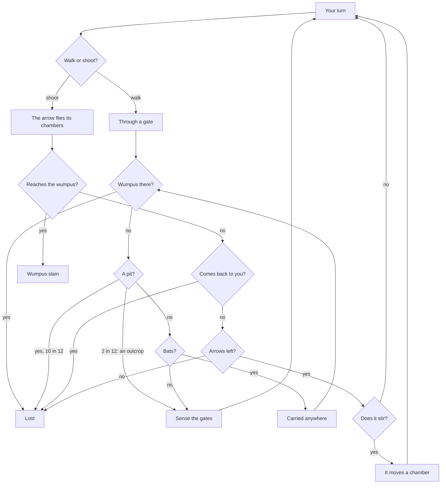

# How to play The Rune Gates

## Goal

Find the chamber where the wumpus sleeps and loose an arrow into it. You win the moment an arrow
reaches its chamber. You lose if you walk into the wumpus (or it wanders into you), fall into a
bottomless pit, your own arrow comes back round to you, or your quiver runs empty.

## What you sense

Each chamber has three gates, labelled with the chamber each one leads to. On arriving you sense
what lies one or two tunnels out:

| Sense         | On screen                                                | What it means                           |
| ------------- | -------------------------------------------------------- | --------------------------------------- |
| Cold draft    | The draft badge lights; white wind curls out of one gate | A bottomless pit lies through that gate |
| Bat flutter   | The flutter badge lights; bats burst from a gate         | Super-bats roost one tunnel away        |
| Wumpus stench | The stench badge lights; green mist rises in the chamber | The wumpus is one or two tunnels away   |

## Controls

| Action                        | Keyboard              | Mouse                          | Remappable |
| ----------------------------- | --------------------- | ------------------------------ | ---------- |
| Walk through the left gate    | `1` or `A`            | Click the gate, or ◀ Move [1]  | no         |
| Walk through the middle gate  | `2` or `W`            | Click the gate, or ▲ Move [2]  | no         |
| Walk through the right gate   | `3` or `D`            | Click the gate, or Move [3] ▶  | no         |
| Plan an arrow                 | `S`                   | Shoot Arrow [S]                | no         |
| Add a chamber to its flight   | Tab to it, then Enter | Click a chamber in the planner | no         |
| Clear the flight / loose it   | Tab to it, then Enter | Clear Path / Release Arrow!    | no         |
| The cave chart                | `M`                   | Map                            | no         |
| Rules                         | `H` or `?`            | Lore                           | no         |
| The deep-hall drone on or off | —                     | Drone                          | no         |
| Close a dialog                | Esc                   | ×                              | no         |
| Leave the delve for the menu  | —                     | Menu (asks first)              | no         |
| Begin a delve (briefing)      | Enter                 | Begin the delve                | no         |
| Play again (chronicle)        | `R`                   | Play again                     | no         |
| Game menu (chronicle, pages)  | Esc                   | Game menu                      | no         |
| Back to the Hall (chronicle)  | `H`                   | Back to the Hall               | no         |
| Next delve (chronicle)        | `N`                   | Next                           | no         |

On the game menu, Esc goes back to the Hall. At any time, ← Back to the Hall and Game menu are on
the Hall's strip above the game; from the keyboard, Shift+Tab reaches it.

## Rules

1. Walk through one gate a turn, or loose one arrow.
2. Arriving, the cave checks the wumpus first (you are lost), then a pit (two times in twelve you
   catch a rock outcrop and climb back), then bats (they drop you in any chamber, which is
   checked the same way).
3. An arrow follows the chambers you name, up to five. Where there is no tunnel to the next one,
   it veers down a random tunnel and flies on. Before its third chamber it may fall short (2 in
   10), and before its fourth (6 in 10).
4. An arrow that reaches the wumpus's chamber slays it; one that comes back to yours ends the
   delve.
5. A miss makes the wumpus more restless (a growing chance out of 12, out of 9 on the hard
   level); when it wakes it moves to a neighbouring chamber. Bumping into a wall wakes it one
   time in six.

## Modes

| Mode        | What changes                                                                                                   |
| ----------- | -------------------------------------------------------------------------------------------------------------- |
| Career      | Twelve delves through four halls; clearing one opens the next; three quests in every briefing                  |
| Daily Delve | One cave for everyone today, with three quests; only your first delve of the day counts; a share line, no link |
| Free delve  | The game's own setup: the twenty-chamber plan or a cave dug by chance, easy or hard, the quiver's size         |

| #   | Delve                    | Hall               | The new thing                                       |
| --- | ------------------------ | ------------------ | --------------------------------------------------- |
| 1   | The Threshold Hall       | The Upper Gates    | Twenty chambers on the old twelve-faced plan        |
| 2   | The Twelve-Pillared Hall | The Upper Gates    | More of everything that lurks                       |
| 3   | The Bat Vaults           | The Upper Gates    | Five bat roosts                                     |
| 4   | The Chasm Stair          | The Upper Gates    | Five pits                                           |
| 5   | The First Delving        | The Wandering Deep | Twenty-five chambers dug by chance, one-way tunnels |
| 6   | The Winding Deep         | The Wandering Deep | Thirty chambers                                     |
| 7   | The Hard Gate            | The Iron Halls     | The original's hard level                           |
| 8   | The Echoing Galleries    | The Iron Halls     | Forty chambers                                      |
| 9   | The Restless Hall        | The Iron Halls     | The hard level with four arrows                     |
| 10  | The Long Dark            | The Deepest Roads  | Sixty chambers                                      |
| 11  | Depths of the Delvers    | The Deepest Roads  | Eighty chambers, hard                               |
| 12  | The Last Gate            | The Deepest Roads  | A hundred chambers, hard                            |

### Quests and seals

Each briefing lists three quests, such as "Never ride with the super-bats", "Slay it with your
first arrow" or "Keep 3 arrows in your quiver". Each one met on a delve whose wumpus you slay
earns a seal (◆). A delve's stars are the most seals you have earned there.

### Ranks

Lamp-bearer, Tunnel-walker (2 delves cleared), Rune-reader (4), Gate-warden (6), Deep-delver (9),
Master of the Rune Gates (12).

### The ledger and the codex

Every finished delve is written up as a chronicle and kept in the ledger (the last thirty). The
lore codex has sixteen pages, each found by doing something for the first time: smelling the
beast, riding with the bats, clinging to an outcrop, clearing a hall.

## Settings

The game's own setup (free delves only): the cave (the twenty-chamber plan or one dug by chance,
with its number of chambers), easy or hard, the quiver's size. The deep-hall drone is off until you
turn it on. In the Hall, the Hall's volume and mute set how loud every sound in the game plays
(silent while muted); the Drone button stays your choice. The Hall's appearance applies to the
Hall around the game, and its reduced-motion setting does not reach the game yet: the mist, spores
and wind keep moving.

## Scoring

A slain wumpus scores 50, plus 10 for every arrow left and 15 for every seal. The Daily Delve's
share line reads, for example, `The Rune Gates #32 · slain in 11 moves · 🏹2 · ◆◆◇`.

## Achievements (packages)

| Package          | How to earn it                                                   |
| ---------------- | ---------------------------------------------------------------- |
| `first-slay`     | Slay your first wumpus                                           |
| `bat-rider`      | Let the super-bats carry you off, and live                       |
| `outcrop`        | Cling to a rock outcrop over a bottomless pit                    |
| `first-seal`     | Earn a quest seal on any delve                                   |
| `daily-delver`   | Finish a Daily Delve                                             |
| `single-arrow`   | Slay a wumpus with your first arrow                              |
| `crooked-flight` | Slay a wumpus with an arrow named through three or more chambers |
| `hard-gate`      | Slay a wumpus on the hard level                                  |
| `gate-warden`    | Clear six delves of the career                                   |
| `sealbearer`     | Hold eighteen seals across the twelve delves                     |
| `loremaster`     | Find every page of the lore codex                                |
| `master-delver`  | Clear all twelve delves                                          |

## XP

Every finished delve is reported to the Hall: a session, the first win of the day and the Daily
Delve earn XP under the Hall's rules. On top of that a slain wumpus earns 10 XP, each seal 3 XP
and a new rank 6 XP. Weekly cron jobs may ask for a few slain wumpuses or a handful of seals. A
delve left half-way counts as a quit.

## Tips

- The wind curls out of the gate that leads towards the pit: trust it.
- A chamber with no draft, no flutter and no stench is safe on all three sides.
- Short arrows never fall short: within two chambers an arrow always arrives.
- The cave chart shows every tunnel; one quest asks you not to open it.
