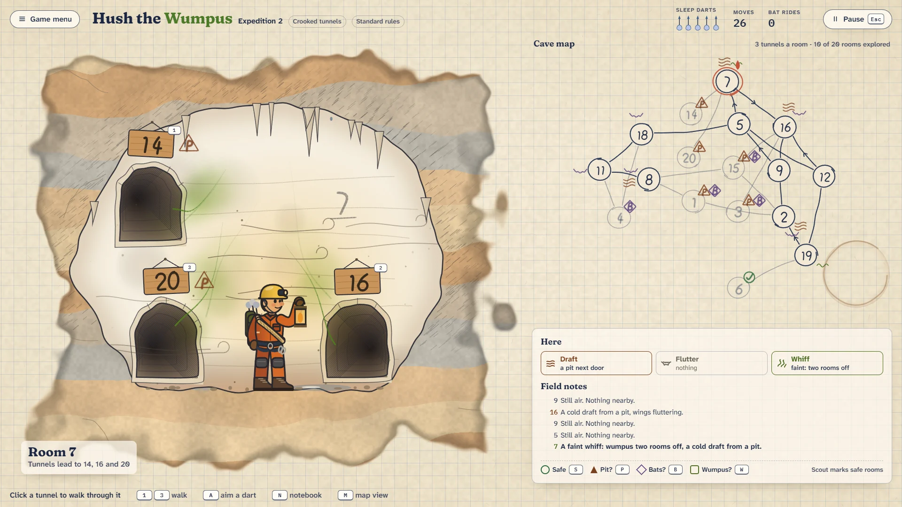
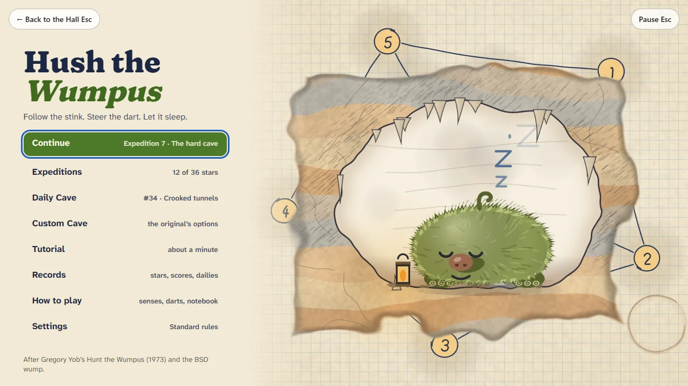
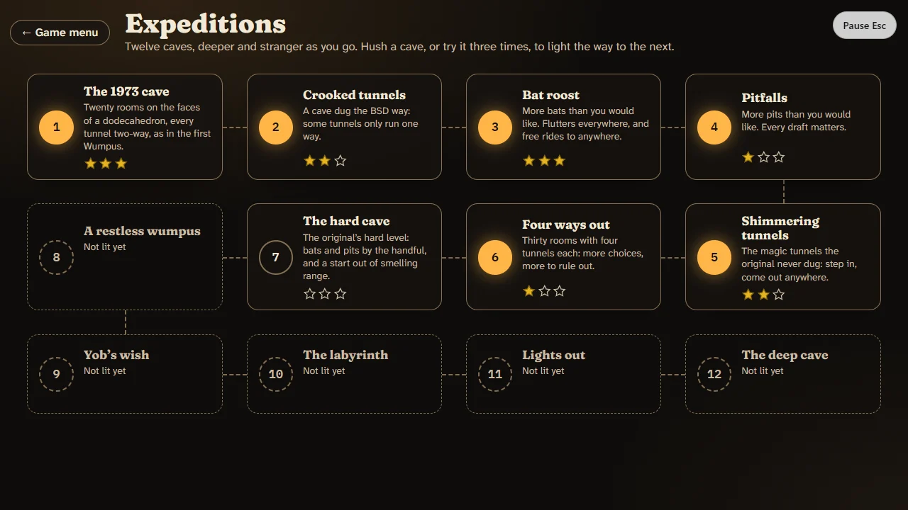
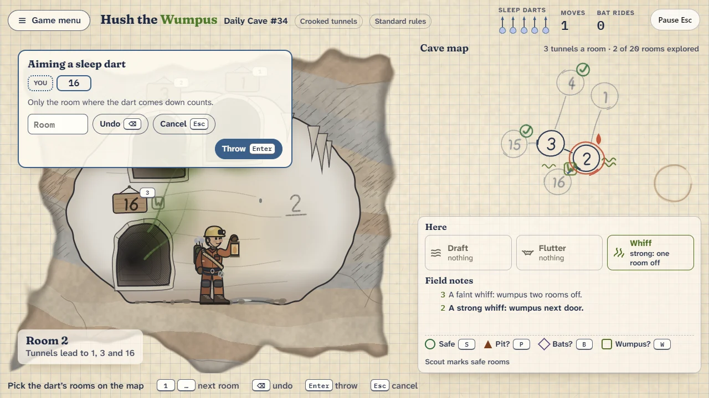
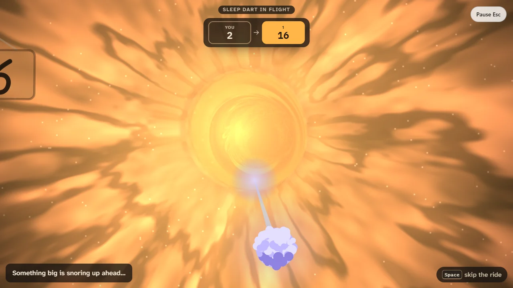
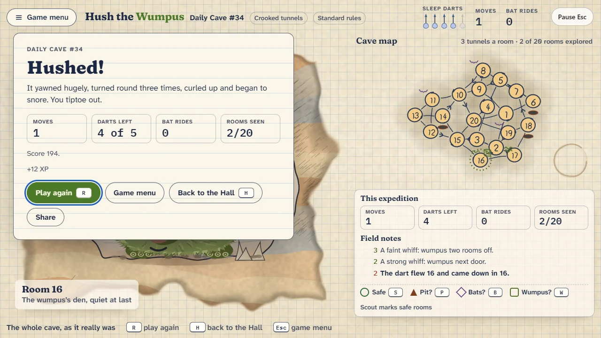
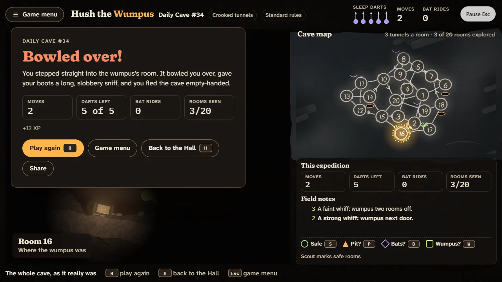
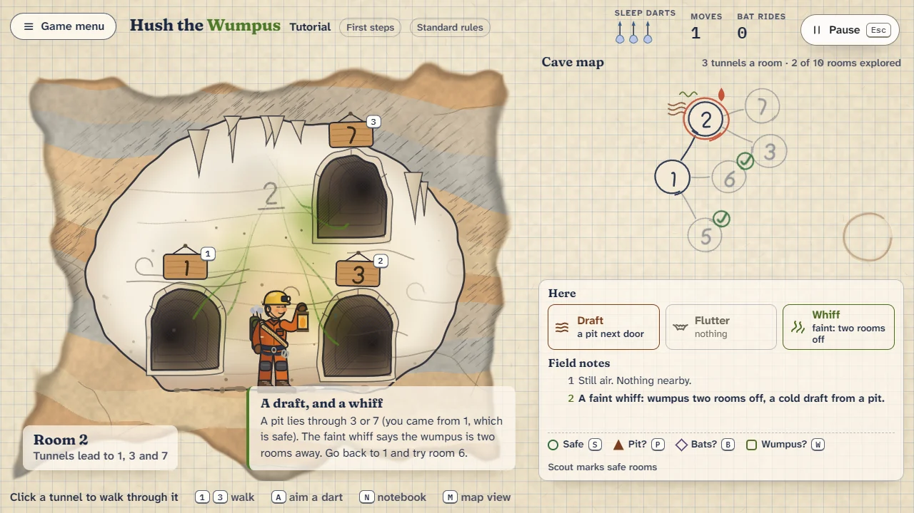
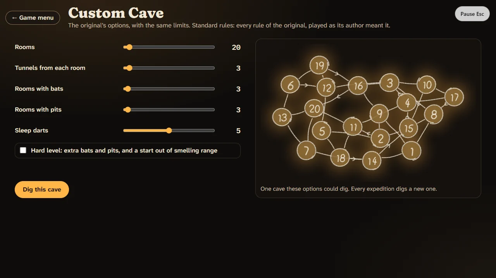

# Hush the Wumpus

> Follow the stink. Steer the dart. Let it sleep.

## The hook

Somewhere in a cave of numbered rooms a huge, shaggy, very smelly wumpus is snoring. You carry a
lantern, a notebook and a handful of sleep darts. Every room tells you something: a cold draft
means a pit next door, a flutter means bats, a whiff means the wumpus is close. Walk carefully,
write down what you learn, work out where it must be, then lay a dart's path through up to five
rooms and let it fly. The camera rides along with the dart down the tunnels, plaques flashing past,
and if you reasoned well the wumpus yawns, turns round three times and curls up asleep while the
whole cave lights up on your map.

## Where it comes from

Gregory Yob wrote _Hunt the Wumpus_ in BASIC in 1973, around the People's Computer Company in
California. The hide-and-seek games of the day were played on square grids, and he wanted a cave
that was not one: his twenty rooms sat on the corners of a dodecahedron, three tunnels each. The BSD
games carried the idea on as `wump`, a C program contributed by Dave Taylor, which dug a fresh,
crooked cave every game: tunnels that only run one way, bats that carry you anywhere, pits, and
arrows that could travel up to five rooms. There was no map; players drew their own on scraps of
paper. You typed room numbers and read the replies.

## What is new

- **Two views that agree.** The chamber you stand in, with its tunnel mouths and their room
  numbers, and a map that draws itself as you explore, in ink on squared paper or in chalk by
  lantern light.
- **A notebook.** Mark any room safe, pit?, bats? or wumpus?; the Scout can mark the rooms your
  notes prove safe.
- **The dart ride.** Steer the dart room by room, then ride with it in first person.
- **Two rule sets.** Standard plays the rules the original meant; Classic plays them exactly as
  the C code ran, bugs and all.
- **A trail of twelve caves**, from Yob's dodecahedron to a hundred and twenty rooms in the dark,
  a Daily Cave that is the same for everyone, and the original's options in a Custom Cave.
- **A kinder ending.** The wumpus is only ever sent to sleep, and when it wins you simply flee.

## At a glance

|                 |                                                        |
| --------------- | ------------------------------------------------------ |
| Directory       | `/usr/games/strategy`                                  |
| Players         | 1                                                      |
| Session         | 3–8 minutes                                            |
| Daily challenge | yes                                                    |
| Inspired by     | `wump` (BSD games), after Gregory Yob's 1973 cave hunt |

## Screens

| Scrap Paper                                                                            | Lantern Dark                                                                                             |
| -------------------------------------------------------------------------------------- | -------------------------------------------------------------------------------------------------------- |
|  |                                 |
|      |                       |
|      |               |
|             |  |

## More

- [How to play](HOW-TO-PLAY.md)
- [Changes from the original](CHANGES-FROM-ORIGINAL.md)
- [Architecture](ARCHITECTURE.md)
- [Notes](NOTES.md)
