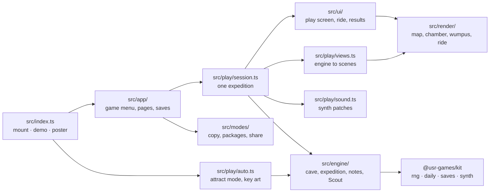
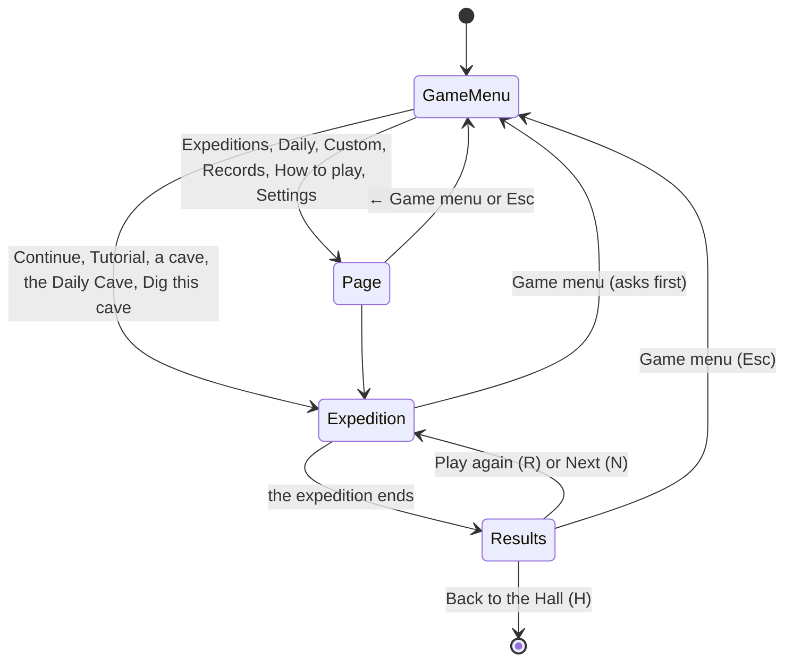
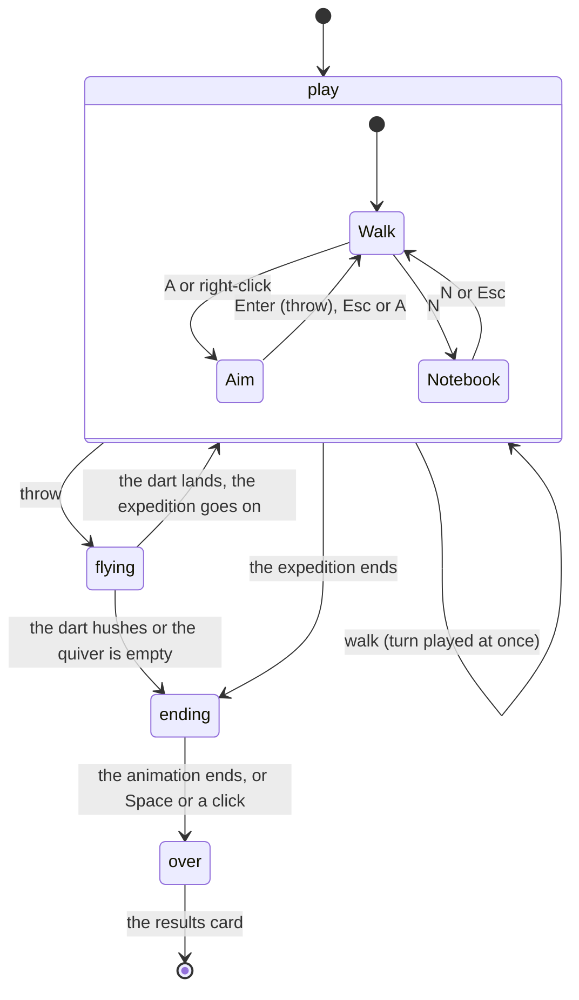

# Hush the Wumpus — architecture

## Overview

A native game of the collection: TypeScript, mounted by the Hall through the kit's `GameModule`.
The map, the chamber and every screen are Canvas 2D and DOM; the dart ride is one hand-written
WebGL 2 fragment shader ([ADR 0001](adr/0001-canvas-and-one-shader.md)). The engine is pure
TypeScript with no DOM, seeded by the kit's RNG, and plays two rule sets
([ADR 0002](adr/0002-two-rule-sets.md)). Nothing is a raster file and nothing is fetched.

## Module map

| Path                       | Responsibility                                                                                           |
| -------------------------- | -------------------------------------------------------------------------------------------------------- |
| `src/index.ts`             | The kit contract: `mount`, `demo` (the Scout exploring silently), `poster` (the key art), `achievements` |
| `src/engine/random.ts`     | `Random`: unsigned draws from the kit RNG, `roll(random, n)` as the original's `random() % n`            |
| `src/engine/cave.ts`       | Digging a cave the original's way, the size limits, the dodecahedron, tunnels and reachability           |
| `src/engine/rules.ts`      | `CaveRecipe` and every constant of the rules (wake odds, ledge, dart limits, temper)                     |
| `src/engine/glibc.ts`      | The GNU C library's `random()` from its default seed, for Classic's hard-level extras                    |
| `src/engine/expedition.ts` | Placing hazards (both rule sets), senses, moving, bats, pits, dart flights, the wumpus's temper          |
| `src/engine/knowledge.ts`  | The explorer's notes: what was felt where, which tunnels are known, the odds for every room              |
| `src/engine/scout.ts`      | The Scout bot: proven-safe rooms, risk, where to walk, when and where to throw                           |
| `src/engine/campaign.ts`   | The tutorial, the twelve expeditions, stars and the score                                                |
| `src/engine/daily.ts`      | The Daily Cave: one of five cave shapes picked and dug from the day's seed                               |
| `src/play/session.ts`      | One expedition on screen: input modes, turns, logs, sounds, the ride, the ending                         |
| `src/play/views.ts`        | Turns the engine's state and notes into the chamber and map scenes, and log lines                        |
| `src/play/sound.ts`        | The cave's synth patches and ambience                                                                    |
| `src/play/auto.ts`         | The key art and the attract mode                                                                         |
| `src/render/`              | Everything drawn: see below                                                                              |
| `src/ui/`                  | The play screen's DOM, the ride overlay, the results card, the confirm dialog, `wump.css`                |
| `src/app/`                 | The game menu and its pages, results and what the Hall hears, the save slots                             |
| `src/modes/`               | Player-facing copy (endings, refusals, tutorial), the twelve packages, the share line                    |
| `dev/`                     | The workbench on port 5274: staged scenes for the hero frames and the whole game with a stand-in Hall    |
| `scripts/sim.ts`           | The balance report: the Scout plays every cave over many seeds                                           |

## State machines

The app moves between screens; inside an expedition the session has a phase and an input mode.

A turn is played by the engine in one call (`move` or `shoot`) that returns the turn's events in
order. The session then observes them into the notes, writes the log, plays the sounds, animates
newly discovered tunnels and offers any package earned.

## Engine

### The cave generator

`digCave` follows the original exactly: a ring through every room first (room _i_ leads to
`(i + delta) % rooms + 1` and the far room answers, with `delta` re-drawn until
`gcd(rooms, delta + 1) = 1`), then the remaining tunnels at random, each answered by a tunnel back
only when a coin toss says so and the far room has a free slot; tunnels are sorted. Under Classic
a random tunnel may lead back into its own room; Standard re-draws it, and may turn some extra
tunnels into magic ones (to room `rooms + 1`, which drops you anywhere). Every cave is connected
from every room because of the ring; tests check it over many seeds.

### Hazards and the start

`startExpedition(recipe, rules, random, options)` asks `population` how many bats and pits there
are (Classic draws the hard level's extras from glibc's default seed, Standard from the
expedition's own stream, clamped so the cave never overflows), then fills the cave:
`fillClassic` copies the original's placement, `&&` bug included; `fillStandard` chooses a calm
start first and keeps every hazard and the wumpus out of its reach. Presets place everything by
hand for the tutorial.

### Randomness

Each expedition takes one stream from the kit's `createRng` (Daily Caves: the kit's daily seed for
`wump`; everything else: a fresh seed). Every draw goes through `roll(random, n)`, so the order of
draws is the original's and a replay with the same seed and the same actions is identical, which
the browser tests rely on.

### The notes and the Scout

`knowledge.ts` keeps what the explorer has actually felt: senses per room, tunnels seen, rooms
stood in, ledges and roosts survived, and an epoch that moves on whenever the wumpus may have
moved. `hazardOdds` samples hazard layouts consistent with every sense (a short Markov chain over
placements), and `deduce` returns the rooms that are proven safe. The Scout (`scout.ts`) walks to
the nearest unexplored proven-safe room, takes the least risky step into the unknown when there is none, and throws
when the wumpus's room is certain (or likely enough with darts to spare). It plays the demo,
marks rooms for the Scout assist, and runs the balance tests.

## Where visuals are defined

Two looks, each designed on its own: Scrap Paper (light) and Lantern Dark (dark), chosen from the
Hall's appearance. Every colour of the canvases is in `src/render/look.ts`; the colours of the DOM
are CSS variables in `src/ui/wump.css` under `[data-look='paper']` and `[data-look='lantern']`.

| Visual                                               | Defined in                                              | Change it by                                                   |
| ---------------------------------------------------- | ------------------------------------------------------- | -------------------------------------------------------------- |
| Paper, grid, coffee ring, the lantern-dark wall      | `src/render/backdrop.ts`                                | `backdrop(look, …)`; cached per size                           |
| The map: rooms, tunnels, one-way arrows, stubs       | `src/render/map.ts` (`drawMap`)                         | `MapScene`; framing in `viewOf`, room size in `roomRadius`     |
| Map layout                                           | `src/render/layout.ts`                                  | Stress majorization; the dodecahedron has its own flat drawing |
| The crumpled or smudged map after a loss             | `src/render/crumple.ts`                                 | `spoilMap`                                                     |
| Hand-lettered numbers and marks                      | `src/render/hand.ts`                                    | Stroke glyphs in `GLYPHS`; `letter`, `stroke`                  |
| The chamber: rock, light, senses, signs              | `src/render/chamber.ts`, `chamber-shape.ts`             | `ChamberScene`; the rock layer is cached per room and size     |
| Tunnel mouths and their placement                    | `src/render/mouths.ts`                                  | `layoutArches` keeps mouths, plaques and marks apart (tested)  |
| The explorer and the lanterns                        | `src/render/explorer.ts`                                | `drawExplorer`, `drawDroppedLantern`, `drawStandingLantern`    |
| The wumpus (idle, grumpy, charging, yawning, asleep) | `src/render/wumpus.ts`                                  | `drawWumpus`, `WumpusPose`                                     |
| The dart ride: the tunnel                            | `src/render/tunnel-gl.ts`                               | The fragment shader; render scale 0.75                         |
| The dart ride: the dart and passing plaques          | `src/render/ride.ts`                                    | `drawRideOverlay`                                              |
| Screens, bar, notes, aim panel, results, menus       | `src/ui/play-screen.ts`, `src/app/menus.ts`, `wump.css` | DOM built with `h`; styles in `wump.css`                       |
| Key art and the attract mode                         | `src/play/auto.ts`                                      | `drawKeyArt`, `AutoCave`                                       |

Reduced motion: no ride (the flight is traced on the map instead), no screen shake, endings
shortened to a cut, no breathing on the title. The Hall's accent is not used inside the cave;
the game keeps its own moss green (light) and lantern amber (dark).

## Where sounds are defined

All sounds are kit synth patches in `src/play/sound.ts`; there are no audio files. They play only
when the game's Sound setting is on, at the Hall's volume.

| Sound    | Patch                  | Plays when                                |
| -------- | ---------------------- | ----------------------------------------- |
| Cave air | `AMBIENCE` (drone)     | While an expedition is on screen          |
| Drip     | `CAVE_PATCHES.drip`    | Now and then, with the ambience           |
| Step     | `CAVE_PATCHES.step`    | Walking through a tunnel                  |
| Draft    | `CAVE_PATCHES.draft`   | Arriving next to a pit                    |
| Flutter  | `CAVE_PATCHES.flutter` | Arriving next to bats                     |
| Whiff    | `CAVE_PATCHES.whiff`   | Arriving within two tunnels of the wumpus |
| Bump     | `CAVE_PATCHES.bump`    | Walking into a wall                       |
| Grumble  | `CAVE_PATCHES.grumble` | A bump wakes the wumpus                   |
| Flap     | `CAVE_PATCHES.flap`    | Bats carry you off                        |
| Ledge    | `CAVE_PATCHES.ledge`   | Catching the ledge over a pit             |
| Shimmer  | `CAVE_PATCHES.shimmer` | Stepping through a magic tunnel           |
| Throw    | `CAVE_PATCHES.throw`   | Throwing a dart                           |
| Twang    | `CAVE_PATCHES.twang`   | The string snaps                          |
| Lullaby  | `CAVE_PATCHES.lullaby` | The wumpus is hushed                      |
| Snore    | `CAVE_PATCHES.snore`   | A moment after the lullaby                |
| Lost     | `CAVE_PATCHES.lost`    | Any other ending: two soft falling notes  |

## Hall integration

- **Results.** Every finished expedition calls `reportResult` with `presentation: 'game'` (the
  game draws its own results card): `outcome` `win` or `loss`, the score, `stats` (`hushed`,
  `moves`, `dartsLeft`, `batRides`, `roomsSeen`), `xpEvents` (`hushed` 10, `stars` 3 each,
  `darts-left` up to 6), `daily` for the first Daily Cave of the day and `durationSeconds`.
  Leaving mid-expedition reports nothing.
- **Packages.** The twelve in `src/modes/packages.ts` (also in the manifest; a test keeps the
  two in step), installed during play (ledge, shimmer, bat taxi) or at the end.
- **Pause menu.** Two game items: the rules for the next expedition, and the Scout assist.
- **Title screen.** `setOnTitleScreen(true)` on the game menu, so the Hall shows "Back to the
  Hall" there; every other screen leaves the corner to the game.
- **Daily.** Number, seed and date key from the context; the share line goes through
  `context.share`, with no URL.
- **Saves.** Five slots of the kit's storage, each at version 1: `settings`, `progress` (stars
  and records per cave, tutorial done), `daily` (one record per date), `custom` (the last custom
  options) and `counters` (hushes, expeditions, dailies, rooms seen).
- **Weekly cron goals** in the manifest: hushes (2–6) and rooms explored (30–120).

## Tests

| Test                             | Command                                                                        | What it proves                                                                                                                                       |
| -------------------------------- | ------------------------------------------------------------------------------ | ---------------------------------------------------------------------------------------------------------------------------------------------------- |
| Faithfulness                     | `pnpm vitest run --project wump src/engine/faithfulness.test.ts`               | Every rule of the original, both rule sets, the temper bug as a table of misses                                                                      |
| Engine basics                    | `pnpm vitest run --project wump src/engine/expedition.test.ts`                 | Digging, the dodecahedron, senses, darts                                                                                                             |
| Balance (Scout over 1 000 seeds) | `pnpm vitest run --project wump src/engine/balance.test.ts`                    | The locked win rates in NOTES.md                                                                                                                     |
| Tunnel mouths                    | `pnpm vitest run --project wump src/render/mouths.test.ts`                     | No two mouths, plaques or marks overlap, in 450 rooms at three sizes                                                                                 |
| Content                          | `pnpm vitest run --project wump src/content.test.ts`                           | No wording of the original or its instructions; all-ages copy; manifest = packages                                                                   |
| The game in a browser            | `pnpm --filter @usr-games/game-wump e2e`                                       | Tutorial by keyboard and by mouse, notebook, a five-room path, daily win and share, loss, bats, ledge, leaving, Classic, custom refusals, frame rate |
| Hero frames                      | `pnpm --filter @usr-games/game-wump hero`                                      | Renders `docs/media/hero/`                                                                                                                           |
| Documentation screens            | `pnpm --filter @usr-games/game-wump shots` (`SHOTS_SIZE=1920` for 1920 × 1080) | Renders `docs/media/screens/`                                                                                                                        |
| Balance report                   | `pnpm --filter @usr-games/game-wump sim 1000`                                  | Prints the table in NOTES.md                                                                                                                         |

The browser runs use the workbench (`pnpm --filter @usr-games/game-wump dev`, started for you if it
is not running); Daily Caves on fixed dates make every cave known in advance, so the tests plan
their moves with the engine and check the screen agrees.

## How to add a campaign cave

1. Add a `CaveDefinition` to `CAMPAIGN` in `src/engine/campaign.ts`: an `id`, a `number`, a
   `name`, the one new `idea` in a sentence, a `recipe` (rooms, tunnels, bats, pits, darts, and any
   of `hard`, `magicTunnels`, `wakeOneIn`, `temperOutOf`, `yobsWish`), a `moveTarget`, the
   `thirdStar` (`no-bat-rides` or `darts-to-spare`), and `darkness: true` for a cave with no map.
2. A new rule goes into `CaveRecipe` (`src/engine/rules.ts`) and the engine, with a test in
   `faithfulness.test.ts` saying which rule set it belongs to.
3. Run `pnpm --filter @usr-games/game-wump sim 1000 <id>` and tune the recipe until the Scout's
   win rate sits where the cave belongs on the trail; if the cave matters for balance, lock it in
   `balance.test.ts` with its measured number.
4. The trail, records, stars and unlocking follow by themselves. If the cave has a package, add it
   to `src/modes/packages.ts` and the manifest together.

## Kit candidates

Not made (the kit belongs to another session this wave); listed in the final report:

- `fitCanvas(canvas, width, height)` in `src/ui/dom.ts`: size a canvas for the device pixel ratio.
- A stand-in `GameContext` for workbenches (`dev/game-host.ts`), so every native game can be
  played whole outside the Hall.
- `askToConfirm` (`src/ui/confirm.ts`) as a kit dialog in the game's own look.
