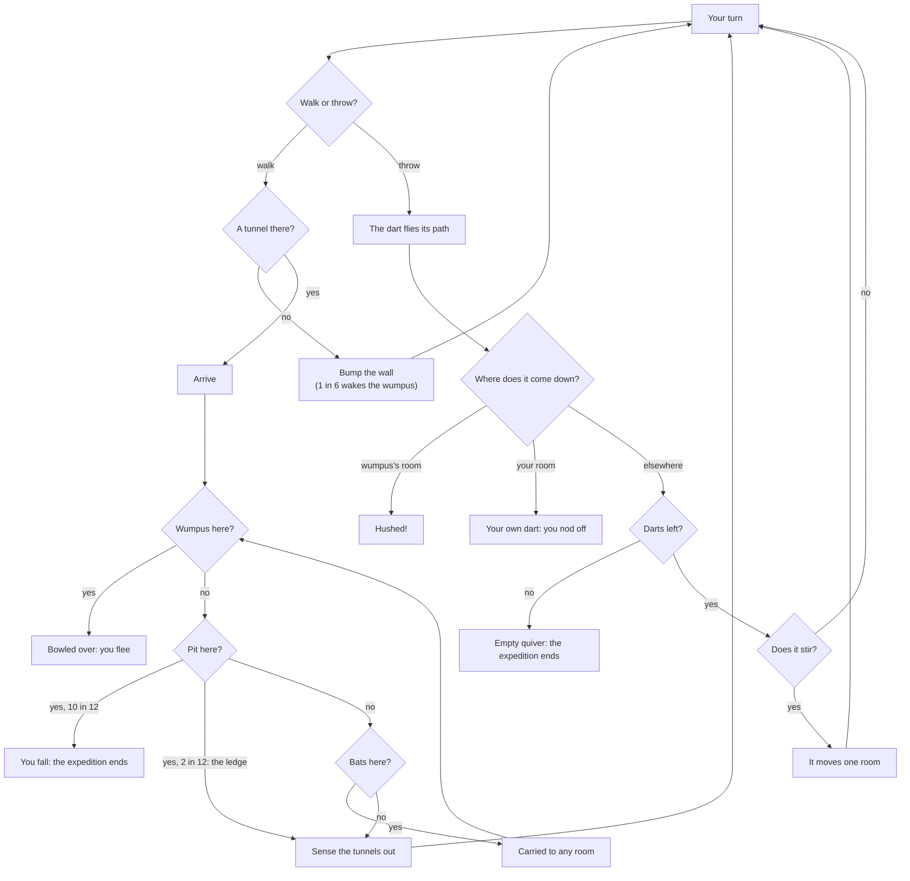

# How to play Hush the Wumpus

## Goal

Find the room where the wumpus is snoring and send a sleep dart into it. You win the moment a dart
comes down in its room. You lose if you walk into the wumpus (or it wanders into you), fall into a
pit, catch your own dart, or run out of darts.

## What you sense

Every time you arrive in a room you feel what lies **through the tunnels leading out of it**. A
tunnel that only leads _into_ your room tells you nothing.

| Sense   | On screen                                      | What it means                                                                                          |
| ------- | ---------------------------------------------- | ------------------------------------------------------------------------------------------------------ |
| Draft   | Dust streaming towards the mouths; a cold hiss | A pit lies one tunnel away                                                                             |
| Flutter | Bat shadows on the wall; a rustle              | Bats roost one tunnel away. Walk in and they carry you to any room at all                              |
| Whiff   | Green wisps curling out of the mouths          | The wumpus is within two tunnels. Standard rules say which: **strong** is one room away, **faint** two |

The same feelings are always written out under **Here** and in the field notes, so nothing depends
on colour or sound. The senses do not say which tunnel they come from: that is what the notebook is
for.

## Controls

| Action                               | Keyboard                                                                                       | Mouse                                                      | Remappable |
| ------------------------------------ | ---------------------------------------------------------------------------------------------- | ---------------------------------------------------------- | ---------- |
| Walk through a tunnel                | `1`–`9` (exits in the order shown)                                                             | Click its mouth in the chamber, or its room on the map     | no         |
| Aim a dart                           | `A`                                                                                            | Right-click the chamber                                    | no         |
| Add the next room to the dart's path | `1`–`9` (known tunnels of the dart's room), or type a number in the Room field and press Enter | Click the room on the map (the first room: also its mouth) | no         |
| Take back the last room of the path  | Backspace                                                                                      | Undo                                                       | no         |
| Throw the dart                       | Enter                                                                                          | Throw                                                      | no         |
| Stop aiming                          | Esc or `A`                                                                                     | Cancel                                                     | no         |
| Skip the dart ride                   | Space, Enter or Esc                                                                            | Click the ride                                             | no         |
| Notebook mode                        | `N`, then arrows to move between rooms                                                         | —                                                          | no         |
| Mark a room                          | `S` safe · `P` pit? · `B` bats? · `W` wumpus? (in notebook mode)                               | Right-click the room on the map, then pick a mark          | no         |
| Leave notebook mode                  | `N` or Esc                                                                                     | Done                                                       | no         |
| Big map                              | `M`                                                                                            | —                                                          | no         |
| See the results now (after a hush)   | Space or Enter                                                                                 | Click the chamber                                          | no         |
| Pause                                | Esc                                                                                            | Pause button                                               | no         |
| Play again (results)                 | `R`                                                                                            | Play again                                                 | no         |
| Next expedition (results)            | `N`                                                                                            | Next                                                       | no         |
| Game menu (results, pages)           | Esc                                                                                            | Game menu                                                  | no         |
| Back to the Hall (results)           | `H`                                                                                            | Back to the Hall                                           | no         |

A click that cannot do anything (a room with no tunnel from yours, a dart that has already left the
chamber) gives a gentle shake and a one-line reason. Clicking a room you know leads _into_ yours,
but not out of it, tries that tunnel the wrong way: you bump into the wall, as in the original,
and one bump in six wakes the wumpus.

## Rules

1. You start in a calm room with a few sleep darts (Standard rules; Classic may start you anywhere
   but the wumpus's room).
2. Each turn, walk through one tunnel **or** throw one dart.
3. Arriving in a room, the cave checks in this order: the wumpus (you are bowled over and flee),
   then a pit (two times in twelve you catch the ledge and climb out), then bats (they drop you in
   any room, and that room is checked the same way).
4. A dart flies through up to five rooms you choose. If a hop has no tunnel, the dart goes down a
   random tunnel of the room it is in and stops there. After its third room the string may snap
   (2 in 10); after its fourth the dart may waver and drop (6 in 10).
5. **Only the room where the dart comes down counts.** A dart that flies through the wumpus's room
   and on is a miss, and a dart that comes back to your room is your own sleep.
6. A miss makes the wumpus a little more restless. Sooner or later it stirs and lumbers down one of
   its tunnels, possibly into your room.

### The notebook

Right-click a room on the map (or press `N` and move with the arrows) to mark it **Safe**,
**Pit?**, **Bats?** or **Wumpus?**. Each mark has its own shape and letter. With the Scout assist
on, every room your notes prove safe gets a green tick by itself; the Scout never guesses, it only
writes down what follows from what you have felt.

### Aiming

Press `A` (or right-click the chamber) and pick rooms one at a time. Hops through tunnels you have
seen are drawn solid; hops you are guessing at are dashed, and the panel tells you the risk. When
the path is ready, press Enter. With the camera ride on, you fly along with the dart; with it off,
the flight is traced on the map.

## Modes

| Mode          | What changes                                                                                                                                                                 |
| ------------- | ---------------------------------------------------------------------------------------------------------------------------------------------------------------------------- |
| Tutorial      | A ten-room cave with one draft, one flutter, one whiff and one safe dart, explained step by step                                                                             |
| Expeditions   | Twelve caves, each adding one idea (below). Hush a cave, or try it three times, to light the next                                                                            |
| Daily Cave #N | Everyone gets the same cave today, numbered by the Hall, always under Standard rules. Only your first expedition of the day counts; share a one-line result without spoilers |
| Custom Cave   | The original's options as sliders: rooms, tunnels, bats, pits, darts, hard level, with the same limits and a sketch of a cave they could dig                                 |

| #   | Expedition         | The new idea                                                                  |
| --- | ------------------ | ----------------------------------------------------------------------------- |
| 1   | The 1973 cave      | Yob's dodecahedron: twenty rooms, every tunnel two-way                        |
| 2   | Crooked tunnels    | A cave dug the BSD way: some tunnels only run one way                         |
| 3   | Bat roost          | Five bat roosts: flutters everywhere                                          |
| 4   | Pitfalls           | Five pits: every draft matters                                                |
| 5   | Shimmering tunnels | Magic tunnels: step in, come out anywhere                                     |
| 6   | Four ways out      | Thirty rooms, four tunnels each                                               |
| 7   | The hard cave      | The original's hard level: extra bats and pits, a start out of smelling range |
| 8   | A restless wumpus  | Bumps and misses wake it far more easily                                      |
| 9   | Yob's wish         | The wumpus steps round pits, and bats can carry it a room                     |
| 10  | The labyrinth      | Sixty rooms                                                                   |
| 11  | Lights out         | The map does not draw itself: your notebook is the map                        |
| 12  | The deep cave      | A hundred and twenty rooms                                                    |

Each expedition has three stars: hush the wumpus; do it within the cave's move target; and either
take no bat rides or keep half your darts, depending on the cave.

## Settings

| Setting            | Options            | Default  |
| ------------------ | ------------------ | -------- |
| Rules              | Standard · Classic | Standard |
| Scout assist       | on · off           | on       |
| Map draws itself   | on · off           | on       |
| Ride with the dart | on · off           | on       |
| Sound              | on · off           | on       |

Rules and the Scout assist can also be changed from the pause menu; a new rule set applies from the
next expedition. Volume, reduced motion and colours are the Hall's settings. **Standard** plays
every rule as the original's author meant it. **Classic** plays the BSD program exactly: its
crooked temper, stacking pits, a start that may be on a pit or among bats, the hard level's fixed
extras, and the wumpus's temper carried from one Classic expedition to the next in one sitting.

## Scoring

A hushed wumpus scores 100, plus 15 for every dart left and 2 for every room you never needed to
enter, minus 2 for every move and 5 for every bat ride (never below 10). A lost expedition scores
nothing. Records keep the best score, the fewest moves and the stars for every cave. The Daily
Cave's share line reads, for example, `Hush the Wumpus #42 · hushed in 14 moves · 🎯2 · 🦇0 · 💤`.

## Achievements (packages)

| Package            | How to earn it                                                       |
| ------------------ | -------------------------------------------------------------------- |
| `first-hush`       | Send your first wumpus to sleep                                      |
| `bat-taxi`         | Ride with the bats three times in one expedition and live to tell it |
| `shimmer`          | Step through a magic tunnel                                          |
| `daily-regular`    | Explore seven Daily Caves                                            |
| `one-dart-wonder`  | Hush the wumpus with your very first dart                            |
| `scrap-paper`      | Hush a wumpus with the Scout assist turned off                       |
| `ledge-grabber`    | Catch the ledge over a pit                                           |
| `classic-chaos`    | Hush a wumpus under Classic rules                                    |
| `yobs-wish`        | Hush the wumpus in the cave named for Gregory Yob                    |
| `five-room-thread` | Hush the wumpus with a dart that flies all five rooms                |
| `lights-out`       | Hush the wumpus in the cave with no map                              |
| `deep-diver`       | Hush the wumpus at the bottom of the deep cave                       |

## XP

This game reports every finished expedition to the Hall: a completed session, the first win of the
day, the Daily Cave and packages all earn XP under the Hall's rules. On top of that, a hush earns
10 XP, each star 3 XP, and darts to spare up to 6 XP. Weekly cron jobs can ask for a few hushes or
for a number of rooms explored.

## Tips

- A calm room is gold: every room it leads to is free of pits and bats, and the wumpus is at least
  three tunnels away.
- A faint whiff in one room and nothing in a neighbour narrows the wumpus down fast.
- Unknown hops are the risky part of a dart's path. A short path through tunnels you have seen is
  usually better than a long guess.
- Past the third room the dart may fall short, so the room that matters should come early.
- Bats are not all bad: a ride is a free look at a far-off part of the cave.
