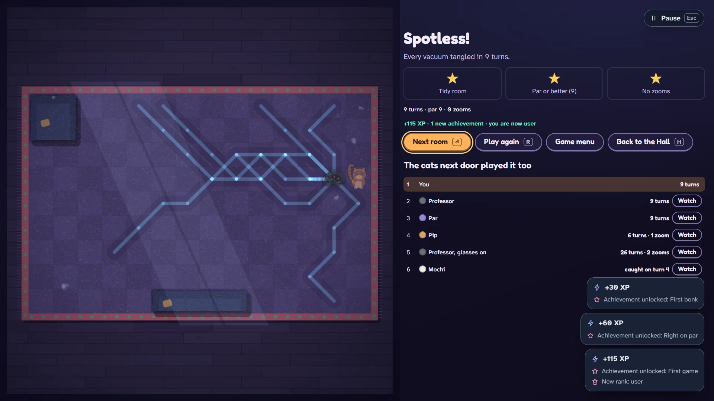

# Zoomies

> Every robot vacuum in the house wants your fur. Make them bonk.

## The hook

You are a cat, the hairiest thing in the house, and every robot vacuum is set to pet-hair mode.
You cannot fight them. You can only move, and after every move each vacuum rolls one square
straight at you. Stand where two of them will arrive at the same moment and they bonk into a
tangle; anything that rolls into the tangle later is stuck too. Tangle them all and the room is
tidy, and the rug shows you everything that happened: every vacuum's path wiped clean in the dust.

## Where it comes from

`robots` is Ken Arnold's turn-based chase from the BSD games (its code dates from 1980). On an
80×24 terminal the robots were plus signs, their wrecks were asterisks, you were an at sign, and
the only thing you had besides your feet was a teleporter you could not aim. In 1999 Christos
Zoulas added a mode in which the computer played for you, and its games went into the same score
file as everyone else's, marked as the automatic player's.

The source holds more than the manual says. Two hidden experiments play the game with no thought
at all: one stands still until a robot is next to it, the other runs round and round in eight
directions. The automatic player has two endearing bugs: it is frightened of robots that are
already scrapped, and it takes the corners of the screen's border for robots. And from the fourth
level on, the game never gets any harder.

## What is new

- **The cats next door.** Every room you play, four rival cats play too, and three of them play
  strategies straight out of the original's source: Mochi the stand-still experiment, Pip the
  pattern runner, and the Professor, the 1999 automatic player, bugs and all. Watch any of them
  replay the room on your floor.
- **Par, worked out.** The vacuums are completely predictable, so every room is a puzzle. A search
  through every possible game finds the fewest turns it can be cleared in, without a single zoom.
- **The House.** Twelve rooms, each with one new idea: socks, furniture, mop bots that cannot cut
  corners, an old model that naps, turbos, a shop vac that swallows tangles, a charging dock that
  keeps sending more. Three stars a room; stars earn new coats.
- **Today's Mess.** One room a day, the same for everyone, with a share line that carries no link.
- **The Long Night.** The original, rule for rule, on its 59 by 22 field.
- **The Pattern Lab.** Write a pattern of up to eight directions and see whether it outlasts Pip's.
- **Loafing pays.** Wait it out while vacuums tangle and earn safe zooms that always land somewhere
  quiet.

## At a glance

|                 |                     |
| --------------- | ------------------- |
| Directory       | `/usr/games/arcade` |
| Players         | 1                   |
| Session         | 3–12 minutes        |
| Daily challenge | yes (Today's Mess)  |
| Inspired by     | `robots` (1980)     |

## More

- [How to play](HOW-TO-PLAY.md)
- [Changes from the original](CHANGES-FROM-ORIGINAL.md)
- [Architecture](ARCHITECTURE.md)
- [Notes](NOTES.md)
