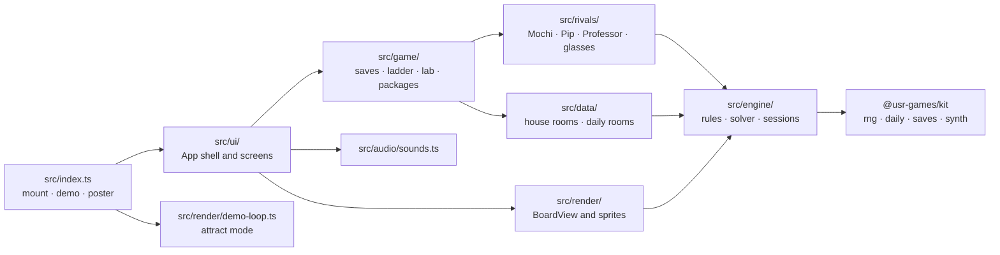
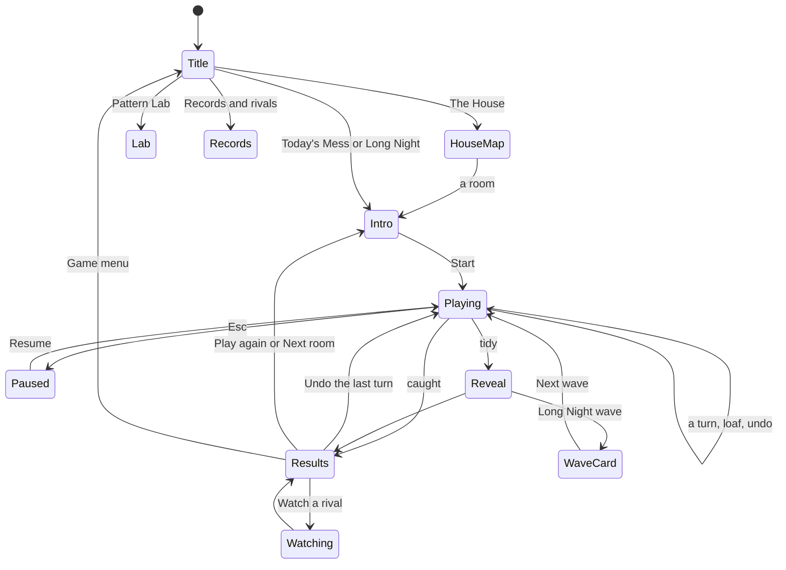

# Zoomies — architecture

## Overview

Zoomies is a **native** game: strict TypeScript against the kit contract, mounted by the Hall from
`src/index.ts`. Everything is drawn with Canvas 2D (no WebGL, no raster files); the menus are plain
DOM. The rules are a small pure engine (about 1,000 lines with the solver); the rivals, the solver
and the room generator all run on it.

## Module map

| Path                     | Responsibility                                                                                      |
| ------------------------ | --------------------------------------------------------------------------------------------------- |
| `src/index.ts`           | The kit contract: `mount`, `demo`, `poster`, `achievements`                                         |
| `src/engine/types.ts`    | Plain data: rooms, vacuums, tangles, docks, actions, turn events                                    |
| `src/engine/rules.ts`    | One turn (`applyAction`), legality, danger, the cat's nine options                                  |
| `src/engine/room.ts`     | Room specs, the Long Night's waves (the original field and counts)                                  |
| `src/engine/solver.ts`   | Par: IDA* with a lower bound and a transposition table; a beam search for quick checks              |
| `src/engine/generate.ts` | Blueprints to rooms: place everything from a seed, keep it only if the solver proves a par in range |
| `src/engine/session.ts`  | Undo history; the Long Night's run of waves                                                         |
| `src/engine/scoring.ts`  | The original's points, stars and room scores                                                        |
| `src/rivals/`            | The four rival strategies and the harness that plays them through a room or a night                 |
| `src/data/`              | The twelve house rooms (blueprints and the searched layouts) and the daily plan                     |
| `src/game/`              | Saves, the ladder of results, the Pattern Lab, today's room, package definitions                    |
| `src/render/`            | `BoardView` (animation from turn events), floor, dust and trails, sprites, effects, icons           |
| `src/ui/`                | The `App` shell, screens, key map, styles                                                           |
| `src/audio/sounds.ts`    | Synth patches and which turn events play them                                                       |
| `scripts/`               | Developer tools: room search, rival simulation, workbench screenshots and timing (not shipped)      |
| `dev/`                   | The workbench on port 5290: the game against a stand-in Hall, and single board scenes               |

## State machine

## Engine

A `RoomState` is plain data: the layout (size, furniture, a blocked-cell table), the cat, every
vacuum (alive or not, with the last place it was), tangles (wrecks, socks, cables), an optional
dock, counters, and the zoom stream's RNG state. `applyAction(state, action)` returns a new state
and the list of events the turn produced; nothing is mutated.

One turn: the cat acts; every vacuum that is not resting moves one step toward the cat (all at
once, by the sign of the distance, sliding along furniture); the catch is checked first, then
bonks (two or more on a square) and stuck vacuums (one on a tangle; a hungry sweeper swallows it
instead); slow vacuums flip their rest; turbos take a second step with the same checks; the dock
sends a vacuum on its beat; the room is tidy when nothing is left rolling and the dock is done.

Randomness, all from the kit's `createRng`:

| Stream            | Seed                                   | Used for                             |
| ----------------- | -------------------------------------- | ------------------------------------ |
| A room's zooms    | `${spec.seed}/zoom`, kept in the state | Zoom landings (undo replays them)    |
| A Long Night wave | `${seed}/wave-${n}`                    | The original's random layout         |
| A candidate room  | `${searchSeed}/${i}`                   | Placing clutter, docks, vacuums, cat |
| Today's furniture | `${dailySeed}/furniture`               | Picking the day's furniture          |

The daily seed comes from the kit (`zoomies:daily:<date>`), so every player gets the same room.

**Solver.** `solve()` is iterative deepening with a lower bound: no vacuum can tangle sooner than
its distance to another vacuum (divided by their combined speed) or to a tangle. States reached
earlier at no greater depth are skipped. Budgets are counted in nodes, never time. A lone vacuum
with nothing to bump into is recognised as unwinnable. The house's twelve pars and the daily pars
are proven (see NOTES.md for node counts).

## AI

The rivals are in `src/rivals/`; each is a `Mind` with `decide(state)` and an optional `newRoom()`.

- **Mochi** (`mochi.ts`): the original's stand-still experiment. Zooms when a vacuum is next to her
  or no square is safe, else loafs.
- **Pip** (`pip.ts`): the original's pattern-roll experiment, read from `get_move`: run in the
  current direction while the original's step check passes; when it fails, take the next letter;
  if the pattern comes back to the letter it started the turn on, stay (the original asked the
  human). The Pattern Lab hands the same function the player's pattern.
- **Professor** (`professor.ts`): `automove()` from `auto.c`, line for line, in the original's
  screen coordinates: forty robot slots with scrapped robots at row −1 (the ghost bug), a screen
  reader that sees the border's corner marks as robots, and the integer-division slope.
- **Professor, glasses on** (`glasses.ts`): the same idea with exact danger from the engine and a
  one-turn lookahead (tangles, open squares, vacuums shielded by tangles).
- **Par**: the solver's route.

`playRoom` and `playNight` (`run.ts`) run any mind with a turn budget (a nap-forever strategy can
circle a lone vacuum for good).

## Where visuals are defined

| Visual                                      | Defined in                                       | Change it by                                      |
| ------------------------------------------- | ------------------------------------------------ | ------------------------------------------------- |
| Day and night colours per room              | `src/render/palette.ts` (`LOOKS`)                | Editing a room's `day` or `night` entry           |
| Vacuum colours, coats, rival coats          | `src/render/palette.ts`                          | `vacuumColors`, `COATS`, `RIVAL_COATS`            |
| Floor boards, rugs, tiles, the window light | `src/render/floor.ts`, `BoardView.drawLight`     | Floor and surface painters; painted once per size |
| Dust, clean stripes, paw prints, night glow | `src/render/dust.ts`                             | `sprinkle`, `sweep`, `paw`                        |
| The cat and its poses                       | `src/render/sprites/cat.ts`                      | `drawCat` (sit, step, loaf, zoom, fluffed, happy) |
| Vacuums, visor eyes and moods               | `src/render/sprites/vacuum.ts`                   | `drawVacuum`, `sizeFor`, `drawKindDetails`        |
| Tangles, socks, cables, the dock            | `src/render/sprites/things.ts`                   |                                                   |
| Furniture                                   | `src/render/sprites/furniture.ts`                | One function per kind; night shading at the end   |
| Bonk words, puffs, fur, sparkles, streaks   | `src/render/effects.ts`                          |                                                   |
| Turn animation, hints, the trail reveal     | `src/render/board-view.ts`                       | `BASE` timings, `drawHints`, `revealTrails`       |
| Menus, panel, cards                         | `src/ui/styles.css`                              | Tokens at the top: `--zm-*` for each look         |
| House-map miniatures, icons                 | `src/render/miniature.ts`, `src/render/icons.ts` |                                                   |

The game has its own two looks, chosen by the Hall's appearance: **Afternoon** (light) and
**Midnight** (dark), both designed. It follows appearance changes live. Fonts come from the Hall
(Fredoka for display, the Hall's body face). Reduced motion: turns change at once, no camera zoom,
shake or streaks, and the demo slows down. The night glow and other blurs are skipped on small
squares, and between turns the board redraws at a calmer rate.

## Where sounds are defined

All in `src/audio/sounds.ts`, played through the kit's synthesiser (no files):

| Sound   | Plays when                                  |
| ------- | ------------------------------------------- |
| paw     | The cat steps                               |
| whirr   | Vacuums roll                                |
| bonk    | Two or more vacuums tangle                  |
| stuck   | A vacuum rolls into a tangle, sock or cable |
| gulp    | A shop vac swallows a tangle                |
| zoom    | The cat zooms                               |
| purr    | A loaf or a nap starts                      |
| sparkle | A safe zoom is earned                       |
| dock    | The dock sends out a vacuum                 |
| refuse  | A step is refused                           |
| caught  | A vacuum reaches the cat                    |
| tidy    | The room is tidy                            |

## Hall integration

| Moment                          | Call                                                                                                                        |
| ------------------------------- | --------------------------------------------------------------------------------------------------------------------------- |
| A House or daily room is tidied | `reportResult({ outcome: 'win', score, stats: { vacuumsTangled, roomsTidied: 1 }, xpEvents, daily, presentation: 'game' })` |
| A room is lost                  | The same with `outcome: 'loss'`, sent when the player leaves the results (an undo cancels it)                               |
| A Long Night ends               | `outcome: 'win'` if a wave was cleared, `stats: { vacuumsTangled, wavesCleared, roomsTidied: 0 }`                           |
| Events during play              | `installPackage(id)` for the twelve packages                                                                                |
| Title screen                    | `setOnTitleScreen(true)`; every other screen `false`                                                                        |
| Pause items                     | In play: "Restart the room" (or "Start the night again") and, in the House, "House map"                                     |
| Today's Mess                    | Seed and number from `context.daily`; `share()` with the day, turns against par, stars and rivals beaten                    |

XP events: `room-tidy` 8, `on-par` 6, `waves-cleared` 5 a wave up to 25. Weekly goals in the
manifest count `vacuumsTangled` and `roomsTidied`.

Saves (all version 1, through `context.save`): `prefs` (careful paws, whiskers, pace, coat),
`house` (stars, best turns, tidy per room), `daily` (one record per date, the last 60),
`night` (top ten) and `lab` (best pattern, runs).

`demo(seed)` plays the house rooms with the patched Professor, silently, and stops drawing when
hidden. `poster()` draws the living room one turn before the end of its par route, trails and all.

## Tests

| Test                          | Command                                                                     | What it proves                                                                     |
| ----------------------------- | --------------------------------------------------------------------------- | ---------------------------------------------------------------------------------- |
| Rules                         | `pnpm vitest run --project zoomies`                                         | Steps per kind, bonks, socks, sweepers, catches, nap bonus, docks, safe zooms      |
| Solver                        | (same)                                                                      | Shortest routes really clear; the bound is admissible; lone vacuums are unsolvable |
| House and daily rooms         | (same)                                                                      | Every stored par is proven again; daily rooms are deterministic and solvable       |
| Rivals and ladder             | (same)                                                                      | Mochi and Pip read the original; the Professor's ghost and corner quirks; ranking  |
| In the Hall                   | `pnpm exec playwright test -c games/zoomies`                                | Launch, a room cleared by keyboard, results, packages, ways out, no requests       |
| Workbench screenshots         | `pnpm --dir games/zoomies dev`, then `tsx games/zoomies/scripts/drive.ts …` | The screenshots in `docs/media/`                                                   |
| Frame timing                  | `tsx games/zoomies/scripts/perf.ts …`                                       | 60 fps at 1920×1080 (see NOTES.md)                                                 |
| Rival ladder over many nights | `tsx games/zoomies/scripts/sim-rivals.ts 40`                                | The medians in NOTES.md                                                            |
| Room search                   | `pnpm --dir games/zoomies rooms`                                            | Rewrites `src/data/house-layouts.ts` from the blueprints                           |

## Kit candidates

- `src/engine/solver.ts`'s pattern (IDA* with a transposition table and node budgets) could serve
  other puzzle games' pars.
- `src/render/shapes.ts` (cached floor shadows, glow that switches itself off when small).
- The workbench's stand-in context (`dev/mock-context.ts`) could become a kit testing helper for
  native games.
