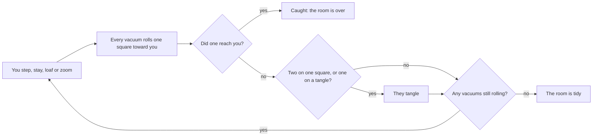

# How to play Zoomies

## Goal

Tangle every robot vacuum in the room without letting one reach you. In the House and Today's Mess
a room is a puzzle with a par; in the Long Night the waves keep coming until one catches you.

## Controls

| Action                                   | Keyboard                                    | Mouse                                           | Remappable |
| ---------------------------------------- | ------------------------------------------- | ----------------------------------------------- | ---------- |
| Step (eight directions)                  | Q W E · A D · Z X C, arrow keys, number pad | Click a square next to the cat, or drag the cat | yes        |
| Stay put for one turn                    | S, Space, `.` or number pad 5               | Click the cat                                   | yes        |
| Loaf (wait while it is safe)             | L                                           | Loaf                                            | yes        |
| Zoom (dash to a random square)           | T                                           | Zoom                                            | yes        |
| Undo a turn (House, Today's Mess)        | U, Backspace, Ctrl+Z or ⌘Z                  | Undo                                            | yes        |
| Nap until the wave is over (Long Night)  | N                                           | Nap till it's over                              | yes        |
| Whiskers on or off                       | V                                           | The Whiskers switch                             | yes        |
| Whole room or follow the cat (big rooms) | O                                           | The Whole room switch                           | yes        |
| Skip the room-cleared moment             | Any key                                     | Click                                           | no         |
| Start a room (intro card)                | Enter                                       | Start                                           | no         |
| Next room (results)                      | Enter                                       | Next room                                       | no         |
| Pause                                    | Esc                                         | Pause button                                    | no         |
| Play again (results)                     | R                                           | Play again                                      | no         |
| Back to the Hall (results)               | H                                           | Back to the Hall                                | no         |

Keys are remapped in the Hall's settings. In the Pattern Lab the step keys fill the pattern's
slots, Backspace removes the last one and Enter runs it.

When the board has the keyboard's focus, a dashed ring circles the cat; the square under the
pointer gets a solid frame.

## The room and the panel

The cat is never smaller than 48 pixels. When a room is too big to show at that size (the Long
Night always, the biggest house rooms on a small screen), the view follows the cat, and a small
marker at the edge points at every vacuum out of sight. **Whole room** (`O`, or its switch in the
panel, shown only when it applies) shows the whole room at once, smaller.

With Whiskers on, every square a vacuum could reach next turn is hatched; the hatching is strong on
the squares around the cat and faint further away.

The panel counts the turn against par, the zooms used, the vacuums ("6 left · 3 docked", with one
dot per vacuum, filled once it is tangled, or two counts past eight) and the safe zooms in hand.

When the last vacuum tangles, the room has its moment: the view eases in on the cat and the pile,
the pile bounces under dizzy stars, the cat stretches with a proud "mrrp", and then the trails of
every vacuum draw themselves onto the rug. The counter changes after that, and the packages earned
during the room are announced with the results.

## Rules

1. You step one square (in any of eight directions), stay put, loaf or zoom. You cannot step onto
   a vacuum, a tangle, a sock or a cable, or under furniture.
2. Then every vacuum rolls one square toward you, diagonally when it can. If furniture is in the
   way it slides along it.
3. Two or more vacuums on one square bonk into a tangle. A vacuum that rolls onto a tangle, a sock
   or a cable is stuck in it too.
4. If a vacuum reaches your square, you are caught (even if others pile in at the same moment).
5. When no vacuum is left moving (and any charging dock is empty or jammed), the room is tidy.

**Careful paws.** With it on (the default, and always in the Long Night, as in the original), the
game will not let you step or stay where a vacuum could reach you next turn. You are caught only
by a zoom that lands badly, or a nap.

**Loaf.** Waits turn after turn and stops by itself before anything can reach you. In the House
and Today's Mess, every vacuum that tangles while you loaf earns a **safe zoom** (you can hold
three).

**Zoom.** A dash to a random square. With a safe zoom in hand you land where nothing can reach you
next turn; without one you land on any empty square, which may be right beside a vacuum. Zooms
are worked out from the room as it stands, so undoing a zoom and trying again lands in the same
place.

**Nap (Long Night only).** The original's wait: turns pass until the wave is decided, and it does
not stop for danger. Every vacuum that tangles while you nap adds a bonus point, paid if you clear
the wave.

### The vacuums and what lies on the floor

| Thing         | What it does                                                                         |
| ------------- | ------------------------------------------------------------------------------------ |
| Robot vacuum  | Rolls one square straight at you after every turn.                                   |
| Mop bot       | Square-nosed. Moves only along one axis, so a square diagonal to it is safe.         |
| Old model     | Rests every other turn; its light dims and a "z" floats up before a rest.            |
| Turbo         | Small and red. Takes two steps a turn.                                               |
| Shop vac      | Tall drum. Swallows the first tangle it rolls onto, then is as clumsy as the rest.   |
| Sock, cable   | Lying on the floor. A vacuum that rolls onto one is stuck.                           |
| Charging dock | Sends out a new vacuum every few turns until it is empty, or until a tangle jams it. |

**Whiskers.** Hatched squares are within a vacuum's reach next turn. Around the cat, a paw print
marks every square you can safely step to and a cross every square you cannot.

## Modes

| Mode            | What changes                                                                                                                                                                                          |
| --------------- | ----------------------------------------------------------------------------------------------------------------------------------------------------------------------------------------------------- |
| The House       | Twelve rooms in order, each opened by tidying the one before. Undo as much as you like.                                                                                                               |
| Today's Mess #N | One room a day, the same for everyone (numbered by the Hall). Each weekday has its own crowd: Sock Monday, Mop Tuesday, Sleepy Wednesday, Turbo Thursday, Shop-vac Friday, Dock Saturday, Sunday mix. |
| Long Night      | The original game: a 59 by 22 field, ten more vacuums every wave up to forty, zooms that land anywhere, no undo. You may skip to wave 4 for a bonus of 600 if you clear it.                           |
| Pattern Lab     | A pattern of up to eight directions plays five fixed Long Nights by itself, the way Pip does, and is scored against Pip's.                                                                            |

## The cats next door

Every House room and every daily room is played by four rivals and by par. Their results appear
beside yours at the end, and **Watch** replays any of them on your floor.

| Rival                 | How it plays                                                                                                      |
| --------------------- | ----------------------------------------------------------------------------------------------------------------- |
| Mochi                 | Naps until a vacuum is right beside her, then zooms. The original's hidden stand-still experiment.                |
| Pip                   | Runs as far as she can one way, then the next of Y H B J N L U K. The original's hidden pattern experiment.       |
| Professor             | The 1999 automatic player, exactly: frightened of scrapped vacuums near the top wall, wary of the room's corners. |
| Professor, glasses on | The same plan with the bugs fixed and an exact sense of danger.                                                   |
| Par                   | The fewest turns the room can be cleared in, without zooming.                                                     |

Rankings put clears first, then the fewest zooms, then the fewest turns.

## Settings

| Setting                 | Options                    | Default      |
| ----------------------- | -------------------------- | ------------ |
| Careful paws            | on · off                   | on           |
| Whiskers                | on · off                   | on           |
| How fast turns play out | Calm · Brisk · Zippy       | Brisk        |
| Coat                    | six, earned by House stars | Ginger tabby |

Sound, motion, light or dark and key bindings are the Hall's settings. With reduced motion, turns
change at once and the floor's flourishes stay still.

## Scoring

- **House and Today's Mess:** stars for a tidy room, for par or better, and for never zooming.
  The score sent to the Hall is ten points a tangled vacuum plus thirty a star.
- **Long Night:** ten points a vacuum, plus the nap bonus on a cleared wave, plus 600 if you
  skipped to wave 4 and cleared it. Your best ten nights are kept on this device.
- **Pattern Lab:** the total of the five nights.
- **Share (Today's Mess):** the day's number, your turns against par, your stars and how many of
  the five rivals you finished ahead of. No link.

## Achievements (packages)

| Package            | How to earn it                                                        |
| ------------------ | --------------------------------------------------------------------- |
| `first-bonk`       | Make two vacuums bump into each other.                                |
| `hallway-tidy`     | Clear the first room of the house.                                    |
| `earned-loaf`      | Earn a safe zoom by loafing while a vacuum tangles.                   |
| `sock-trap`        | Watch a vacuum choke on a sock.                                       |
| `morning-tidy`     | Clear a Today's Mess room.                                            |
| `night-shift`      | Clear a wave of the Long Night.                                       |
| `right-on-par`     | Clear a room in par turns or fewer.                                   |
| `top-of-the-class` | Clear a room in fewer turns than the Professor.                       |
| `jammed-dock`      | Get a tangle onto a charging dock.                                    |
| `domino-day`       | Tangle four vacuums in a single turn.                                 |
| `spotless`         | Earn all thirty-six stars of the house.                               |
| `pattern-prodigy`  | Write a pattern in the Pattern Lab that scores more than twice Pip's. |

## XP

Zoomies reports every finished room and every Long Night to the Hall: a completed session, the first
win of the day, Today's Mess and packages all earn XP under the Hall's rules. In-game events: a tidy
room (8), par or better (6), and Long Night waves (5 a wave, up to 25). A room you lose and then
undo is not reported. Weekly cron goals: tangle a number of robot vacuums, and tidy a number of
rooms.

## Tips

- Two vacuums on the same row or column, equally far from you, will meet if you stay put.
- A tangle between you and a vacuum is a wall it cannot see. Keep one handy.
- Loafing costs turns. Use it when par is out of reach anyway, or to bank a safe zoom.
- Mops cannot reach a diagonal square. The old model is harmless on its rest turn. Give turbos
  twice the room.
- A sweeper is dangerous only until its first gulp. Feed it a sock early.
- Sitting on a charging dock stops it sending new vacuums, but it will start again when you leave.
