# Zoomies — polish P1-Z, before and after (with the Hall's safe zones)

The owner's checkpoint for prompt P1-Z (§5). The "after" frames come from
`e2e/polish-shots.spec.ts`
(`SHOTS=1 HALL_PORT=5282 pnpm exec playwright test -c games/zoomies polish-shots`), inside the Hall
(Console Home) at 1920×1080 in Afternoon (day) and Midnight (night), plus one frame at 1280×720.
The "before" frames are the consolidation review's (`docs/media/review/zoomies/` and, for the
Hall, `docs/media/review/lightkeeper/`), copied here so this page stands on its own.

No rule or par changed. Everything is in `src/render/`, `src/ui/`, `src/audio/` and the manifest's
key list; `src/engine/` is untouched.

## 1. Room cleared: the payoff

| Before                                                                       | After                                                                |
| ---------------------------------------------------------------------------- | -------------------------------------------------------------------- |
| 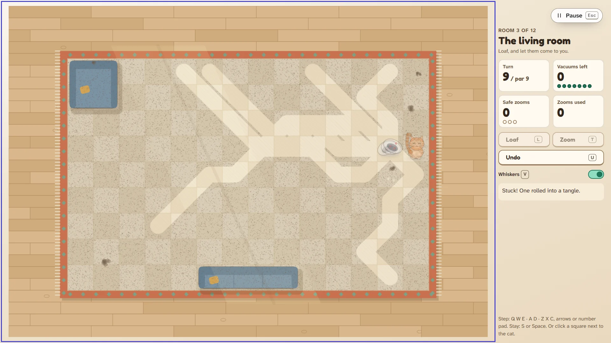 | 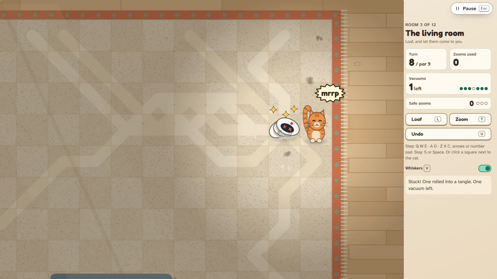 |
| 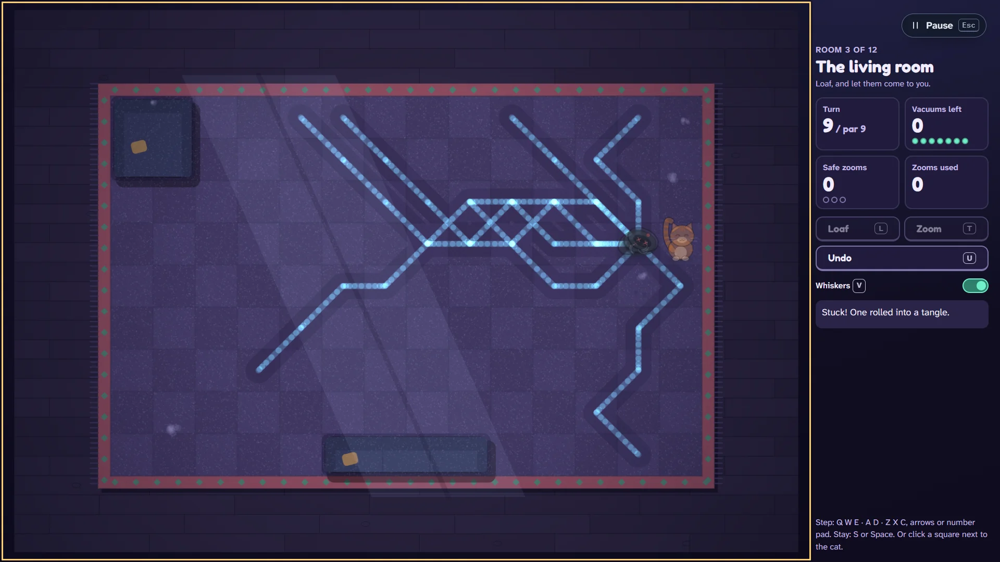                        | 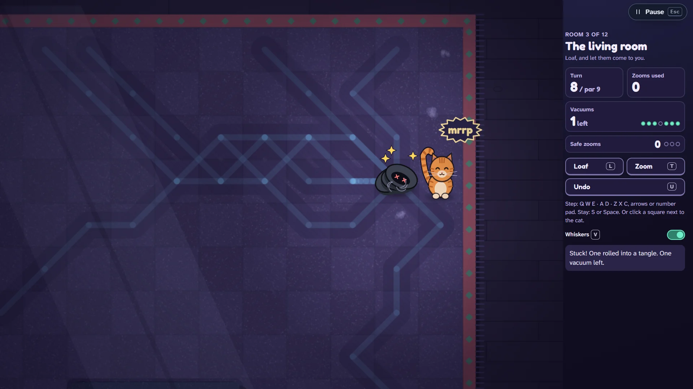                           |

The last vacuum bonks and fully arrives; then about two and a quarter seconds play out.

1. The camera eases in on the cat and the pile (up to 1.45× closer, drawn part of the way towards
   the middle, never baring the edge of the view) while the rest of the room dims under a soft
   spotlight.
2. The pile does two small hops, squashing as it lands, with three dizzy stars circling over it.
3. Once the bonk's own word has faded, the cat does its proud stretch, tail up and eyes happy, with
   a little "mrrp" (a new two-note synth patch, and a word in the bonk style).
4. The camera eases back and the trails draw onto the rug turn by turn, in the order the vacuums
   rolled. Everything but the cat and the pile dims so the trails come forward.
5. Only then does the panel change: the counter, the status line, and the achievements earned in
   that turn. In the frames it still says "1 left" because the moment is still playing.

Any key or click jumps to the end. Under reduced motion it is a still of the tangle with the
trails already drawn, held for 0.7 s. The whole timeline is in `src/render/payoff.ts`.

## 2. Afternoon trails a player can read

| Before                                                                         | After                                                     |
| ------------------------------------------------------------------------------ | --------------------------------------------------------- |
|  | 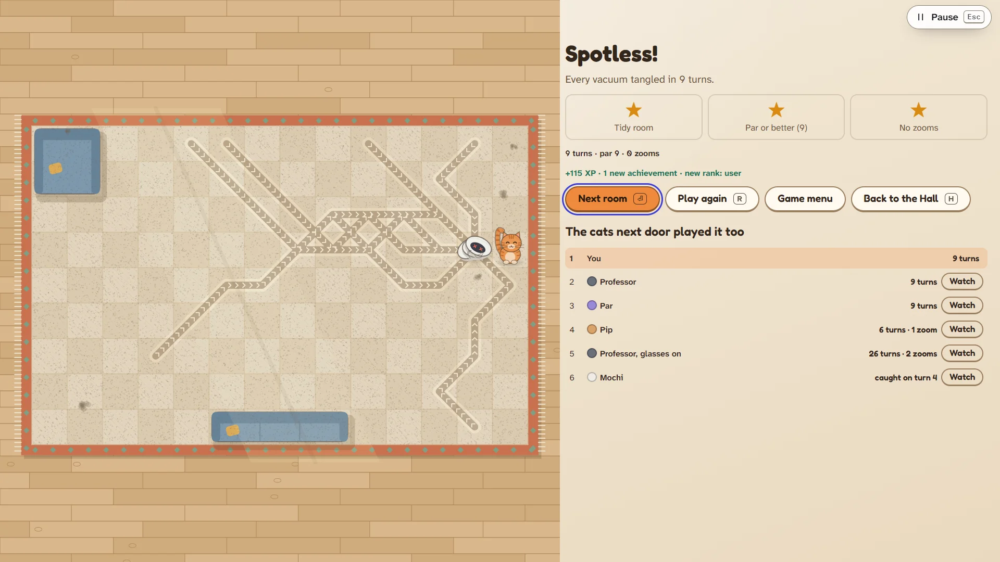       |
|            | 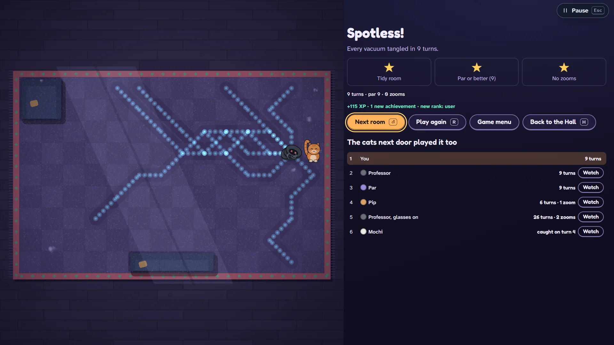 |

By day each vacuum's path is now a thin dark stripe combed like vacuumed carpet, with the nap's
chevrons pointing the way it rolled. Where paths cross, two thin stripes cross instead of two wide
bands merging. The lane the vacuums clean during play is narrower by day (0.36 of a square, not
0.62), so it no longer swamps the stripe. Midnight keeps its glowing dots, now drawn on in order
too. Both are in `src/render/trails.ts`.

## 3. The board and the panel

| Before                                                | After                                                           |
| ----------------------------------------------------- | --------------------------------------------------------------- |
| 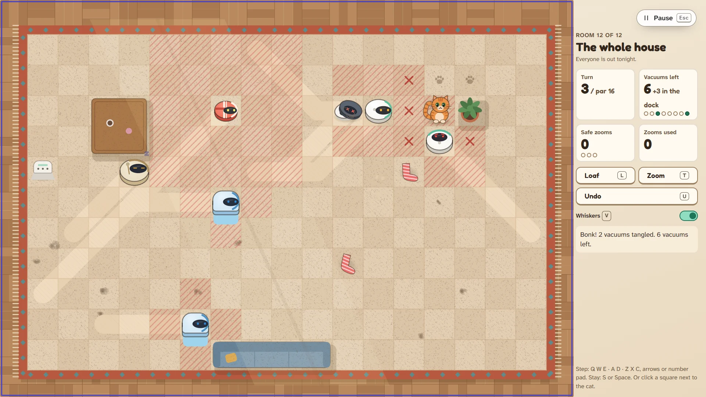 | 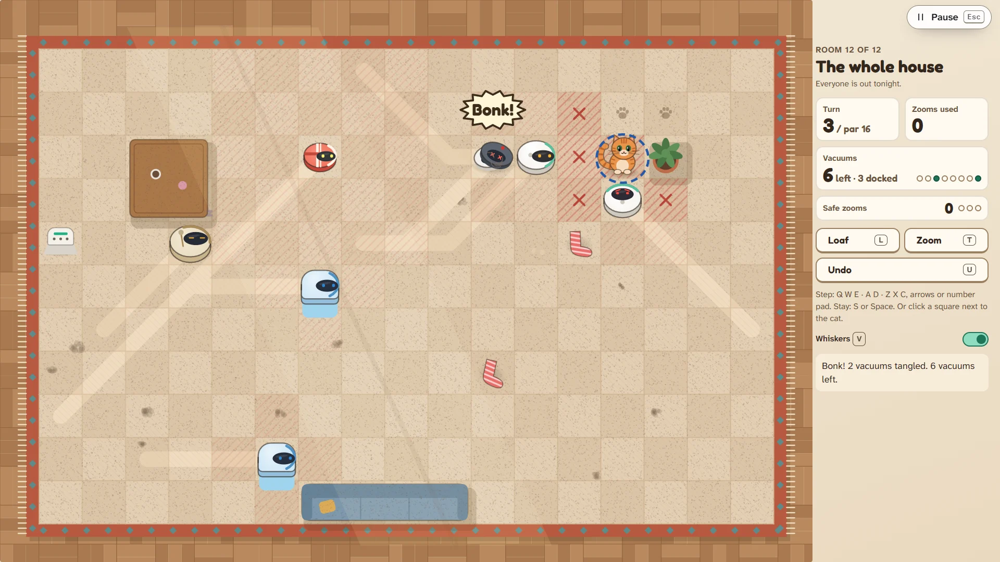 |
| 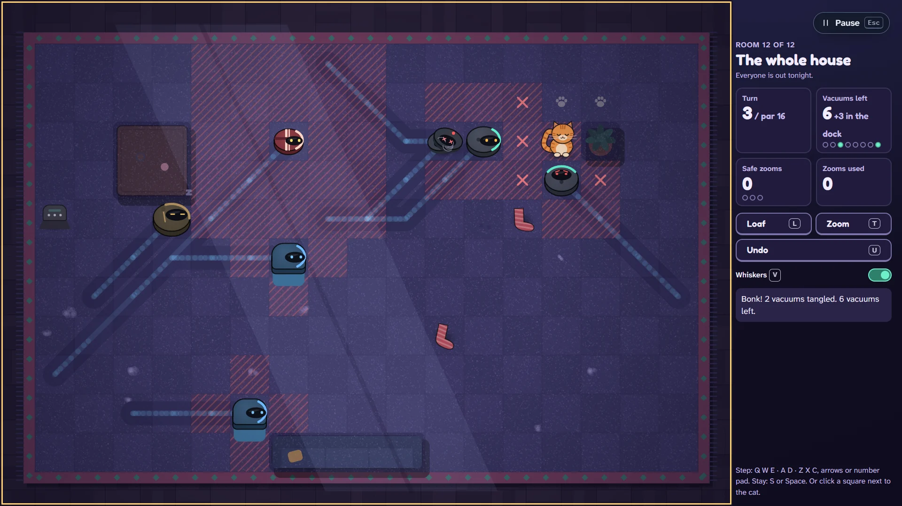      | 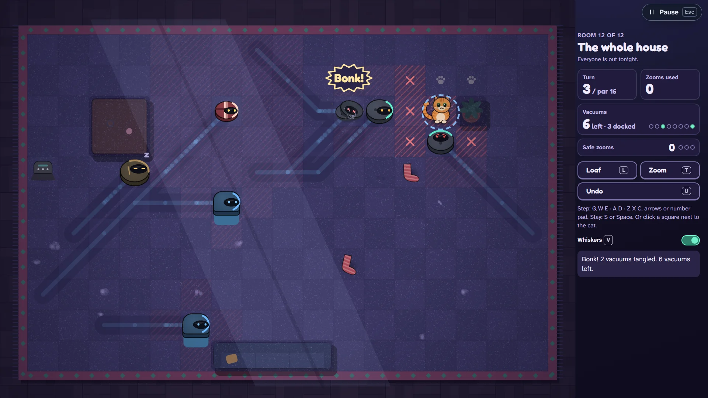                    |

| At 1280×720: the camera keeps the cat 48 px tall       | The Long Night: the camera on the cat, markers at the edge |
| ------------------------------------------------------ | ---------------------------------------------------------- |
| 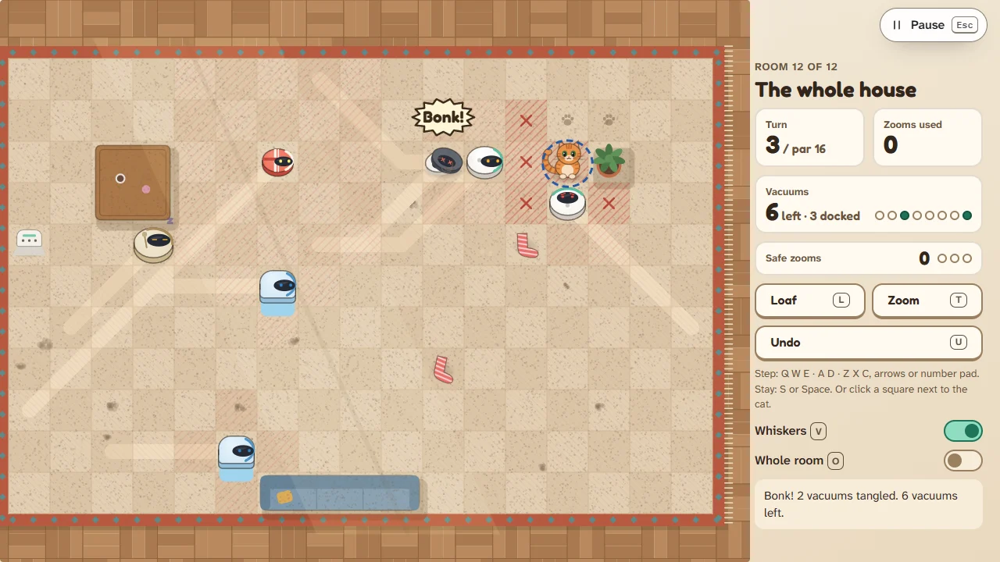 | 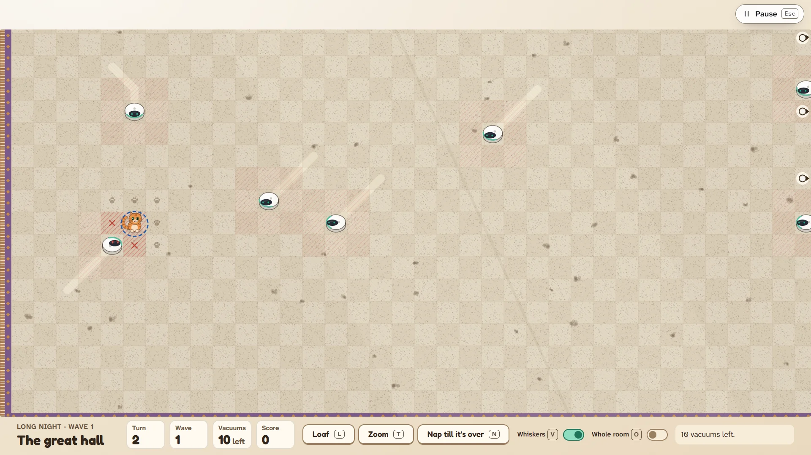         |
|                                                        | 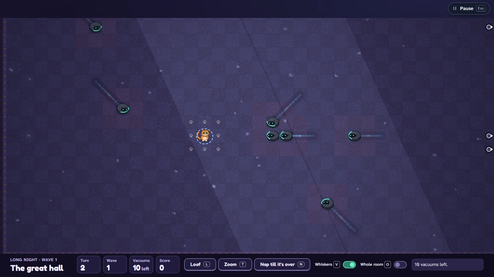     |

- **The cat is never a speck.** Squares never go below 53 px, so the cat (about 0.92 of a square
  tall) is at least 48 px tall at 1280×720 and above. When a room no longer fits at that size, the
  floor is laid out bigger than the view and the camera follows the cat smoothly (a 140 ms ease,
  instant under reduced motion). At 1280×720 that is the whole house (17×11) and the bathroom
  (19×5), panning a little. The Long Night's 59×22 field follows the cat at every size. Every
  vacuum outside the view gets a small marker at the view's edge, pointing at it, and **Whole room**
  (`O`, also a switch in the panel, shown only when the room outgrows the view) shows everything
  at once, smaller, as before.
- **Calmer hatching.** Squares a vacuum could reach next turn keep their hatching, but at full
  strength only on the cat's eight neighbours. Elsewhere they are a whisper (a third as strong).
- **The panel.** The vacuum counter spans the panel and never wraps ("6 left · 3 docked"). Its dots
  sit on the same line, and past eight vacuums they become two counts (a filled dot ×tangled, an
  empty one ×rolling). Safe zooms (or the Long Night's score) is one slim line. The key help sits
  right under the buttons. Under 760 px tall the panel tightens and drops the room's idea line
  (it is on the intro card), so the status line stays in view.
- **Focus.** The board-wide focus frame is gone. When the board has the keyboard's focus, a dashed
  ring walks slowly around the cat, and the chosen square (under the pointer) gets a solid
  focus-blue frame. A click hides the cue again.
- **Toasts never cover the panel.** The Hall now puts toasts bottom-left (§4), and Zoomies holds the
  packages earned mid-room until the room ends, so no note covers the floor mid-puzzle either.

## 4. The Hall: the Pause pill and the toasts keep to safe zones

| Before                                                                         | After                                                                          |
| ------------------------------------------------------------------------------ | ------------------------------------------------------------------------------ |
| 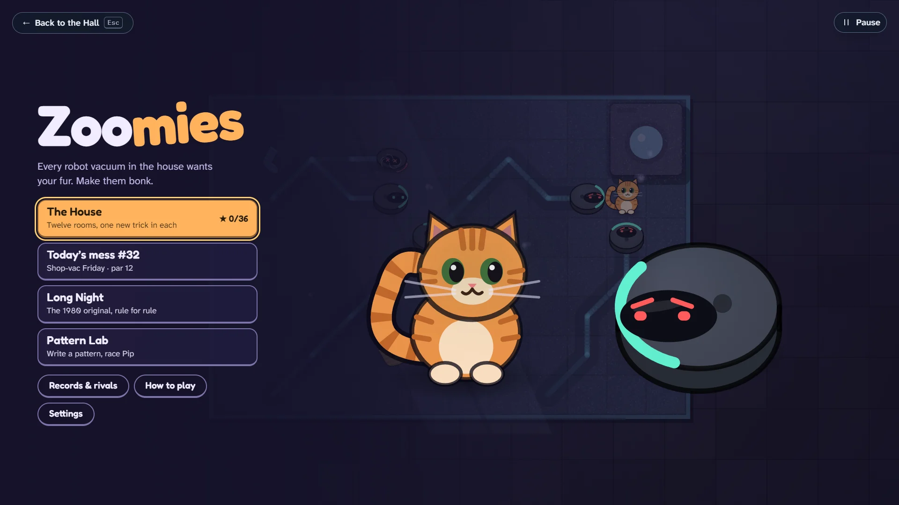         | 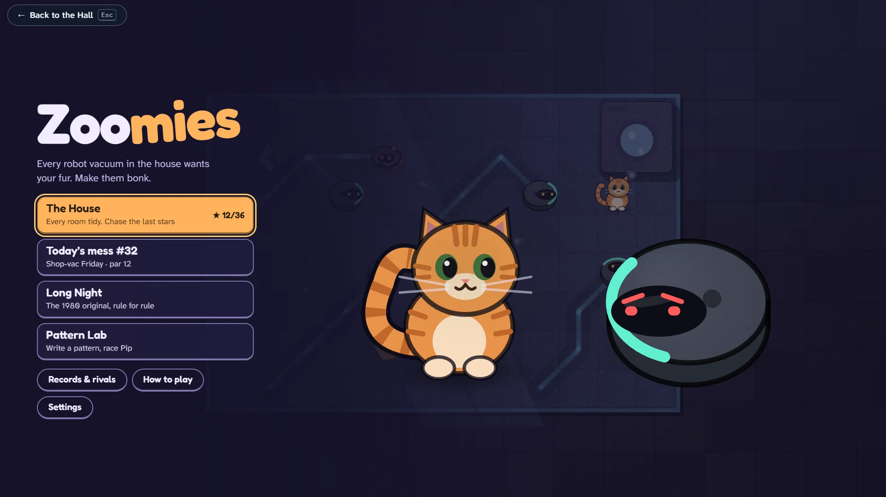                 |
| 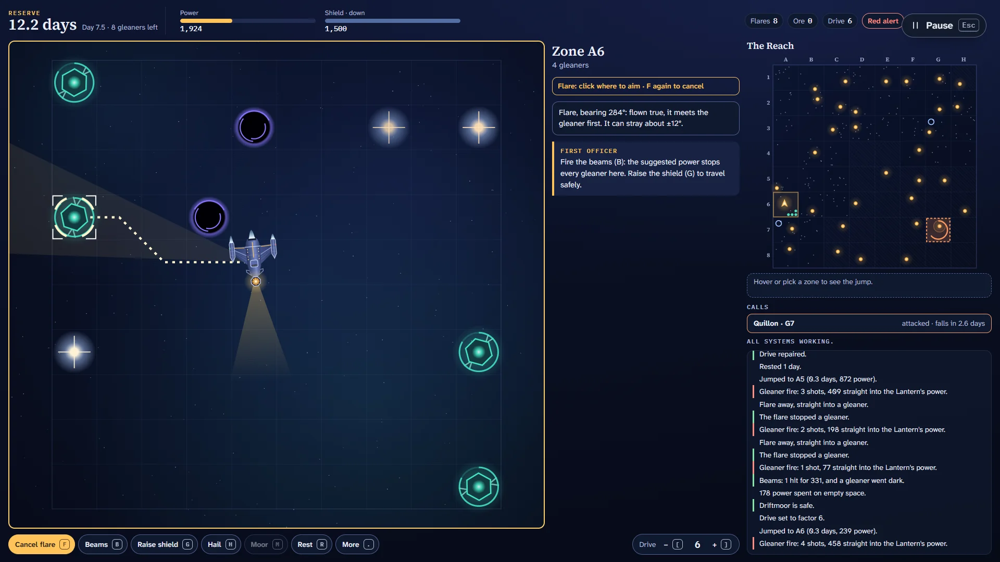 | 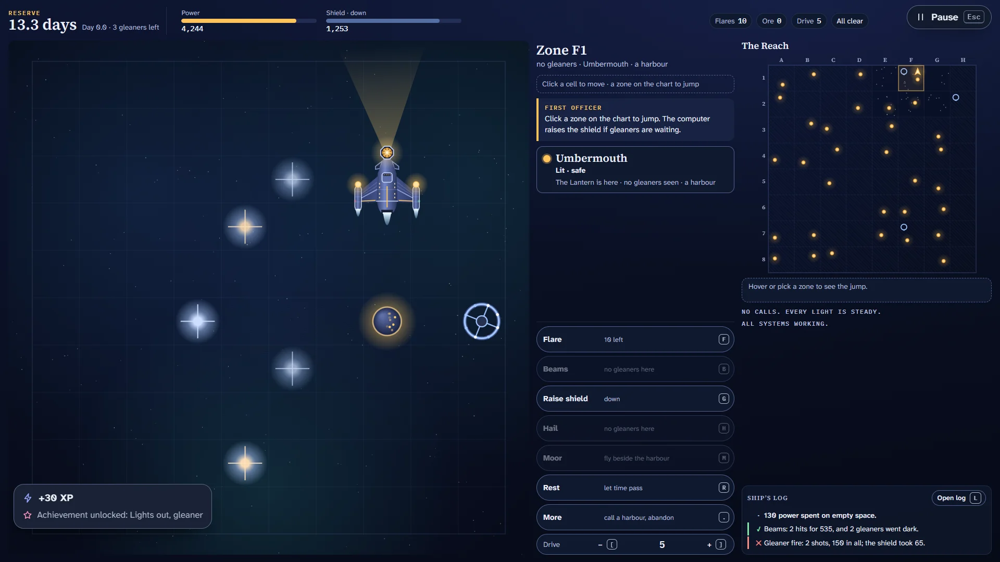 |

For native games, in `apps/hall/src/core/player/`:

- **On a game's own menu only "← Back to the Hall" shows.** Games already tell the Hall when they
  are on their title screen (`setOnTitleScreen`), so no new signal was needed: the Pause pill is now
  hidden there and comes back with play.
- **The safe zones.** The pill sits 10 px from the top and 16 px from the right, inside the
  top-right 220 × 64 px that games keep free. Toasts stack in the bottom-left, 64 px up (above
  any bottom bar), at most 400 px wide. The zones are CSS custom properties on `.pl-page--native`
  (`--pl-safe-pill-width`, `--pl-safe-pill-height`, `--pl-toast-lift`, `--pl-toast-width`). Over
  hosted games the toasts stay bottom-right as before.

Checked in play in all six native games at 1920×1080 and 1280×720, with three toasts in the stack:

| Game            | Pill (1920 / 1280)                    | Anything of the game's under the pill | Under the toasts                                                   |
| --------------- | ------------------------------------- | ------------------------------------- | ------------------------------------------------------------------ |
| Skyloom         | 163×46, bottom 56 / 138×44, bottom 54 | nothing                               | nothing (the toasts sit above its key bar)                         |
| Lightkeeper     | same                                  | nothing                               | nothing                                                            |
| Zoomies         | same                                  | nothing                               | nothing                                                            |
| Hush the Wumpus | same                                  | nothing                               | **its "Room 1 · tunnels lead to…" card, and at 1280 its tip card** |
| Noodle Nine     | same                                  | nothing                               | nothing                                                            |
| Full Pockets    | same                                  | nothing                               | nothing                                                            |

The pill measures the same in Holo (163×46) and Machine Room (168×46, its monospace face), in light
and dark.

## Critique rounds

1. **First frames.** The payoff worked, but by day the old wide cleaned lanes sat under the new
   stripes and made the floor busy, so the day lane is narrower. The Long Night's panel below the
   field broke into rows with the new wide counters, so it is back on one row. With bottom-left
   toasts, a full stack covered vacuums on Zoomies' board, so packages now wait for the room's end.
2. **The moment.** The last bonk's "Stuck!" was still on screen when the "mrrp" popped beside it,
   so the cat's stretch and "mrrp" now come after the bonk's word has faded. At 1280×720 the new
   Whole room switch pushed the status line below the fold, so the panel tightens on short screens.
3. **Legibility.** The edge markers were small and faint on the day floor, so they have a backing
   disc now. The mid-moment and Long Night shots were retimed to show what they should.

## For the owner

1. **The Long Night's camera.** A 48 px cat means the Long Night's 59-column field shows about 36
   columns at 1920 and 22 at 1280, following the cat. Edge markers point at every vacuum out of
   view, and Whole room (`O`) shows the full field at the old size. Keep that, or leave the Long
   Night uncropped (the 1980 original always showed the whole field)?
2. **Hush the Wumpus and the toast zone.** Its room card sits in the bottom-left zone, so for a few
   seconds a toast can cover it. Options: its owner moves the card (a KNOWN-ISSUES row for that
   session), the toast zone moves for everyone (top-left under the status bar is free in all six
   games), or accept it because toasts are brief.
3. **Achievements arrive with the results.** Zoomies now holds the packages earned mid-room until
   the room ends, so "First bonk" shows with the results rather than mid-puzzle. All right?
4. **A game's own results screen still shows the Pause pill.** Games only signal their title screen.
   A results signal could be added to the native contract in the Hall (optional, documented) if
   you want the pill gone there too.
