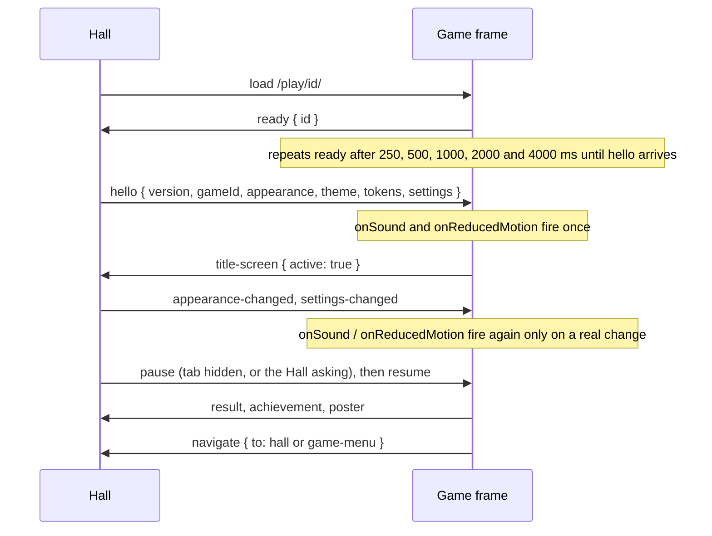

# @usr-games/bridge

The bridge connects the Hall to a **hosted game**: a finished game that runs in an `<iframe>` served
from `/play/<id>/` on the same origin as the Hall. It is one small, dependency-free module speaking a
versioned `postMessage` protocol, so any game (plain HTML and JavaScript or a Vite app) can join the
Hall with one line and a handful of calls.

Native games do not use the bridge; they mount directly through the kit contract.

## Joining the Hall

**Static games** (no build step) include the classic build with one script tag. From
`/play/<id>/index.html` the relative path always reaches the shared copy, whatever the site base is:

```html
<script src="../../bridge/bridge.js"></script>
<script>
  const hall = UsrGamesBridge.connectToHall({ id: 'pom' });
</script>
```

**Games with their own Vite build** import the package and let their bundler include it:

```js
import { connectToHall } from '@usr-games/bridge';

const hall = connectToHall({ id: 'robots', onPause: pauseTheGame, onResume: resumeTheGame });
```

### Follow the Hall's sound, motion and pause (revision 1.1)

Every hosted game follows the player's Hall settings, mapped onto its own controls:

```js
const hall = UsrGamesBridge.connectToHall({
  id: 'rain',
  // Muted means silent; otherwise the game's own level, scaled by the Hall's volume.
  onSound: (sound) => mixer.setLevel(UsrGamesBridge.soundLevel(sound, 0.6)),
  // Into the game's existing reduced-motion path, live.
  onReducedMotion: (reduced) => (pond.reducedMotion = reduced),
  // The Hall's pause and a hidden page, folded into one pause and one resume.
  pauseWhenHidden: true,
  onPause: () => pond.freeze(),
  onResume: () => pond.thaw(),
});
```

- `onSound({ volume, muted })` and `onReducedMotion(reduced)` are called once when the hello
  arrives, then only when a value changes (the Hall sends its settings on every change).
- `soundLevel(sound, designed)` is 0 while muted, `designed` (the level the game uses on its own)
  at the Hall's default volume (`HALL_DEFAULT_VOLUME`, 0.35), scaled with the Hall's slider and never
  above 1. A game whose sound started on now follows the Hall; one that started silent starts at the
  Hall's level, as native games do. Its own sound switch still works during the visit.
- Map reduced motion onto the game's **existing** path (a flag read from `matchMedia`, its motion
  toggle). A game with none is listed in `docs/KNOWN-ISSUES.md` rather than given an invented one.
- The Hall pauses the game while its tab is hidden and while it asks the player something over the
  game ("Leave this round?"). On `onPause` stop the clocks and fall silent; on `onResume` restore
  exactly what was running, never un-pausing something the player paused. `pauseWhenHidden` also
  pauses on the page's own `visibilitychange`, which covers the game running on its own too.

Then report what happens:

```js
hall.setTitleScreen(true); // on your own title screen: Escape now leads back to the Hall
hall.result({ outcome: 'win', score: 1240, stats: { robotsCrashed: 31 }, durationSeconds: 240 });
hall.achievement('chain-of-five'); // one of the packages listed in your manifest
hall.navigate('game-menu'); // or 'hall', from your own quit or menu action
```

### API

```ts
connectToHall(options: {
  id: string;
  onHello?: (hello: HelloPayload) => void;
  onAppearanceChange?: (appearance: AppearancePayload) => void;
  onSettingsChange?: (settings: BridgeSettings) => void;
  onPause?: () => void;
  onResume?: () => void;
  onSound?: (sound: { volume: number; muted: boolean }) => void; // since 1.1
  onReducedMotion?: (reduced: boolean) => void; // since 1.1
  pauseWhenHidden?: boolean; // since 1.1: fold the page's own visibility into onPause/onResume
  applyTokens?: boolean; // write the Hall's theme tokens as CSS custom properties on :root
}): HallConnection;

soundLevel(sound: { volume: number; muted: boolean }, designed?: number): number; // since 1.1
HALL_DEFAULT_VOLUME; // 0.35, the kit's default master volume
BRIDGE_VERSION; // 1, the envelope version
BRIDGE_REVISION; // '1.1'

interface HallConnection {
  readonly hosted: boolean;
  state(): HelloPayload | null;
  result(result: ResultPayload): void;
  achievement(id: string): void;
  navigate(to: 'hall' | 'game-menu'): void;
  setTitleScreen(active: boolean): void;
  requestSettings(): void;
  poster(image: string, width: number, height: number): void; // key art, see "Game art"
  posterFromCanvas(canvas: HTMLCanvasElement, quality?: number): void; // the same, from a canvas
  disconnect(): void;
}
```

The Hall side lives in `@usr-games/bridge/host`:

```ts
createBridgeHost(options: {
  iframe: HTMLIFrameElement;
  gameId: string;
  hello: () => HelloPayload; // built fresh on every `ready`
  origin?: string; // defaults to the Hall's own origin
  onReady?, onResult?, onAchievement?, onNavigate?, onRequestSettings?, onTitleScreen?, onPoster?
}): { sendAppearance(p), sendSettings(s), pause(), resume(), destroy() };
```

### Standalone

Opened on its own, outside the Hall, `connectToHall` returns a connection with `hosted: false`, and
every call is a harmless no-op. A game never needs a second code path.

## Protocol v1, revision 1.1

Every message is an envelope `{ protocol: 'usr-games-bridge', version: 1, type, payload }`.

**Revision 1.1 is backwards compatible both ways.** No message gained, lost or changed a key, and
envelopes still say `version: 1`, so a game written for 1.0 works with a 1.1 Hall and a 1.1 game with
a 1.0 Hall. What 1.1 adds is a contract and helpers: hosted games follow the Hall's mute, volume,
reduced motion and pause (all of which the Hall already sent), with `onSound`, `onReducedMotion`,
`pauseWhenHidden` and `soundLevel` on the game side, and the Hall now also pauses a game while it
asks the player something over it ([ADR 0012](../../docs/adr/0012-bridge-1-1-strip-and-posters.md)).



| Direction   | Type                 | Payload                                                                                                                                                                |
| ----------- | -------------------- | ---------------------------------------------------------------------------------------------------------------------------------------------------------------------- |
| Hall → game | `hello`              | `version`, `gameId`, `appearance` (`light`/`dark`), `theme` (the palette: `phosphor`/`manual`/`sunset`/`console`/`holo`), `tokens` (CSS custom properties), `settings` |
| Hall → game | `appearance-changed` | `appearance`, `theme`, `tokens`, `reducedMotion`                                                                                                                       |
| Hall → game | `settings-changed`   | `settings`: `volume` (0–1), `muted`, `reducedMotion`, `colorBlindPalette`, `language`                                                                                  |
| Hall → game | `pause`, `resume`    | empty                                                                                                                                                                  |
| game → Hall | `ready`              | `id`, which must match the catalog id the frame was opened for                                                                                                         |
| game → Hall | `result`             | `outcome` (`win`/`loss`/`draw`/`complete`/`quit`), optional `score`, `stats`, `xpEvents`, `daily`, `durationSeconds`                                                   |
| game → Hall | `achievement`        | `id` of one of the game's packages                                                                                                                                     |
| game → Hall | `navigate`           | `to`: `hall` or `game-menu`                                                                                                                                            |
| game → Hall | `request-settings`   | empty; the Hall answers with `settings-changed`                                                                                                                        |
| game → Hall | `title-screen`       | `active`: whether the game is on its own title screen                                                                                                                  |
| game → Hall | `poster`             | `image` (a `data:image/png`, `jpeg` or `webp` base64 URL, at most about 1.5 MB), `width`, `height` (whole pixels, at most 4096)                                        |

The Hall answers every `ready` with a fresh `hello`, so a reloaded frame (the strip's "Game menu"
reloads it) always starts with the current appearance and settings. Changes sent before the game's
first `ready` are dropped rather than queued, because the hello carries the current state anyway. A
pause is the exception: if the Hall is paused when the game announces itself, `pause` follows the hello.

## Escape and the title screen

The Hall cannot hear keys pressed inside the frame. While the game has reported
`title-screen { active: true }`, the bridge listens for Escape inside the frame and sends
`navigate { to: 'hall' }` for it. If the game handles Escape itself there (to close a dialog, for
example), it calls `event.preventDefault()` and the bridge leaves the key alone. The bridge decides only after the page has
handled the key, so it does not matter whether the game added its listener before the bridge or after. During play, Escape
belongs to the game.

## Game art (posters)

Console Home and Holo Collection show every game as real key art, not an icon: the Console Home
hero, its rail tiles and the Holo cards. Native games draw it with the contract's `poster()`.
Hosted games have two routes, in order of preference:

1. **A snapshot the game renders itself.** Once the game has drawn something worth showing (its
   title screen, or a still of play), it sends it:

   ```js
   const hall = UsrGamesBridge.connectToHall({ id: 'pom' });
   // After the title screen has been drawn:
   hall.poster(canvas.toDataURL('image/webp', 0.8), canvas.width, canvas.height);
   ```

   `hall.posterFromCanvas(canvas)` does the scaling and encoding for you: it draws the canvas
   into one at most 1280 pixels wide (`POSTER_MAX_WIDTH`) and sends it as WebP. Call it in the
   same task as the drawing, right after the render call, because a WebGL canvas may be cleared
   once the browser has shown the frame. The adopted games do exactly that (see
   `games/pom/app/src/hall.js` and `games/robots/app/src/hall.ts`).

   The Hall keeps the latest poster for that game on its poster shelf, a versioned save in its own
   storage (at most 400 000 characters a poster, 1 600 000 in all; the oldest leave first), and
   uses it wherever it shows the game's art, on later visits too. `isPosterImage` in
   `src/protocol.ts` is the check a poster passes, on arrival and again when read back. Only inline PNG, JPEG or WebP data URLs pass validation: no remote URLs (the Hall
   makes no network requests) and no SVG (which can carry script). Aim for 16:9 at about
   1280×720 so the art reads both as a wide hero and as a portrait card crop; keep the strongest
   detail right of centre, because the Console Home hero puts the title bottom-left.

2. **A still captured at build time.** After building the hosted games, `pnpm build` opens each of
   them in the built Hall in headless Chromium (`scripts/lib/posters.ts`). It keeps the game's own
   snapshot when the game sends one by itself within 14 seconds, otherwise a still of its frame once
   the page has settled, in `dist/play/<id>/poster.webp` (or `.jpg` for a frame still), listed in
   `dist/play/posters.js`, which the Hall imports at start-up. The files exist only in `dist/`: they
   are never committed, because the repository holds no raster files (ADR 0002, ADR 0012). Without
   Chromium, or with `pnpm build --no-posters`, the list is empty.

For a hosted game the Hall shows, in order: its snapshot (this visit or kept), its build-time
poster, the Hall's placeholder key art (pom, robots, sail, trek), and otherwise a procedural poster
from the game's emblem and accent colour, so every game always has something beautiful to show.

## Security

- **Same origin only.** Hosted games are served by the Hall's own site. Both sides accept a message
  only when `event.origin` is that origin and `event.source` is the expected window (the frame's
  `contentWindow` for the Hall, `window.parent` for the game).
- **Explicit target origin.** Every `postMessage` names the origin; `'*'` is never used.
- **Strict schema.** `parseHallMessage` and `parseGameMessage` drop anything that is not exactly a v1
  message: unknown types or keys, wrong value types, non-finite numbers, oversize strings, maps and
  lists (see `LIMITS` in `src/protocol.ts`). The game side also validates its own output and warns
  in the console instead of sending something the Hall would drop.

## Builds

`pnpm --filter @usr-games/bridge build` writes `dist/bridge.mjs` (ES module) and `dist/bridge.js`
(classic script defining `window.UsrGamesBridge`). Both are left unminified so a game author reading
them in the browser's developer tools sees real names. `build.ts` exports
`buildBridge({ outDir?, write? })`, which the Hall's dev server uses to serve `/bridge/*` from memory
and the site build uses to write `dist/bridge/`.

## Fixtures

Two tiny test games, never listed in the Hall, prove the whole path end to end:

- `fixture/`: plain HTML and JavaScript, `hosted-static`, loading `bridge.js` with one script tag.
- `fixture-vite/`: the same game bundled by its own Vite build with the bridge imported as a
  package, `hosted-vite`, built with `--base /play/fixture-vite/`.

Both show the appearance they received (`#appearance`) and offer `#start`, `#win`, `#lose`,
`#unlock`, `#to-menu` and `#to-hall` for the end-to-end tests.

## Testing a hosted game in the Hall

`packages/bridge/testing/` holds the Playwright helpers every adopted game's own suite uses
(`games/<id>/playwright.config.ts`, `games/<id>/e2e/`), so each game is tested the same way: inside
the Hall, in its frame.

- `hall.ts`: `hostedSuiteConfig()` (the Hall dev server on `HALL_PORT`, default 5173),
  `runInHall(page, id, seed)` (a signed-in guest opens the Hall, then the game; the seed sets the
  style, appearance, motion, volume and mute), `waitForGame` and `inGame` (evaluate in the game's
  page, for its own test hooks), `toasts`, `savedGameStats` (what the Hall's progression save holds
  for the game), `watchForeignRequests` (every request that leaves the Hall's origin),
  `expectStripAboveFrame` (the strip never covers the game), `setTabHidden` (the Hall and the game
  both report a hidden tab), `recordBridgeMessages` with `bridgeLog` (what the Hall told the game),
  and `describeWaysOut(game)`, the navigation-standard tests: Back to the Hall, Game menu, the
  browser's Back button and, for games with a title screen, Escape there.
- `shots.ts`: `describeScenes(game, media, scenes)` takes one documentation screenshot per scene at
  1280×720 (a scene may reopen the game's page with its own staging parameters), saved as WebP under
  800 KB; `GPU_LAUNCH_ARGS` let headless Chromium draw WebGL on the machine's GPU, where the adopted
  games keep their full looks.

## Tests

`pnpm vitest run --project bridge` covers the validators, the full handshake and message flow
between a host and a game through a simulated pair of windows (origin and source checks, retries,
Escape on the title screen, cleanup), revision 1.1 (sound and motion delivered once and on change,
`soundLevel`, the folded pause, the unchanged wire format), the fixture manifests and the in-memory
build. `apps/hall/e2e/hosted-games.spec.ts` runs every hosted game in the catalog through the strip
layout, the settings and pause messages, and a keyboard-only way in and out.
